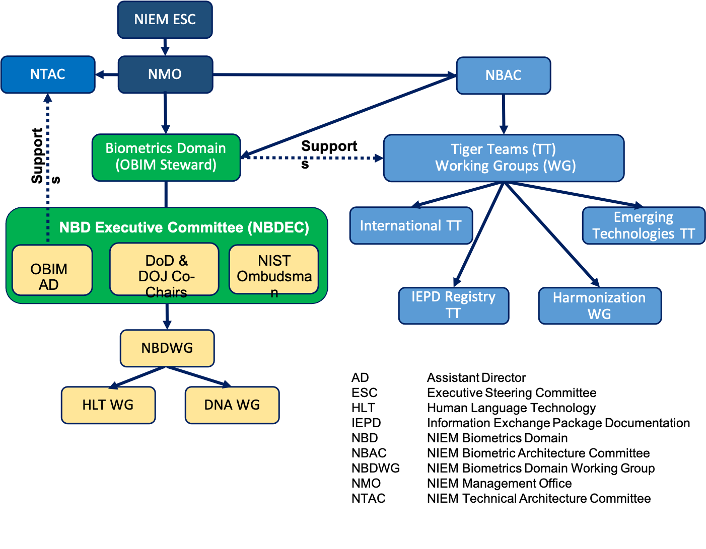

## Executive Committee

OBIM is the Domain Steward and works with the NBDEC members which include the Biometrics Domain Chair, two Co-Chairs (DoD and DOJ), and the National Institute of Standards and Technology (NIST) as Ombudsman to provide guidance to the Biometrics Domain and the community.

The NBDEC communicates the information concerning the Biometrics Domain and associated issues of domain management to the NIEM Management Office (NMO) and NIEM Business Architecture Committee (NBAC) to apprise stakeholders of developments and activities.

|NBDEC|Role|Organization|
|---|---|---|
|John Boyd|Chair|DHS OBIM|
|Jennifer Stathakis|Co-Chair|DoJ Criminal Justice Information Services (CJIS)|
|William Graves|Co-Chair|DoD|
|Diane Stephens|Ombudsman|NIST|

Please contact the [NIEM Biometrics Team](mailto:OBIMFuturesIdentityNIEM@obim.dhs.gov) to become a member and receive updates and newsletters.
