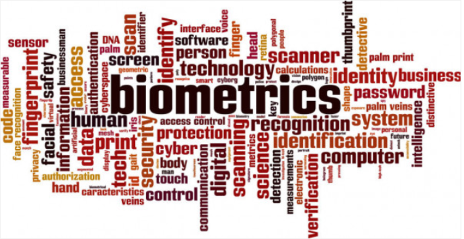

The NIEM Biometrics Domain (NBD) is a data model of agreed upon terms, definitions, and formats. It supports information sharing and promotes interoperability between mission-based organizations engaged in activities such as homeland security, national defense, border management, immigration benefits, and global law enforcement through the joint development and alignment of Extensible Markup Language (XML) Biometric Standards. The NBD was launched in July 2012 and functions under the stewardship of the Office of Biometric Identity Management (OBIM) within the Department of Homeland Security (DHS). OBIM transitioned to the DHS Management Directorate after passage of the Cybersecurity and Infrastructure Security Agency Act of 2018.

OBIM’s Assistant Director, John Boyd, is the Chair of the of the NBD. As a Domain Steward, OBIM’s role is to advance the Biometrics Domain of NIEM by providing active support to the NIEM community and collaborating with Domain Co-Chairs including the Department of Defense (DoD) and Department of Justice (DOJ) with National Institute of Standards and Technology (NIST) as the Ombudsman which forms the NBD Executive Committee (NBDEC).
OBIM manages all domain related activities, including biometrics schema development, harmonizing the schema elements across the NIEM domains, and we also contribute to the community of interest (COI) through outreach. OBIM provides input to the NIEM Business Architecture Committee (NBAC) updates, supports NBAC harmonization, and the core synchronization processes for inclusion in future NIEM releases.

OBIM contributes to NIEM Technical Architecture Committee (NTAC) as a member and provides input during the review and editing of various NIEM technical specifications. We participate in tiger teams like the Information Exchange Package Documentation (IEPD) Registry, and the Emerging Technologies Tiger Team (ET3) as well.

 


