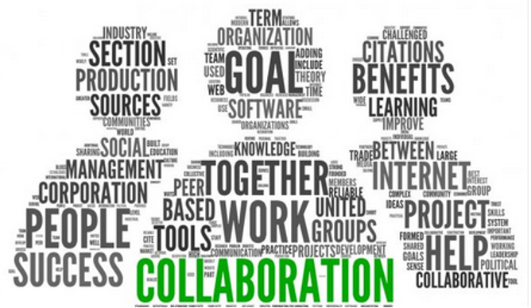
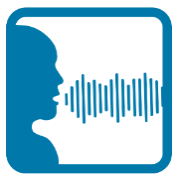

## Working Groups

The NEIM Biometrics Domain (NBD) has a standing working group, the NBDWG. The Chair, Co-Chairs, and Ombudsman of the NIEM Biometrics Domain participates in the NBDWG and the meetings are specific to potential NBD model updates. The Co-Chairs lead the NBDWG based on their respective need for potential NBD model updates, or for updates that align with ANSI/NIST-ITL updates.

The working group is administered by the DHS OBIM who is domain steward in conjunction with the NIEM Biometrics Domain Executive Committee (NBDEC), which communicates issues and resolutions among the working group, the NIEM Management Office (NMO), and the Biometrics Community of Interest (COI).

Changes to the NBD model are first confirmed and approved by the NBDWG before making it into the NIEM Domain release.

## Human Language Technology

DHS OBIM is developing an Human Language Technology (HLT) prototype and utilizes the NIEM Biometrics Domain Working Group (NBDWG) to bring together DHS, DoD, DOJ, HLT SME’s, NIEM, and NIST to mature the voice standard. The goal of this effort is to perform an initial gap analysis by mapping the HLT subject areas to NIST Type 11 and the current NIEM Biometrics Domain which will feed into the later stages of the  Map and Model phase of the NIEM Information Exchange Package Documentation (IEPD) lifecycle.

If you are interested in collaborating in this effort, learning more information about it, or other NBDWG discussions, please contact the NIEM Biometrics Team.

## HLT Artifacts

Here are the HLT related artifacts that were reviewed and updated during NBDWG sessions.

|Artifact Title|Artifact|
|Voice Conceptual Model|
|USCIS Voice Use Cases|
|FBI Forensic Voice Use Cases|
|Voice Glossary|

## DNA

DHS OBIM has developed a DNA prototype and utilized the NIEM Biometrics Domain Working Group (NBDWG) to bring together DHS, DoD, DOJ, DNA SME’s, NIEM, and NIST to mature the DNA standard.

Outcomes of the NBDWG DNA effort including updates to NIEM 4.2 and 5.1 RC, some of which are described  further below. Continued efforts are ongoing which may lead to updates to NIEM 5.2.

### DNA Record Structure

DNA Record Structure

•	Restructuring DNA record so that it contains one to many DNA Typing Technology Data.
•	Sample information should be optional metadata to DNA Typing Technology Data.

### DNA Match

•	Modify DNA match data structure to include the fields required for kinship matches.

### Pedigree

•	To have a separate type in the ANSI/NIST ITL Biometric Data Exchange Standard is recommended for exchanging the embedded pedigree information.
•	Additional fields for pedigree information are also recommended to streamline the communication of complex familial relationships.

### Height Open Source Project

•	Large peak height values must be “capped” at 32,767 in a .fsa file causing loss of data so the group discussed alternative options.  Currently working to set up an open source project to collaboratively develop the “.fsax” data format to meet DNA Vendor requirements.
•	The NBD team worked with the NIEM Management Office (NMO) to stand up a GitHub repo for the open source project to collaborate between NIST, NIEM, SME’s, and DNA Vendors to design the .fsax format to improve Peak Height representation in NIEM and American National Standards Institute (ANSI)/NIST-Information Technology Laboratory (ITL).

If you are interested in collaborating in this effort, learning more information about it, or other NBDWG discussions, please contact [the NIEM Biometrics Team](mailto:OBIMFuturesIdentityNIEM@obim.dhs.gov).

### DNA Artifacts

Here are the DNA related artifacts that were reviewed and updated during NBDWG sessions.

|Artifact Title|Artifact|
|DNA Use Cases|
|DNA Attributes List|
|Recommendations to NIST Type 18 Record|
|DNA Peak Height Analysis|
