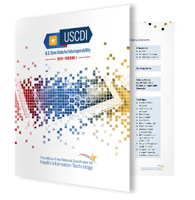

{:toc}
- TOC

## The NIEM Health Community of Interest Overview

With the adoption of the National Information Exchange Model (NIEM) at all levels of government for use cases ranging from immigration to intelligence, there’s a growing and unmet demand to exchange clinical health elements outside the typical hospital/clinician setting. For example, domains such as justice, human services, screening and emergency management are finding a greater need to standardize how they handle healthcare elements and information. However, existing health information technology (IT) standards are distinctly different from those found in the NIEM.

> Federal organizations, led by the **Federal Health Architecture (FHA)**, are working to formalize the relationship between NIEM and commonly used health IT standards.

For the past two years, FHA has evaluated the NIEM community’s need for health data, codified the specific information needed for the Health Community of Interest , then studied existing health IT standards and their associated data elements in order to determine which of the existing standards the NIEM community can use to help meet their need for health data. This mapping effort provided FHA with clear insight into which standards to draw upon, and as importantly, what gaps still exist that need to be filled in order to satisfy the NIEM health data requirements.

This work will result in a canonical and authoritative mapping that aligns NIEM with the standard fields, value sets and codes used in clinical standards as required by US Common Data Interoperability (USCDI) 2018. These fields, value sets, and codes are defined by Health Level Seven’s (HL7) Consolidated-Clinical Document Architecture (C-CDA), Fast Healthcare Interoperability Resource (FHIR), the International Health Terminology Standards Development Organization’s (IHTSDO) SNOMED, the National Library of Medicine's RxNorm, Regenstrief's LOINC, the International Statistical Classification of Diseases and Related Health Problems (ICD) ICD-10, and others.

## Overlap with other NIEM Domains

Multiple NIEM domains may require access to health information. The NIEM Health Community of Interest aims to ensure standards are in place to make it possible to share health data efficiently and securely.

The specific domains that most need access to health data include:

- Emergency Management
- Human Services
- Justice
- Military Operations
- Screening

## NIEM Health Community Goals

The NIEM Health Community’s primary objective is to identify ways to use existing health IT standards to meet the needs of the NIEM community, all while providing education and awareness about the specific requirements for protecting sensitive health data [Health Insurance Portability and Accountability Act (HIPAA), the Federal IT Acquisition Reform Act (FITARA), etc.].

### The NIEM Health Community of Interest’s objectives

1. Catalog and prioritize identified use cases for exchanging health related data outside the healthcare system;
2. Determine health IT standards/frameworks most relevant to high priority exchanges and seek alignment with the NIEM exchange development process;
3. Inventory existing NIEM health data elements;
4. Model and map required health IT standard data elements to existing or new NIEM health elements;
5. Support a community of interest around the sharing of health data with non-traditional partners.

> Through its efforts to harmonize standards and build relationships between the NIEM and clinical health communities, the NIEM Health community of interest will have a lasting impact by making health data available securely to a broader range of organizations that need to the data to better serve the American people.

## Get Involved!

The Health Community of Interest is sponsored by the U.S. Department of Health and Human Services (HHS).

Point of Contact: Robert Tagalicod
