Produced by the Federal Health Architecture

*Download this tutorial as a [document](./assets/NIEMHealth_201_Tutorial.docx) or [slides](./assets/NIEMHealth_201_Presentation.pptx).*

- TOC
{:toc .toc}

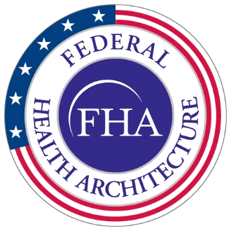
{:.img-right}

## Introduction

The Federal Health Architecture (FHA), an Office of Management and Budget (OMB) e-Gov line of business, has published a series of National Information Exchange Model (NIEM) guidance documents for the NIEM Health Community of Interest (NH-COI) and NIEM stakeholders at large:

- NIEM Health 101: An Introduction to Health Information Exchange,
- NIEM Health 102: An Introduction to Security and Privacy of Protected Healthcare Information,
- NIEM Health 201: Architecting NIEM Health IEPDs using Health Information Models, and
- NIEM Health Element Inventory.

NIEM Health 201, the third of the NIEM guidance documents, demonstrates how to use health IT standard information models to map NIEM Health use case requirements to NIEM elements and health information exchange standards elements.

By the end of this tutorial you should:

- understand the NIEM Health challenge,
- understand how to traverse from health IT standard information models to NIEM elements,
- experience a step-by-step example of creating a NIEM Health IEPD messages, and
- be introduced to a cross-domain sample use case.

Prerequisite: You should be familiar with the [NIEM Information Exchange Package Document (IEPD) lifecycle](http://niem.github.io/training/iepd-developer/) and the [IEPD tutorials](http://niem.github.io/training/iepd-developer/simple-iepd-tutorial/).

NOTE: The precursor to this tutorial are NIEM Health101: An Introduction to Health Information Exchange and NIEM Health 102: An Introduction to Security and Privacy of Protected Healthcare Information.

## NIEM Health Challenge

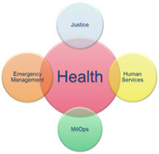
{:.img-right}

Many NIEM-based communities (e.g. Justice, Homeland Security, Child and Family Services, etc.) need to be able to exchange domain-specific healthcare information. Their challenge is to be able to exchange this healthcare information within their communities using NIEM-based technologies.

NIEM Health 101 establishes that the Federal Health Information Model (FHIM) is a useful authoritative source of health IT standard information model definitions for the NIEM Health domain. FHIM is a platform-independent logical health information model that supports semantic interoperability. FHIM is based on the HL7 reference information model (RIM). The FHIM health IT data elements have been harmonized across health information exchange standards, including HL7v2.5.1 (for meaningful use) and FHIR. It has been developed by the federal health IT community through collaboration between standards SMEs, federal agency SMEs, clinicians, and terminologists. Using FHIM as a tool to model information for the NIEM Health domain will guide the NIEM user community, bridging the gap between the NIEM and clinical health communities.

## NIEM IEPD Lifecycle

The NIEM Information Exchange Package Documentation (IEPD) lifecycle is a six-stage collaborative process involving multiple team players, including technical stakeholders (e.g., data architects, data modelers, developers), business analysts, and subject matter experts (SMEs). Since this is an interoperable exchange effort between two or more entities, it is critical for stakeholders on all sides of the exchange to participate in the planning, development, and execution of the exchange.

For the purposes of this tutorial, the focus is specifically on the second "Analyze Exchange Requirements" stage of the IEPD lifecycle. You should have your scenarios ready for the next step in this process. If you are unfamiliar with scenario planning, please visit the [IEPD starter kit](http://niem.github.io/reference/artifacts/messages/iepd/iepd-starter-kit/).

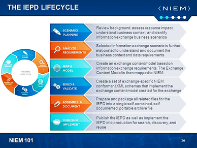

## Analyze Scenario Information Exchange Requirements

The NIEM IEPD Analyze Exchange Requirements stage involves analysis of a scenario’s data exchange requirements (e.g., content requirements, exchange partners, conditions that trigger an exchange, security requirements, etc.). The content portion of the requirements analysis stage may be captured in documents, spreadsheets, or UML diagrams. The kinds of information to be captured include:

- Data elements – These are the data fields for the message. For each field, the following information may or will be needed:
  - Element name – This is the name of the field / tag (e.g., first name, last name, street address, phone number, SSN, arrest date, unit name, and badge number)
  - Data type – The structural representation or format of the element. (e.g., string, date, number, Boolean, state code set, person data type, location data type)
  - Definition – Descriptive definitions will be required for all components in the exchange. At this stage, the semantics need to be captured, but the wording does not have to be finalized or perfected. If in a later stage the element is determined to map to NIEM, then the NIEM element will come with its own definition. The definition captured here should be clear in meaning
  - Occurrence constraints – The minimum and maximum number of times an element may appear in the instance (e.g., last name may occur once only, SSN may occur 0 to 1 times, phone number may occur 0 to many times)
  - Default occurrence constraints in NIEM are 0 to unbounded (with a few exceptions); the default in XML schema is once only. Without explicitly setting these occurrence constraints, the defaults mean that components reused from NIEM will be optional and the ones added locally will be required
  - Source information – (Optional) It may be useful or necessary in some cases to record the source of the requirement. While traceability information may seem very apparent at the time, they can be difficult to reconstruct later if needed
- Objects/Classes – These are the complex, reusable data structures where related elements are grouped together. Examples include person (with elements first name, last name, SSN, and phone) and location (with elements street address, city, state, and ZIP code).
- Values/Code Sets – This is a list of allowable values, such as a state code list or an eye color list. Code sets may come from a standard or may be custom-defined.
- Conditions/Business Rules – There may be certain restrictions on the content that need to be represented. Examples include restrictions on individual values (such as a number that cannot be less than zero or a string that must have a certain number of characters) and conditional restraints (such as if the SSN is not provided, then last name and birth date are required), etc.

NOTE: Other requirements of the exchange, such as technical, security and privacy, performance, reporting, etc. should be described in this stage as well.

## Mapping Scenario to Healthcare and NIEM Information Models

Mapping from scenario requirements to information models specific to healthcare information exchange standards and NIEM information exchange IEPDs is a multi-step process.

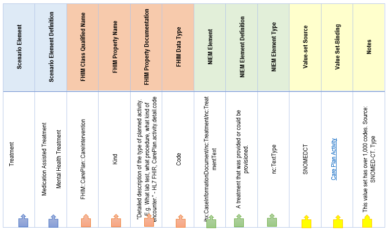

Steps: A through D

{: type="A"}
1. Determine/Identify/List/Reference scenario required element and definition which must be consistent with one another
2. Determine/Identify/List/Reference corresponding health IT standard elements specified as FHIM class qualified name, property name, property documentation, and data type
   - Compare FHIM property name with scenario element name for consistency
   - Compare FHIM property documentation value with scenario definition value for consistency
3. Identify/List/Reference corresponding NIEM element, element definition, and element type
   - Generate a set of potential NIEM elements from FHIM elements
   - Compare generated NIEM elements with potential pre-existing NIEM core and domain elements to determine if generated elements are duplicative or necessary
   - Select NIEM element to be used, either from FHIM-generated set or pre-existing NIEM set
   - Compare chosen NIEM element with scenario element for consistency
   - Compare NIEM element definition with scenario definition for consistency
   - Compare NIEM element type with FHIM data type for consistency
4. Lookup corresponding value set bindings
   - Identify/list corresponding Vocabulary Value Set Binding
     - List value set binding name
     - List value set binding source(s)
     - List value set binding notes: concepts/codes/source

## Use Case: USCDI 2018 Continuity of Care Scenario

For this tutorial we will focus on mapping just the first six USCDI 2018 demographic element requirements instead of mapping all 600+ FHIM elements implied by USCDI 2018. For the complete mapping of USCDI 2018, see the forthcoming NIEM Health Inventory and Model specification.

The second stage of meaningful use requires that healthcare providers use C-CDA document exchange regularly in care transitions, and the continuity of care document (CCD) has been identified as the most appropriate document for this purpose. These documents must be capable of including data elements known as the "Common MU Data Set" that include: patient name, sex, date of birth, race, ethnicity, preferred language, smoking status, problems, medications, medication allergies, laboratory tests, laboratory values/results, vital signs, care plan fields including goals and instructions, procedures, and care team members. In addition, encounter diagnoses, immunizations, referral reason, and discharge instructions may be required based on context.

U.S. Core Data for Interoperability (USCDI) requirements for 2018 align with the Common MU Data Set, defining the required classes/elements to be:

1. Patient Name
2. Sex (Birth Sex)
3. Date of Birth
4. Preferred Language
5. Race
6. Ethnicity
7. Smoking Status
8. Laboratory Tests
9. Laboratory Values/Results
10. Vital Signs
11. Problems
12. Medications
13. Medication Allergies
14. Health Concerns
15. Care Team Members
16. Assessment and Plan of Treatment
17. Immunizations
18. Procedures
19. Unique Device Identifier(s) for a Patient’s Implantable Device(s)
20. Goals
21. Provenance
22. Clinical Notes

Of these requirements, this tutorial will use the first six "demographic" elements (name, sex, birthdate, language, race, and ethnicity) for our modeling and mapping examples.

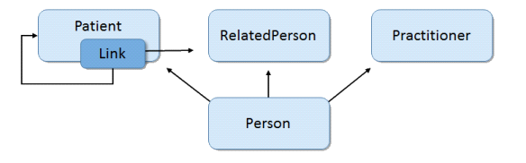
*Person Data Model Derived from USCDI 2018 Scenario Requirements*
{:style="text-align:center"}

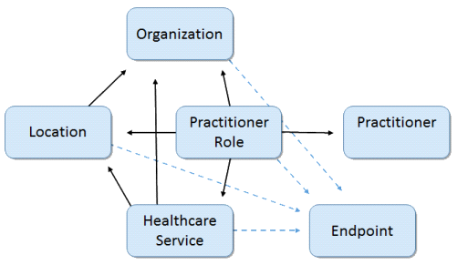
*Location/Healthcare Service/Provider Model Derived from USCDI 2018 Scenario Requirements*
{:style="text-align:center"}

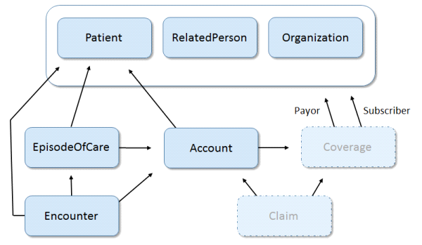
*Encounter/Episode of Care Data Model derived from USCDI 2018 Scenario Requirements*
{:style="text-align:center"}

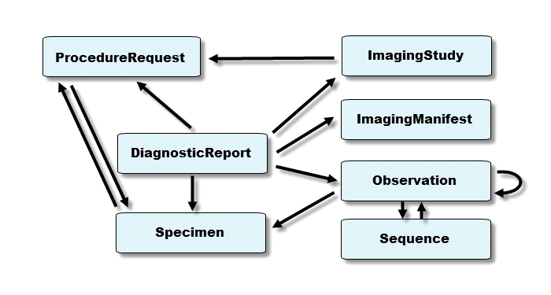
*Diagnostics & Procedures report Data Model Derived from Scenario Requirements*
{:style="text-align:center"}

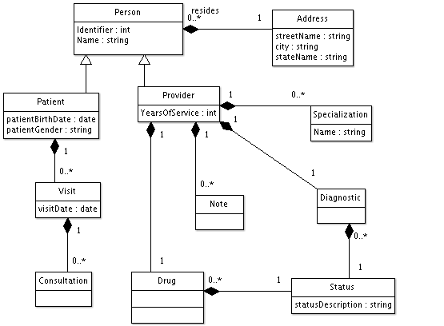

## Create Mapping Spreadsheet with Scenario Element Requirements

The first step is to create a spreadsheet that documents the requirements derived from the scenario model. In subsequent steps, we will map these requirements to canonical healthcare standards resources, NIEM elements, and FHIR elements:

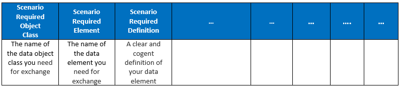

Next populate the scenario required object class and elements with their names and definitions:

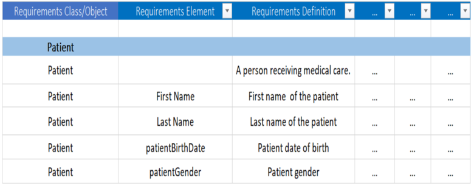
*Scenario requirements in mapping spreadsheet*
{:style="text-align:center"}

## Map Scenario Element Requirements to FHIM

The next step is to map the scenario element requirements derived from the scenario model to conical healthcare standards resources using FHIM. First add and label columns to the mapping spreadsheet for FHIM values to aid in mapping the source elements to the FHIM semantic equivalents:

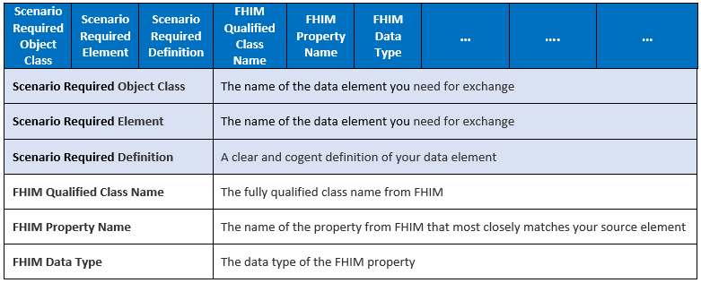

Proceed to fill in values for each FHIM column by locating the scenario requirements elements online in FHIMView (<http://fhimview.com>) or download the FHIM spreadsheet (<https://fhims.org/docs/FHIM_DataElements_AllClasses.xlsx>):

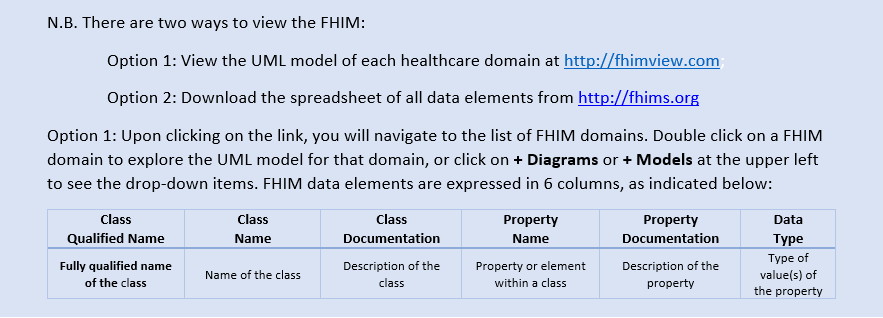

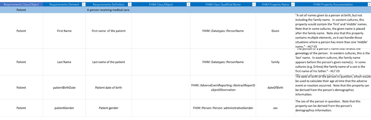
*FHIM Data Elements in mapping spreadsheet*
{:style="text-align:center"}

Within the FHIM class documentation and the property documentation columns, there are references to which of the standards to which the specific element should be bound.

## Map Scenario Element Requirements to NIEM

To map scenario element requirements to NIEM, add columns to your mapping spreadsheet for NIEM values to aid in mapping the scenario elements from FHIM semantic equivalents to the NIEM semantic equivalents:

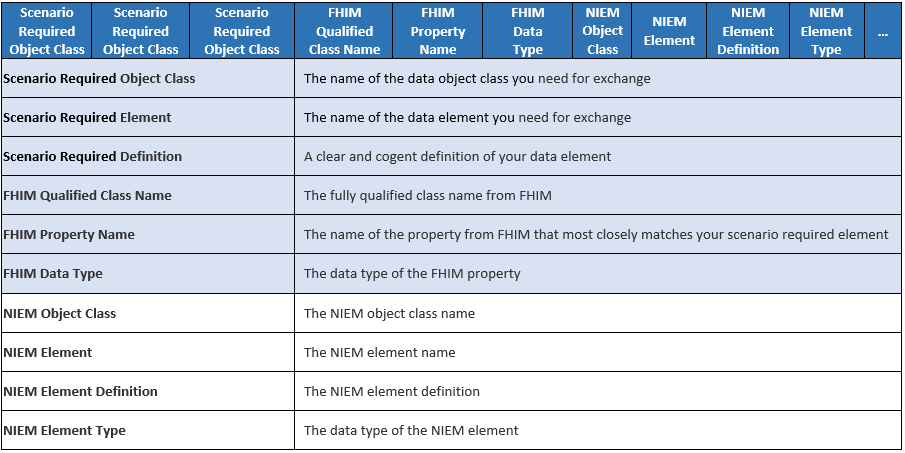

Based on the FHIM class and element definitions, identify potential NIEM elements. Then validate these NIEM elements by attempting to find any pre-existing elements in NIEM Core or other relevant NIEM domains. There are four ways to view NIEM domain elements:

- Option 1: View the UML model of each domain at <http://FHIMview.com/NIEMview>
- Option 2: View the UML model of each domain using the Movement tool at <https://beta.movement.niem.gov/>
- Option 3: Download the zip file of the schema for all data elements from <http://niem.github.io/niem-releases/>
- Option 4: Search for matching NIEM elements using the NIEM Subset Schema Generator Tool at <https://tools.niem.gov/niemtools/ssgt/index.iepd>

If you find a similar pre-existing NIEM element, you will need to decide if the pre-existing element meets the original scenario requirements and health IT standard, with the preference for using the pre-existing NIEM domain element rather than creating a new element.

*NIEM Data Elements in mapping spreadsheet*
{:style="text-align:center"}

## Generate NIEM IEPD Subset

Using NIEM element mappings usually requires a number of supporting classes, types and elements defined across the NIEM domains. However, most IEPD implementations don’t require the full breadth and depth of all the NIEM domain schema definitions. To ease assembling the necessary subset of the NIEM XML schema definitions (XSD) for a compliant IEPD, you may use the NIEM Schema Subset Generator tool (SSGT) available at <https://tools.niem.gov/niemtools/ssgt/index.iepd>.

The following figure shows the results for searching in the SSGT for the person class:

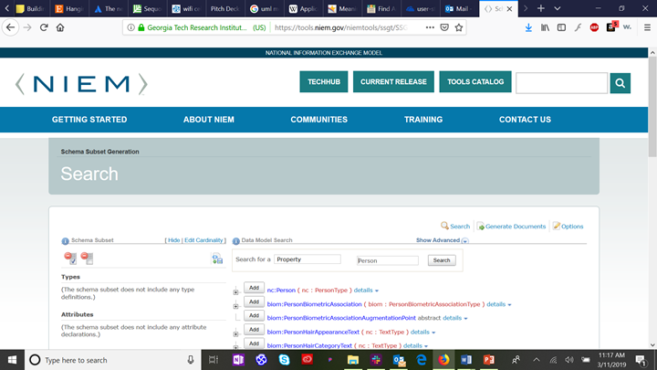

Since we know that the six patient demographic elements we are mapping are elements of the class "Person" in the NIEM Core domain, we click on the "plus" icon to expand the class definition and see the sub-elements of nc:Person.

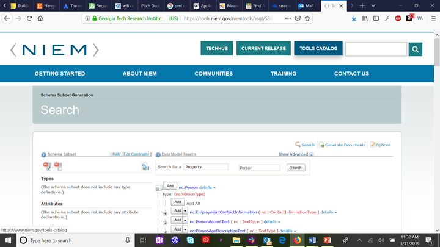

Now we find each of the six patient demographics that are sub-elements of nc:Person, and click on the "add" button next to each. By default, this will generate XML schema with a nullable cardinality (which allows zero to infinite instances of the selected element). If you wish to restrict the schema to require at least one element (e.g., Person:Name) or no more than one element (e.g., Person:BirthDate), select the "down arrow" next to the "add" button to select the appropriate cardinality. The selected types and elements will appear in the left column:

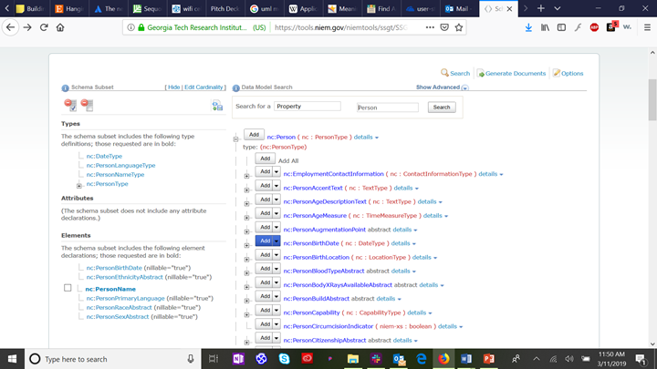

Finally, select "generate documents" from the upper right corner of the SSGT app to generate your base IEPD documents.

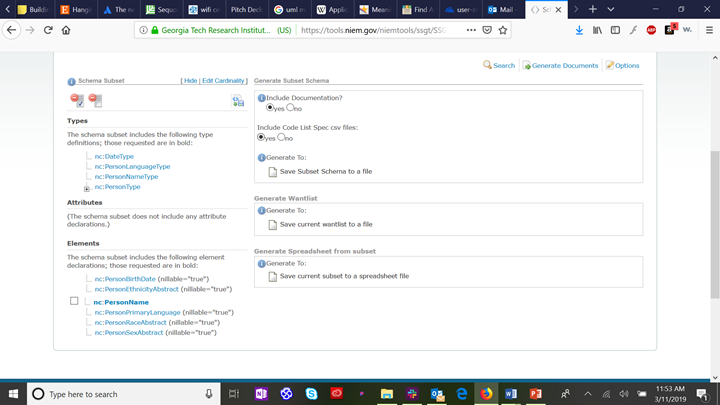

Click on "save subset schema to a file," which will bring up a standard file save dialog screen. The resulting files will include a "wantlist" (manifest) of the schema types and elements required to completely define your subset schema and a spreadsheet view of your subset schema. The generate wantlist and general spreadsheet options are for advanced users that are generating a large subset schema incrementally over time.

You now have the basic IEPD files generated and saved on your system. You may now further fill out documentation files in your IEPD folders and use the IEPD schema files to develop NIEM-compliant information exchange code. For more information on working with NIEM see <https://www.niem.gov/training>.

## Map NIEM to Vocabulary Code Sets

The final step is to add columns to the spreadsheet to map between individual NIEM elements and specific healthcare information vocabulary standard(s).

Most of the applicable standards have been discussed in NIEM Health 101. The table below serves as a refresher:

Acronym | Title | Description
------- | ----- | -----------
SNOMED | Systematized Nomenclature of Medicine-Clinical Terms | Nomenclature copyrighted by the College of American Pathologists; includes diseases, clinical findings, etiologies, procedures, and outcomes
ICD-10 | International Classification of Diseases, 10th Edition | Overlaps with SNOMED in diseases, events, and findings
LOINC | Logical observation Identifiers Names and Codes | Overlaps with SNOMED in findings and measures
CPT | Current Procedural Terminology | Overlaps with SNOMED in procedures/interventions concepts. Not as granular as LOINC; also used for insurance data exchange
X12 | Claim Status Codes | Similar to CPT but focused for insurance claims, not specific enough for clinical reporting
UMLS | National Library of Medicine’s Unified Medical Language System ® | Meta vocabulary collection that includes ICD-10, LOINC, CPT, and SNOMED

For example, the value-set bindings for VitalSignObservation to LOINC vocabulary:

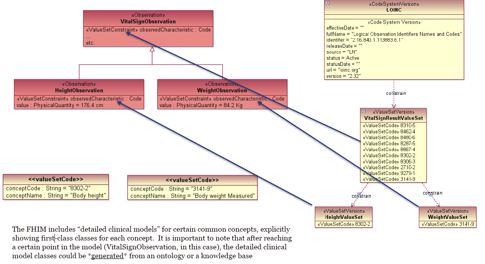

Add and label columns for vocabulary values to aid in mapping from scenario requirements:

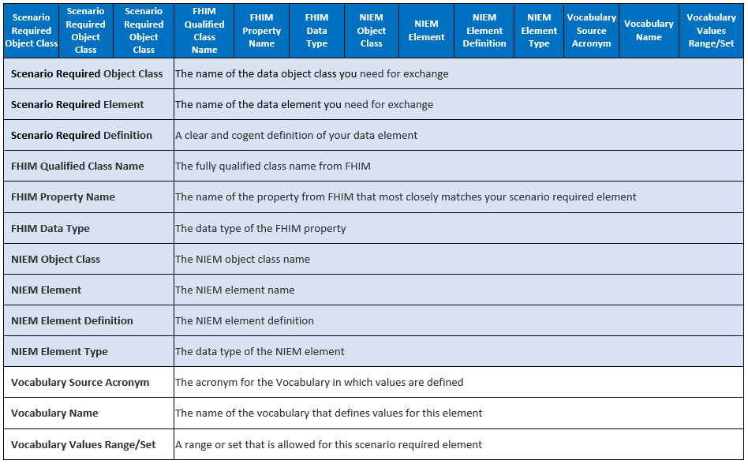

## Conclusion

This tutorial demonstrated how to use health IT standard information models such as the Federal Health Information Model (FHIM) to map NIEM Health use case requirements to NIEM elements and health information exchange standards elements, and how to create Fast Healthcare Interoperability Resources (FHIR) elements reflecting the use case requirements. In addition, NIEM Health201 strives to identify key public health IT data elements that are needed for exemplar NIEM Health community scenarios.
