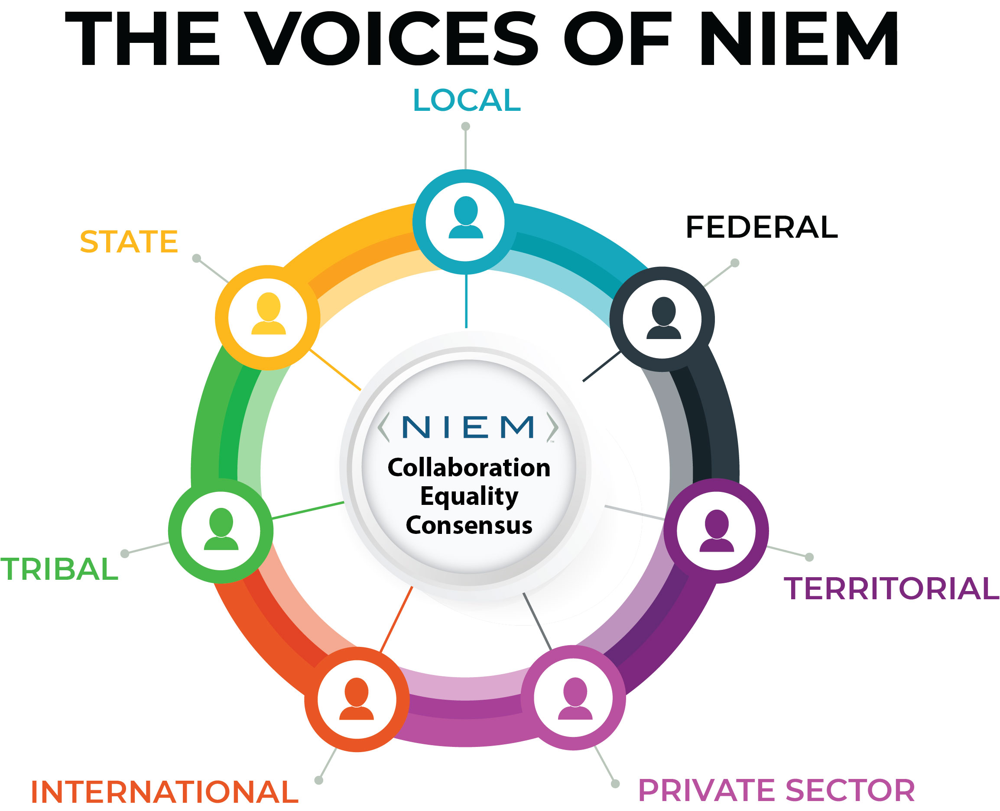

## 90 Day Proposal

<!--  -->

[Download proposal](SLTTT-90DayProposal.pptx)

### Deliverables

- [x] Charter
- [ ] Tiger Team
- [x] GitHub Page
- [ ] Marketing Materials
- [ ] Outreach Opportunities Tracker
- [ ] Grant Assistance
- [ ] NIEM Virtual Roadshow

### Technology

- Website: NIEM GitHub
- Member collaboration: Google Docs
- Webinar capabilities: NIEM MO WebEx

### Timeline

- 30 Days
  - [x] Finalize Charter
  - [x] Initial SLT TT promotion
  - [x] Establish GitHub Page
  - [x] Establish Meeting Logistics
  - [x] Host Kickoff Meeting (scheduled for 2020-06-10)
- 60 Days
  - [ ] Catalogue Existing Marketing Materials
  - [ ] Develop Outreach Opportunities Tracker
  - [ ] Plan "NIEM Roadshow Series"
- 90 Days
  - [ ] Attend / Present at Outreach Opportunities
  - [ ] Follow Up from Outreach Opportunities
  - [ ] Continue Hosting and Growing TT
  - [ ] Host "NIEM Roadshow"

### 30 Days

PROMOTE SLT TT

- Leverage NIEM MO Channels
  - Ask for 2+ representatives from each domain
  - Members of NIEM MO
- Identify Outside Communications  NIEM- SLT reps
  - Identify in first few SLT TT meetings
- Announce in NIC groups, LinkedIn

ESTABLISH GITHUB PAGE

- Work with NIEM MO to stand up page on GitHub
  - TT deliverables, meeting materials, meeting invites, reference docs

ESTABLISH MEETING LOGISTICS

- Webinar Platform - Zoom
- Collaboration Platform - Google Docs
- Meet 1x a week, 1 hr.

HOST KICKOFF MEETING

- Review TT Charter
- Review TT Membership and ID additional invitees

### 60 Days

FINALIZE CHARTER

- Work through Charter during TT Meetings
- Post final product on GitHub Page

CATALOGUE EXISTING MARKETING MATERIALS

- Review marketing materials
  - "group" into presentation type audience
- Edit materials to suit TT needs

DEVELOP "OUTREACH OPPORTUNITIES" TRACKER

- Begin to Identify Outreach Opportunities
  - Conferences, meetings, etc.
  - Should TT attend and/or present
  - If presenting, determine presentation to use

### 90 Days

ATTEND/PRESENT AT OUTREACH OPPORTUNITIES

FOLLOW UP FROM OUTREACH OPPORTUNITY

- Provide out-brief to the TT
- Follow up with organizations
- Blog post and/or summary write up for GitHub Page
- Provide updates at NBAC meetings

CONTINUE TO HOST AND GROWING THE TIGER TEAM

### Outreach Opportunity Register

- This will be a living document on Google Drive
- It will be managed by TT Co-Chairs
- All TT members will have view access
- NIEM-MO will be alerted when there are items for their approval

*Example register*

### Success Metrics

- New NIEM Participants
  - New SLT individuals joining COI Discussions
  - New SLT individuals inquiring about Domains
  - New SLT Individuals joining Domains
- New SLT TT Members
- Speaking Engagements for TT
- Representation from all 50 States
