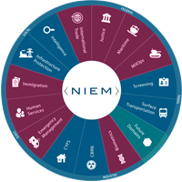

**Produced by the Federal Health Architecture**

Cait Ryan
<Cryan@irishealthsolutions.com>

Brian Handspicker
<BHandspicker@irishealthsolutions.com>

**Downloads:**

- [Final Report for FHA NIEM Health](./assets/FHA-NIEM-Health-Final-Report.docx)
- [NIEM Health Terminology](./assets/NH-Terminology.docx)
- [NIEM Health Scenarios](./assets/NIEM-Health-Scenario-Catalogue.pptx)

## Introduction

The following is a brief final report of the NIEM Health Community of Interest (COI) under the Federal Health Architecture (FHA) Program of the Office of the National Coordinator for Health IT (ONC) from 2012 to September 2019. The FHA will sunset September 9th, 2019 leaving an opportunity for a new steward to enhance this work supporting future of health interoperability.

The value of NIEM lies in its ability to exchange information across multiple domains and platforms. The ability to exchange health information using NIEM enables non-clinical NIEM Domains to save lives.

## THE NATIONAL INFORMATION EXCHANGE MODEL

The National Information Exchange Model (NIEM) is a framework for creating a common vocabulary by standardizing "data in motion" between disparate systems and domains. NIEM consists of 16 domains with 2 new domains – Housing Domain, Stewarded by the United States Department of Housing and Urban Development (HUD), and the Statistics Domain, stewarded by the US Census Bureau.

Although as a nation we have celebrated many accomplishments in Health information exchanges, these are focused on clinical exchanges where HL7 the predominant standard protocol. Overlooked are those in the NIEM community who require health information when responding to natural disasters, querying for beds in an ally's country for a wounded warrior, preparing an inmate for re-entry into the community, or matching patients to a prescription at a pharmacy. It is safe to assume that the majority of the world outside of a health provider setting will not have access to a FHIR server or be able to exchange C-CCDAs.

NIEM Health attempts to solve this dilemma by mapping the health information exchange requirements among 2 or more exchange partners so that the data exchanged will be understood by both the clinical health IT participants and the NIEM IT participants. This type of interoperability has the power to save lives by:

1. Integrating Social Determinants of Health with Healthcare Records;
2. Opioid Epidemic Early Intervention and Prevention;
3. Providing First Responders with the information they need to treat and where to transport a patient
4. Etc.

## Accomplishments

In our time leading NIEM Health we have:

{:.img-right}
1. **Surveyed NIEM Health stakeholders to understand their unique requirements.** During this time, we discovered that at a minimum, the NIEM Community needed a COI that fostered collaboration among organizations.
2. **Stood up a Community of Interest.** The COI was comprised of 30+ members from local, state and federal organizations which met on a quarterly, and then monthly basis. The COI highlight success stories, lessons learned, and milestones.
3. **Authored two documents meant to educate the NIEM user about the complexities of the health IT ecosystem** highlighting the various messaging and terminology standards as well as the importance of protecting privacy and security of protected health information.
4. **Conducted an analysis of previously modeled health related elements.** This resulted in an inventory of over 350 previously modeled and publicly defined health related elements were uncovered.
5. **Began mapping US Core Health Data for Interoperability (USCDI).** Of the 350+ health related elements uncovered; the majority have not been harmonized across NIEM domains nor do they align with HIE standards. Once mapped to USCDI.
6. **Developed a repeatable process for leveraging Health IT standards in NIEM Information Exchange Package Documents (IEPD)s.** This was done deliberately so that if NIEM Health were to be archived the NIEM community would be able to exchange health information with confidence.

## Final Recommendations

{:.img-right}

1. **Existing NIEM Health elements must be aligned across domains and enhanced based on USCDI to be leveraged with existing HIE standards;**

   Health is a nationwide public matter that carries over into nearly every NIEM domain. Yet healthcare is sophisticated, involving multiple specialties and multiple health information exchange protocols. NIEM's goal is to be simple. In the absence of a mapping between these sophisticated and simple realms, NIEM Domains have, over the years, defined many simple NIEM healthcare elements on their own - over 300 NIEM Health elements defined by over six domains, These have been defined to collect critical, yet tightly focused health information to meet the requirements of non-clinical scenarios (e.g., public health, emergency management, foster care records, etc.) But these existing elements often do not align with clinical health information standards and many are not even consistently coordinated across the multiple NIEM domains that define health-related elements.

   This has happened because, while there are effective standards for clinician-to-clinician health information exchange, there is still a need for healthcare information exchange for scenarios that are just beyond the reach of the sophisticated world of health IT standards.

   
   {:.img-right}

   Historically, when NIEM Domains need to collect or exchange healthcare information, generally that information is not central to the mission of the domain and is collected from the healthcare world at the "edge" of the domain – often by reentering data scraped from printed sources. And similarly, from the healthcare IT world's perspective, information that needs to transit from the clinical health information standards world out to a NIEM Domain, is transiting at the edge of the clinical world's domain – often by printing out a record. So, from the perspective of both NIEM Domains and the Clinical Healthcare Domain enabling NIEM Health digital Information Exchange has been an edge-case that is not central to any of their missions. These edge cases are often cases of dire emergency when seconds count to save lives.

2. **NIEM Health should focus on the exchange of healthcare information in non-traditional settings or "Edge Case Scenarios"**

   
   {:.img-right}

   The nation has made great progress in EHR implementations. But what happens outside of these clinical to clinical transactions (hospitals, doctors offices, walk-in clinics, etc.). What happens when we involved police, firefighters and ambulances? What about triaging patients after a natural disaster? Querying for available beds when air lifting a wounded warrior from the battlefield? We coined these "Edge Case" scenarios and there is still a systematic breakdown in the ability for patient health information to be exchanged to the end user, …that is where the value of NIEM for Health is most likely.

   We have identified many examples of NIEM health-related scenarios that require the ability to digitally interoperate between one or more purely NIEM Domains and the purely Clinical Healthcare Domain. Given the requirements of these many scenarios, how do we enable this interoperability between NIEM Domains and the Clinical Healthcare Domain?

3. **Leveraging NIEM for Social Determinants of Health.**

   Determinants of health are the broad range of personal, social, economic and environmental factors that determine individual and population health. NIEM is unique in that information is collected and shared for Justice, Statistics, Housing and Human Services. It is our belief that many of the social, economic and physical environment metrics for an area are likely to be drawn from databases created and supported by agencies which are required to use NIEM for interoperability. The vision here is to work with others organizations to enable automating the integration of SDOH data from these NIEM-based sources into HL7-based clinical health records.

## CLOSING REMARKS

We recognize that in order to achieve nationwide health interoperability, we must look beyond the borders of provider-to-provider, clinical health information exchanges. NIEM Health, if executed correctly, has the power to save lives. It has been an honor and a privilege to have worked on this program and contribute in some small way to the improvement of our nation's health and well-being.
