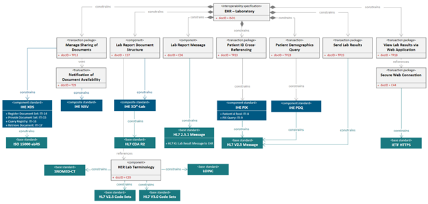

Produced by the Federal Health Architecture

*Download this tutorial as a [document](./assets/NIEMHealth_101_Tutorial.docx) or [slides](./assets/NIEMHealth_101_Presentation.pptx).*

- TOC
{:toc .toc}

{:.img-right}

## Introduction

The Federal Health Architecture (FHA), an Office of Management and Budget (OMB) e-Gov Line of business, has published a series of National Information Exchange Model (NIEM) guidance documents for the NIEM Health Community of Interest (NH-CoI) and NIEM stakeholders at large:

- NIEM Health 101: An Introduction to Health Information Exchange,
- NIEM Health 102: An Introduction to Security and Privacy of Protected Healthcare Information,
- NIEM Health 201: Architecting NIEM Health IEPDs using Health Information Models, and
- NIEM Health Element Inventory.

NIEM Health 101, the first of these NIEM guidance documents, provides a brief overview of the current health information technology (IT) landscape, related reference exchange and terminology standards, the NIEM Health challenges, and the Federal Health Information Model (FHIM). By the end of this guidance document you should better understand:

- NIEM Health information exchange challenge,
- Health IT landscape and health IT standards,
- National Information Exchange Model (NIEM),
- Federal Health Information Model (FHIM), and
- NIEM Health Community of Interest (CoI) Strategy.

{:.note}
> This document should be used in conjunction with the follow-up NIEM Health 201: Architecting NIEM Health information exchange packet documentation (IEPDs) using Health Information Models guidance document and [https://fhims.org](https://fhims.org).

The FHA program was created to coordinate health IT activities among more than 20 federal agencies that provide public healthcare services. FHA’s mission was to support federal agencies and their public-sector exchange partners navigating the various health information systems standards and policies. By ensuring health information systems are interoperable, FHA enables organizations to send, receive, interpret, and operationalize patient information.

## NIEM Health Information Exchange Challenge

{:.img-right}

Many NIEM-based communities (e.g., Justice, Homeland Security, Child and Family Services, etc.) need to be able to exchange domain-specific, albeit limited, healthcare information. Their challenge is to be able to exchange this limited healthcare information within their communities using NIEM-based technologies.

As these NIEM-based communities begin to experience a growing need to exchange health data with partner organizations, it is important that NIEM is compatible with existing health information standards (e.g., HL7, Consolidated- Clinical Document Architecture (C-CDA), Fast Healthcare Interoperability Resources (FHIR). However, it is apparent through conversations with the NIEM community that it does not require an information model in its entirety, but instead requires a small subset of general health information. For instance, querying hospitals for available beds, dealing with emergency response, placing recovering drug users in half-way houses, etc. It is for this reason that we recommend identifying and mapping key health standard data elements that may be used instead of modeling a NIEM Health domain from scratch. This guidance is intended to help bridge the gap of health information readily available to NIEM and further the shared goal for national and regional interoperability based on a common vocabulary.

## Health IT Landscape and Standards

The Healthcare Information Management Systems Society (HIMSS) summarizes today’s health IT landscape as a sophisticated, heterogeneous environment comprised of a wide assortment of health care settings, stakeholders, and information systems, specifically for healthcare delivery. The sheer number and diversity of healthcare entities (e.g., providers, payers, researchers, and beneficiaries) presents a considerable information sharing challenge within the healthcare ecosystem. The challenge to interoperability [1](#footer-1) is primarily due to an absence of a widely adopted and integrated standardized vocabulary, or shared language. Despite the advent of several interoperability standards development organizations (SDO), the assortment of interoperability standards are not harmonized, resulting in gaps, overlaps, and duplication. Furthermore, competing standards create barriers to further development and progress of the standardized exchange and use of protected health information (PHI).

{:.note}
>For further information about health IT standards, please reference the white paper [Evaluating Health IT Standards](https://www.himss.org/evaluating-hit-standards), published by Healthcare Information Management and Systems Society.

## HIT Data Exchange Standards

HIT data exchange standards have evolved through the years to improve messaging and to drive high data quality. These structure and syntax standards include, but are not limited to:

- Digital Imaging and Communications in Medicine (DICOM): Imaging
- HL7v2.x: Messaging
- HL7v3: Clinical Document Architecture (CDA), C-CDA, Continuity of Care Document (CCD) documents
- HL7 FHIR: an emerging web services and document standard, currently in trial use
- National Council for Prescription Drug Programs (NCPDP): developed by the American National Standards Institute, an accredited standards development organization providing healthcare solutions, largely to the pharmaceutical industry

## Health IT Vocabulary Standards

Health IT vocabulary standards were developed to ensure semantic and syntactical consistency with the characteristics and attributes for clinically specific patient medical record information terminologies. Examples of relevant vocabulary standards include:

- SNOMED CT (Systematized Nomenclature of Medicine-Clinical Terms): developed by the International Health Terminology Standards Development Organization (IHTSDO), it is comprehensive, multilingual clinical healthcare terminology originally intended to record observations for pathologists
- RxNorm: developed by the National Library of Medicine (NLM), it provides normalized names for clinical drugs and links its names to many of the drug vocabularies commonly used in pharmacy management and drug interaction software
- LOINC (Logical Observation Identifiers Names and Codes): developed by Regenstrief, LOINC serves as an international standard for identifying health measurements, observations, and documents, and was originally intended for reporting lab results
- CPT® (Current Procedural Terminology): developed by the American Medical Association (AMA) for the purpose of billing outpatient and office procedures
- ICD-10 (International Statistical Classification of Diseases and Related Health Problems 10th revision):  a medical classification list developed by the World Health Organization (WHO), containing codes for diseases, signs and symptoms, abnormal findings, complaints, social circumstances, and external causes of injury or diseases. ICD-10 is commonly used for billing purposes
- DSM-5 (The Diagnostic and Statistical Manual of Mental Disorders): developed and administered by the American Psychiatric Association (APA), serves as a psychiatric classification and diagnostic reference tool

In addition to the standards mentioned above, health information is protected by a number of privacy and security laws that proscribe the type of terminology to utilize as well as the protections around the information being shared.

The combination of a history of multiple healthcare information exchange standards and multiple different specialized healthcare vocabulary standards results in a very sophisticated health IT environment that is challenging for non-healthcare domains to implement directly.

## The National Information Exchange Model (NIEM)

NIEM is an XML information exchange standard, initially adopted by law enforcement and public safety information exchanges at the national and regional level. The systematic breakdown in communications and information sharing between emergency and first responders during the catastrophic events of 9/11 served as an inter-agency driver to develop NIEM.

{:.img-right}

NIEM specifies the foundation and building blocks for interoperable information exchange by serving as a common XML vocabulary, integrated with established information exchange standards and processes, to support cross-domain information sharing and efficient information exchange between inter-related public and private service domains (e.g., law enforcement, public safety, healthcare, etc.). As a result:

- NIEM breaks down interagency stovepipes
- NIEM enables agencies to share information that crosses system, agency, and jurisdictional borders
- NIEM improves decision-making, agility, and efficiency in satisfying business needs
- NIEM supports interoperability and reuse, reducing costs

Originally based on the Global Justice XML Data Model (GJXDM), NIEM has expanded and seen many iterative changes since its formal launch in April 2005 by the chief information officers of the U.S. Department of Homeland Security and the U.S. Department of Justice. As of June 2019, there are over 14 NIEM domains and emerging communities of interest (CoI), including Agriculture, Biometrics, Chemical Biological Radiological and Nuclear Defense (CBRN), Emergency Management, Human Services, Immigration, Infrastructure Protection, Intelligence, International Trade, Justice, Maritime, Military Operations, Screening, and Surface Transportation. Today all 50 states and over 19 federal agencies are using NIEM. The benefits of NIEM have also extended to Europe, the Americas, Australia, and Asia.

As NIEM's adoption continues to expand to new domains, non-clinical domains that utilize health data elements for information exchange will require clinical informatics subject matter expertise to successfully navigate through the complexities of the health IT/health information exchange (HIE) environment. Furthermore, operational health IT/HIE safeguards must be in place to ensure that the exchange of health information is always legal, secure, and private. The real-world challenge is to harmonize across all information exchange standards and to build a compelling business case, through the Federal Health Information Modeling and Standards (FHIMS) program and its corresponding FHIM that defines standardized terminology and the mapping of data relationships, both key to the efficient exchange of healthcare information.

## Federal Health Interoperability Modeling and Standards (FHIMS)

The Federal Health Interoperability Modeling and Standards (FHIMS) program coordinates with partner agencies including:

- Department of Defense (DoD)
- Department of Veteran Affairs (VA)
- Department of Health and Human Services (HHS)
- The Office of the National Coordinator for Health IT (ONC)
- The Centers for Medicare & Medicaid Services (CMS)

These agencies collaborate in the development of standards for electronic medical/health records (EMR/EHR), health information and terminology, and the coordination of cross-agency efforts in relevant SDOs. Many partner agencies are active in SDOs; this enables the FHIMS program to unify agencies into a single voice while limiting redundant SDO participation. For those agencies that do not yet have a presence in an SDO, the FHIMS program provides a mechanism for agencies to delegate issues to another agency.

## Federal Health Interoperability Model (FHIM)

Together these agency experts, including agency subject matter experts (SMEs), clinicians, and terminologists have developed and now maintain the Federal Health Information Model (FHIM). FHIM encompasses over 85% of the health domain and proscribes to the implementer exactly which terminology should be used for a given exchange, dictated by HIPAA, NCPDP, etc. This allows NIEM Health developers to identify and map key health standard data elements from the FHIM instead of modeling a NIEM Health domain from scratch.

FHIM is a logical health information model that supports semantic interoperability through development of a comprehensive and integrated set of implementation guides. The model harmonizes information and terminology content across federal partners and SDOs, and can standardize data concepts and serve as a repository of such concepts. As an implementation-neutral planning and reference tool, FHIM can be used to develop other health information models, including NIEM Health elements and NIEM Health IEPDs.

FHIM is modeled in standard Unified Modeling Language (UML) with both structural and terminology concepts, defining code systems, concept domains, and value sets. The terminology model describes the underlying terminology constructs, including URLs and version numbers. The FHIM logical model “binds to” (i.e. links to) the FHIM terminology model using the same UML profile. The combination of the two FHIM models result in rigorous specifications against which conformance can be tested. FHIM maintains traceability to underlying standards – especially HL7, NCPDP, and X12 – as well as to Standards & Interoperability (S&I) initiatives. FHIM leverages the HL7 Reference Information Model (RIM) as a reference model, but can also leverage other reference models. FHIM derivative models add “interoperability use cases,” which provide additional constraints. These derivative models maintain traceability to the use cases and to the HL7 EHR-S functional model. The models can be leveraged by organizations for internal use in systems and database development.

There are multiple benefits of FHIM's model-driven approach:

- Analyze once, yet implement multiple times because clinical and business concepts remain the same regardless of HIE standards
- Ensure uniformity across HIE conceptual landscape for consistent HIE structures and clinical models
- FHIM can be used to create standards (e.g., HL7 implementation guides) because it is a product information management (PIM) system
- Generate code to minimize cost and human errors
- Generate other artifacts, including implementation guides, developer interactive assistance, etc.
- Enable seamless transition from one HIE to another HIE

FHIM continues to evolve as information modeling and terminology teams work closely together on health informatics concepts to promote the implementation of FHIM.  To learn more about leveraging health standards for NIEM IEPD development, refer to the follow up tutorial to this work, NIEM 201: Architecting NIEM Health IEPDs using Health Information Models.

## NIEM and FHIM: A Brief Comparison

NIEM and FHIM are logical information models. Combining the best features of FHIM and NIEM can result in NIEM Health IEPDs that are:

- Based on structures and constraints defined in NIEM
- Compatible with similar structures in consolidated CDA implementation guides required for meaningful use

FHIM's biggest value is that it is proscriptive, so that implementers know exactly which terminologies to use for a given element. Consequently, the resulting NIEM IEPDs comply with federal laws and are interoperable with existing standards-based health IT systems.

The table below provides a high-level view of the similarities and differences between NIEM and FHIM.

Comparison | NIEM | FHIM
---------- | ---- | ----
Purpose | Provides a common vocabulary to enable efficient information exchange across diverse public and private organizations | Supports semantic interoperability and harmonizes information requirements from federal partners and multiple standards organizations
Model Type | Conceptual, Information Exchange, XML | Logical, Information, Platform-Neutral, Standard-Neutral, UML
Functionality | XML-based. “Proven” information exchange framework | Semantic-based. Information exchange, traceability, and alignment into industry information models and standards
Standards-Neutral | Yes, each domain steward determines the specific standards they will use | Yes, contents identified in the FHIM may be represented using any technology or standard representation
Platform-Neutral | Yes | Yes
Domains | 14, each is specific to a community of interest (CoI) | 41, all are specific to healthcare
Exchanges | NIEM is about the semantics, not the transportation, of XML messages. Web services {e.g. Web Services Description Language (WSDL)} provide the mechanism for exchanging machine-to-machine NIEM XML messages | FHIM does not provide a method for transport of information
Developed By | Federal, State, and Local Agencies | Federal Agencies
Used By | Federal, State, and Local Agencies | Federal Agencies

Within health IT, the functional interoperability between EHR and HIE creates the bridge for inter-connecting the diverse modern health care ecosystem. NIEM can take business and information requirements to create reusable IEPDs to address the needs of heterogeneous health information producers and consumers. The IEPD is fundamental to the NIEM architecture, acting as a complete definition of an information exchange. It is composed of a data exchange schema, a business context, and usage documentation.

Like NIEM, FHIM provides a common vocabulary and a well-defined set of model elements to make the federal healthcare system more understandable and healthcare information more readily exchanged. It synthesizes recognized industry standards into a single model and is validated using a bottom up approach to its construction by agency representatives. The FHIM assists in identifying shared information needs across two or more agencies, building mutual understanding and consensus on data sharing and documents, and automating key aspects of information exchange protocols.

NIEM is comprised of industry specific domains, or CoIs, that are developed and maintained by a specific federal agency. For example, the Human Services domain is owned by HHS and the Military Operations (MilOps) domain is owned by DoD. Both domains are built from the NIEM core components and domain-specific elements.

Unlike NIEM, FHIM domains consist of a singular CoI: health. Therefore, FHIM domains are classified into an assortment of healthcare categories, as illustrated below, and can be viewed at <http://fhims.org/>.

## NIEM Health Community-of-Interest Strategy

The NIEM Health Community-of-Interest Strategy is to:

- Lead NIEM Health Community discussions to define use-cases, and functional and technical requirements
- Develop high-level FHIM to NIEM core mapping and guidance documents, including:
  - Identifying most commonly needed health elements
  - Leveraging FHIM to access authoritative element value sets and code sets
- Develop detailed guidance documents with examples on how to traverse from the NIEM core to required FHIM elements, and how elements can be associated at least conceptually if not through notation
- Review, revise, and socialize NIEM Health guidance documents with the NIEM Health community of interest
- Catalog and prioritize identified use cases for exchanging health related data outside the healthcare system
- Determine health IT standards/frameworks most relevant to high priority exchanges and seek alignment with the NIEM exchange development process
- Inventory existing NIEM health data elements
- Model and map required health IT standard data elements to existing or new NIEM Health elements
- Support a community of interest around the sharing of health data with non-traditional partners

## Conclusion

Functional interoperability, both within and outside of HIEs, is the key to accurate, useful, and secure information exchange networks. Currently, disparate interoperability standards vary between health IT organizations and their stakeholders, and the lack of consistent standards adoption impedes HIE interoperability on both a national and regional scale.

FHIM can provide a means to harmonize competing standards and produce artifacts that will improve the quality of implementations through model-to-model transformations. Information exchanges have numerous requirements related to standards and terminology. Their diverse data sets and cross-domain relevance require the FHIM logical model to describe the contents of the information exchanges (e.g., HL7, NIEM). With model driven health tools, the FHIM can bridge the existing semantic gap between domains (e.g., HL7, NIEM) to consistently exchange health information, regardless of context, by defining explicit information exchange requirements in a platform independent fashion.

Thus, FHIM and NIEM can be leveraged together to increase accuracy and to ease the development of functional interoperability between federal, local, state, and tribal health entities by adopting and integrating the standardized use and exchange of health data amongst various public health entities.

---

<a name="footer-1">1</a> The 21st Century Cures Act (Cures Act) defines interoperability in the context of health information technology (health IT) as health IT that

{: type="A" }
1. enables the secure exchange of electronic health information with, and use of electronic health information from, other health information technology without special effort on the part of the user;
2. allows for complete access, exchange, and use of all electronically accessible health information for authorized use under applicable State or Federal law; and
3. does not constitute information blocking as defined in section 3022(a).
