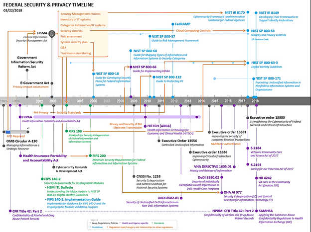

Produced by the Federal Health Architecture

*Download this tutorial as a [document](./assets/NIEMHealth_102_Tutorial.docx) or [slides](./assets/NIEMHealth_102_Presentation.pptx).*

- TOC
{:toc .toc}

{:.img-right}

## Preface

The Federal Health Architecture (FHA), an Office of Management and Budget (OMB) e-gov line of business, has published a series of National Information Exchange Model (NIEM) guidance documents for the NIEM Health community of interest (NH-COI) and NIEM stakeholders at large:

- NIEM Health 101: An Introduction to Health Information Exchange,
- NIEM Health 102: An Introduction to Security and Privacy of Protected Healthcare Information,
- NIEM Health 201: Architecting NIEM Health IEPDs using Health Information Models, and
- NIEM Health Element Inventory.

NIEM Health 102, the second of these NIEM guidance documents, provides a brief overview of the security and privacy of protected healthcare information (PHI). By the end of this guidance document you should better understand:

- protected healthcare information,
- privacy requirements of HIPAA,
- exceptions to the HIPAA Privacy Rule,
- security consequences of the privacy requirements of HIPAA, and
- trusted healthcare information exchange frameworks.

Note: This document should be used in conjunction with the follow-up NIEM Health 201: Architecting NIEM Health Information Exchange Package Documentation (IEPDs) using Health Information Models guidance document and <https://fhims.org>.

## Introduction

Privacy and security are both critical aspects of health information technology (IT). In 1996, Congress passed the Health Information Portability and Accountability Act (HIPAA), a federal law that provides data privacy and security provisions for safeguarding medical information. HIPAA was created in response to the need for healthcare reform, which aims to protect health insurance coverage, improve access to healthcare, reduce fraud and abuse, improve quality of healthcare, and decrease healthcare administrative costs (electronic transactions).

HIPAA places protections on most individually identifiable health information held or transmitted by a covered entity or its business associate in any form or medium, whether electronic, on paper, or orally. HIPAA has since been updated and additional policies and guidelines have been released surrounding patient privacy as well as the security of data (the type of information that is protected, how and where data is stored, the transport of information, etc.). The updates produced policies and procedures throughout federal, state, and local government agencies.

HIPAA resulted in established regulations to protect both the privacy and security of certain health information through two key rules:

1. HIPAA Privacy Rule: national standards for the protection of certain health information
2. HIPAA Security Rule: national set of security standards for protecting certain health information that is either held locally or transferred in electronic form

## Privacy Rule Requirements of HIPAA

The HIPAA Privacy Rule defines protected health information (PHI). PHI includes demographic information, which relates to the individual's past, present, or future physical or mental health or condition, the provision of health care to the individual, or the past, present, or future payment for the provision of health care to the individual, and that identifies the individual or for which there is a reasonable basis to believe can be used to identify the individual. Beyond health conditions, PHI includes many common identifiers when they can be associated with the individual's health information, such as:

- Name
- Birth Date
- Fax Number
- Account Number
- Web URL
- Street Address
- Admission Date Electronic Mail Address Certification/License Number
- License Plate Number
- City
- Discharge Date
- Social Security Number
- Vehicle Type and/or Serial Number
- Device Identifier and/or Serial Number
- Precinct
- Date of Death
- Medical Record Number
- IP Network Address
- Full Face Photographic Images
- Zip Code
- Telephone Number
- Health Plan Beneficiary Number
- Biometrics (e.g., Finger Prints, etc.)
- Any Other Identifying Information

The Privacy Rule assigns individuals with specific rights to their PHI. Furthermore, The Privacy Rule requires all healthcare organizations and partners to protect individuals' health records and other identifiable health information by establishing privacy protection safeguards as well as conditions and limits on the appropriate usage and disclosures of PHI. The Privacy Rule provides health information exchanges (HIEs) the foundation for balancing the privacy of individuals' PHI and assuring that their PHI is accessible to healthcare parties for providing care, payment, etc. The Privacy Rule warrants that everyone's health information is protected, especially during the ongoing flow of health information needed to provide quality health care and to protect public health.

The advent of digital healthcare systems {computerized physician order entry (CPOE), electronic health records (EHR), etc.}, has advanced healthcare delivery in so many ways: digital speed, interconnectivity, analytics, mobility, self-service, etc. The Security Rule protects individual's privacy while promoting the adoption, by diverse covered entity organizations (providers, health plans, clearinghouses, etc.), of leading and emerging digital healthcare technologies that drive high quality healthcare delivery through streamlined efficiencies, automation, new products, and services. The Security Rule enables the Privacy Rule's protections by establishing both technical and non-technical guidance and requirements which covered entities must both comply with and operationalize to secure electronic PHI (e-PHI). The Security Rule's flexibility and scalability empowers the diverse healthcare market to operationalize policies, procedures, and technologies relative to the entity's organizational size, structure, and security and privacy risks to their consumers' e-PHI.

In 2009, The Health Information Technology for Economic and Clinical Health (HITECH) Act was authorized through the American Recovery and Reinvestment Act (ARRA) to promote the adoption and meaningful use of health IT. Specifically, Subtitle D addresses the privacy and security of the electronic transmission of PHI and e-PHI, including strengthening legal enforcement of HIPAA. The following timeline illustrates the various security and privacy legislation and accompanying guidance that exist for the protections of PHI.

ARRA stipulates that the National Institute of Standards and Technology (NIST) [1](#footer-1) should:

- Advance health care information enterprise integration through standards and testing
- Establish grants program for health enterprise integration centers
- Consult on:
  - Updating the Federal Health IT Strategic Plan
  - Voluntary certification programs
  - Health IT implementation
- Provide pilot testing of standards and implementation specifications, as requested

NIST's security specifications enable communicating parties to ensure the confidentiality, integrity, and availability of health information and helps to safeguard health information by providing a harmonized set of security principles and guidelines for use in developing secure health information exchanges. Technical accomplishments include:

- Lead author of the Healthcare Information Technology Standards Panel (HITSP) secure communication construct
- Developed a resource guide for covered entities implementing the HIPAA Security Rule

## Exceptions to the HIPAA Privacy Rule

The Department of Health and Human Services (HHS) Office of Civil Rights (OCR) released clarifying guidance on the exceptions to the HIPAA Privacy Rule that permit disclosure of PHI.

This guidance clarifies that physicians may disclose PHI to a patient's loved ones, regardless of whether they are recognized as relatives under applicable law, and that permissive disclosures are not limited by the sex or gender identity of the person. For example, a patient's unmarried same-sex partner is recognized as a relative with whom PHI can be shared.

In addition, this HIPAA and HITECH legislation permits disclosure of PHI to support public health activities including:

- Reporting communicable disease
- Conducting public health monitoring
- Public health investigations and interventions
- Supporting Food and Drug Administration monitoring
- Identifying patients exposed to a communicable disease
- Supporting medical monitoring of the workplace
- Supporting the use of certified electronic health record technology

The full list of exceptions to the HIPAA Privacy Rule includes:

- 45 C.F.R. § 164.502(a)(1)(iii) - Incidental to a permissible use or disclosure
- 45 C.F.R. § 164.506(c) - Treatment, payment, and healthcare operations purposes (e.g., quality improvement and credentialing)
- 45 C.F.R. § 164.510(a)(1) - Directory information (e.g., location, general health status) [requires opportunity for the patient to agree or object to the disclosure]
- 45 C.F.R. § 164.510(b)(1)(i) - To notify family/friends/patient-designated individuals involved in a patient's care [requires opportunity for the patient to agree or object to the disclosure]
- 45 C.F.R. § 164.510(b)(1)(ii) - To notify persons responsible for a patient's care or a patient's location and health status [requires opportunity for the patient to agree or object to the disclosure]
- 45 C.F.R. § 164.512(b)(1)(i) - To legally-designated authorities for public health activities
- 45 C.F.R. § 164.512(b)(1)(ii) - To report child abuse or neglect
- 45 C.F.R. § 164.512(b)(1)(iii) - With respect to an FDA-regulated product or activity for which that person has responsibility, for the purpose of activities related to the quality, safety or effectiveness of such FDA-regulated product or activity.
- 45 C.F.R. § 164.512(b)(1)(iv) - To an individual exposed to or at risk of contracting a communicable disease
- 45 C.F.R. § 164.512(b)(1)(v) - To an employer about an employee's work-related illness/injury or about findings from workplace medical surveillance when the patient is treated at the employer's request
- 45 C.F.R. § 164.512(c) - To report suspected abuse, neglect, or domestic violence in limited circumstances
- 45 C.F.R. § 164.512(d) - To a health oversight agency for health oversight purposes
- 45 C.F.R. § 164.512 (e) - In response to a judicial or administrative order, subpoena, etc.
- 45 C.F.R. § 164.512(f) - To law enforcement for limited purposes (e.g., reporting a crime on site)
- 45 C.F.R. § 164.512 (g)(h) - To coroners, medical examiners, funeral directors, and organ procurement agencies to enable their legally authorized duties
- 45 C.F.R. § 164.512(i) - For research purposes subject to restrictions
- 45 C.F.R. § 164.512(j) - To a person reasonably able to prevent a serious and imminent threat to the health or safety of a person or the public
- 45 C.F.R. § 164.512(k) - For specialized government functions (e.g., national security)
- 45 C.F.R. § 164.512(l) - To an organization responsible for providing worker's compensation benefits

Please reference [The Nationwide Privacy and Security Framework for Electronic Exchange of Individually Identifiable Health Information](https://www.healthit.gov/sites/default/files/nationwide-ps-framework-5.pdf) (the Privacy and Security Framework), the [HIPAA Omnibus Rule](https://www.hhs.gov/hipaa/for-professionals/privacy/laws-regulations/combined-regulation-text/omnibus-hipaa-rulemaking/index.html), and the [Health Information Technology for Economic and Clinical Health Act (HITECH)](https://www.hhs.gov/hipaa/for-professionals/special-topics/hitech-act-enforcement-interim-final-rule/index.html) for additional information regarding exceptions and exclusions for PHI and HIEs.

## Security Rule Requirements of HIPAA

FHA's mission is to support the federal agencies and their public sector exchange partners and navigate the various standards and policies, like those mentioned above, so that health information systems are securely interoperable and patient information can be securely sent, received, interpreted, and operationalized. FHA leads its federal partners and other healthcare stakeholders in the development of innovative HIE architectures for the sharing of EHRs on a nationwide and regional basis. This huge effort requires careful planning, analysis, and coordination of an extensive number of agency business requirements, healthcare delivery requirements, subject matter research, public policy, relevant technologies, and enterprise systems and devices for the sharing of healthcare information including data security, patient consent, clinical informatics, interoperability standards, and accurate healthcare provider and payer data.

## Evolution of Security and Privacy Protections

Since HIPAA was first introduced, several laws, regulations, and polices have been developed to ensure that information exchange between healthcare participants (providers, HIEs, organizations, etc.) complies with HIPAA as well as new or updated standards and guidance. These include:

- HITECH (ARRA) – Health Information Technology for Economic and Clinical Health
- DoDI 8582.01 – Security of Unclassified DoD Information on Non-DoD Information Systems
- DoDI 8580.02 – Security of Individually Identifiable Health Information in DoD Health Care Programs
- VHA Directive 1605.01 – Privacy and Release of Information
- DHA AI 077 – Security Categorization (SC) and Control Selection for Information Technology (IT)
- S.2184 – Veterans Community Care and Access Act of 2017
- S.2193 – Caring for our Veterans Act of 2017
- HR 4242 – VA Care in the Community Act (Section 202)
- NPRM: CFR Title 42: Part 2 – Confidentiality of Alcohol and Drug Abuse Patient Records
- SAMSHA – Applying the Substance Abuse Confidentiality Regulation

In 2002, the federal government took matters of protecting information a step further when the Office of Management and Budget (OMB) introduced the Federal Information Security Management Act (FISMA) that applied to all federal information, including healthcare information.

## The Federal Information Security Management Act (FISMA)

Updated in 2014, FISMA defines a comprehensive framework to protect government information, operations, and assets against natural or man-made threats. All agencies must be compliant with FISMA and report their compliance annually to the Office of Management and Budget. FISMA's primary framework is detailed in NIST 800-53, therefore all agencies must be complaint with NIST standards and guidelines to meet annual compliance guidelines FISMA.

FISMA assigns responsibilities to various agencies to ensure the security of data in the federal government. The act requires program officials, and the head of each agency, to conduct annual reviews of information security programs, with the intent of keeping risks at or below specified acceptable levels in a cost-effective, timely, and efficient manner. NIST outlines nine steps toward compliance with FISMA:

1. Categorize the information to be protected
2. Select minimum baseline controls
3. Refine controls using a risk assessment procedure
4. Document the controls in the system security plan
5. Implement security controls in appropriate information systems
6. Assess the effectiveness of the security controls once they have been implemented
7. Determine agency-level risk to the mission or business case
8. Authorize the information system for processing
9. Monitor the security controls on a continuous basis [2](#footer-2)

NIST's FISMA Implementation Project aims to produce several key security standards and guidelines required by Congressional legislation to comply with FISMA. These publications include FIPS 199, FIPS 200, and NIST Special Publications 800-53, 800-59, and 800-60. Additional security guidance documents are being developed in support of the project, including NIST Special Publications 800-37, 800-39, 800-171, 800-53A, and NIST Interagency Report 8011. It should be noted that the Computer Security Division continues to produce other security standards and guidelines in support of FISMA.

Some specific goals include:

- Implementing a risk management program
- Protecting information and information systems from unauthorized access, use, disclosure, disruption, modification, or destruction
- Ensure the integrity, confidentiality, and availability of sensitive information

The American Recovery and Reinvestment Act (ARRA) stipulates that NIST should:

- Advance health care information enterprise integration through standards and testing
- Establish grants program for health enterprise integration centers
- Consult on:
  - Updating the Federal Health IT Strategic Plan
  - Voluntary certification programs
  - Health IT implementation
- Provide pilot testing of standards and implementation specifications, as requested

NIST's security specifications enable communicating parties to ensure the confidentiality, integrity, and availability of health information and help to safeguard health information by providing a harmonized set of security principles and guidelines for use in developing secure health information exchanges. Technical accomplishments include:

- Served as lead author of HITSP secure communication construct
- Developed a resource guide for covered entities implementing the HIPAA Security Rule

Though HIPAA and FISMA are governed by different federal agencies and serve different purposes, there is overlap between them. "When following FISMA requirements, HIPAA compliance can be achieved without any additional methodology. This philosophy does not hold true going in the opposite direction; HIPAA guidelines do not encompass all that is required for FISMA compliance. HIPAA provides guidance to address the provisions required for the security and privacy of health-related information, whereas FISMA presents instructions for the security of the information and the information systems which support these activities." [3](#footer-3)

Though the scope of this document is to provide a high-level overview of HIPAA requirements for protecting certain health information, it is important to point out the many laws that govern and direct privacy and security of protected health information. Below is a timeline FHA created that depicts the evolution of privacy and security governance for the federal agencies. A table with links to helpful references for additional reading is included. It is important to note that state and local governments often have their own laws for security and privacy.

## Trust Frameworks

There are several trust frameworks that healthcare organizations can leverage to help secure the confidentiality, integrity, and availability of information and data. A cyber security framework is a roadmap for securing IT systems with established policies and procedures in the form of agreements. These include eHealth Exchange's Data Use and Reciprocal Support Agreement (DURSA), NIST's Cyber Security Framework, and the Office of the National Coordinator for Health Information Technology (ONC's) Trusted Exchange Framework and Common Agreement (TEFCA).

## eHealth Exchange's DURSA

The eHealth Exchange network started as the Nationwide Health Information Network (NHIN), an ONC program initiative.  The network discontinued operating under the NHIN moniker and changed its name to eHealth Exchange when it moved to a private sector initiative, supported by The Sequoia Project. The eHealth Exchange network exists independently of Sequoia, the company. eHealth Exchange staff provide support to the eHealth Exchange network, the coordinating committee and participants, all under the direction of the eHealth Exchange coordinating committee. The coordinating committee has authority over the eHealth Exchange network, not Sequoia, and Sequoia is not a party to the DURSA. The DURSA is:

- A comprehensive, multi-party trust agreement that is signed by all eligible entities who wish to exchange data among eHealth Exchange participants
- A scalable alternative to multiple point-to-point agreements, which are not sustainable for widespread information exchange
- Requires signatories to abide by common set of terms and conditions that establish participants' obligations, responsibilities, and expectations
- The obligations, responsibilities, and expectations create a framework for safe and secure health information exchange. These are designed to promote trust among participants and protect the privacy, confidentiality, and security of the health data that is shared.

The DURSA was developed through an intensive effort facilitated by ONC, with consensus among a diverse group of private and state entities and federal agencies. As a living document, the agreement will be modified over time under the direction of the coordinating committee.

## NIST's Cyber Security Framework

The Framework for Improving Critical Infrastructure Cybersecurity (known as the Cybersecurity Framework), is a voluntary framework. It is a risk-based approach to managing cybersecurity risk and is composed of three parts: the Framework Core, the Framework Implementation Tiers, and the Framework Profiles. Each Framework component reinforces the connection between business drivers and cybersecurity activities. It is comprised of standards, guidelines, and best practices to manage cybersecurity-related risk.  The Cybersecurity Framework's prioritized, flexible, and cost-effective approach helps to promote the protection and resilience of critical infrastructure and other sectors important to the economy and national security (NIST, n.d.).

NIST developed a publication, [The Cybersecurity Framework: Implementation Guidance for Federal Agencies](https://csrc.nist.gov/csrc/media/publications/nistir/8170/draft/documents/nistir8170-draft.pdf), to assist federal agencies in strengthening their cybersecurity risk management. The publication helps agencies determine an appropriate implementation of the Framework for Improving Critical Infrastructure Cybersecurity. Federal agencies can use the Cybersecurity Framework to complement the existing suite of NIST security and privacy risk management standards, guidelines, and practices developed in response to FISMA, as amended. The relationship between the Cybersecurity Framework and the NIST Risk Management Framework are discussed in eight use cases.

## ONC's Trusted Exchange Framework and Common Agreement

While the HITECH Act of 2009 stimulated significant health IT adoption and exchange of electronic health information with the goal of providing every American with access to their information, the interoperability needed to support this goal remains a work in progress. The 21st Century Cures Act's (Cures Act) 2 focus on trusted exchange is an important next step toward establishing an interoperable health system that:

- Empowers individuals to use their electronic health information to the fullest extent
- Enables providers and communities to deliver smarter, safer, and more efficient care
- Promotes innovation at all levels

In the Cures Act, Congress identified the importance of interoperability and laid out a path for establishing the interoperable exchange of electronic health information. In collaboration with NIST, federal agencies, industry stakeholders, and ONC are working diligently to further advance the interoperability progress made to date and to address a complex-yet-core tenet of interoperability - building and maintaining trust. Among other provisions, in Section 4003, Congress directed ONC to "develop or support a trusted exchange framework, including a common agreement among health information networks nationally," which may include:

- "(I) a common method for authenticating trusted health information network participants;
- "(II) a common set of rules for trusted exchange;
- "(III) organizational and operational policies to enable the exchange of health information among networks, including minimum conditions for such exchange to occur; and
- "(IV) a process for filing and adjudicating noncompliance with the terms of the common agreement.6

The ONC's vision is to seek to achieve a system where individuals are at the center of their care and where providers have the ability to securely access and use health information from different sources; a system where an individual's health information is not limited to what is stored in EHRs, but also includes information from many different sources (including technologies that individuals use every day) and provides a longitudinal picture of their health. Additionally, this will enable a system where public health agencies and researchers can rapidly learn, develop, and deliver cutting edge treatments by having secure, appropriate access to electronic health information.

## Conclusion

NIEM is currently supporting the secure and private exchange of information in production today. As NIEM's adoption continues to grow, non-clinical domains that utilize health data elements for information exchange will require clinical informatics subject matter expertise to securely and privately navigate through the complexities of the health IT/HIE.

## Appendix

**NIST SP 800-37**

**Guide for Applying the Risk Management Framework to Federal Information Systems: A Security Life Cycle Approach**

The purpose of SP 800-37 Rev 1 is to provide guidelines for applying the Risk Management Framework to federal information systems to include conducting the activities of security categorization, security control selection and implementation, security control assessment, information system authorization, and security control monitoring.

<https://csrc.nist.gov/publications/detail/sp/800-37/rev-1/final>

**NIST SP 800-63r3**

**Digital Identity Guidelines**

These guidelines provide technical requirements for federal agencies implementing digital identity services and are not intended to constrain the development or use of standards outside of this purpose. The guidelines cover identity proofing and authentication of users (such as employees, contractors, or private individuals) interacting with government IT systems over open networks. They define technical requirements in each of the areas of identity proofing: registration, authenticators, management processes, authentication protocols, federation, and related assertions. This publication supersedes NIST Special Publication 800-63-2.
<https://pages.nist.gov/800-63-3/sp800-63-3.html>

- Section A - Enrollment and Identity Proofing Requirements
- Section B - Authentication and Lifecycle Management
- Section C – Federation and Assertions
- Section D – Identity Assertions

<https://github.com/usnistgov/800-63-3/tree/volume-d> (link to NIST document repository for Part D, Identity Assertion, yet to be released)

**NIST SP 800-122**

**Guide to Protecting the Confidentiality of Personally Identifiable Information (PII)**

The purpose of this document is to assist federal agencies in protecting the confidentiality of personally identifiable information (PII) in information systems. The document explains the importance of protecting the confidentiality of PII in the context of information security and explains its relationship to privacy using the the Fair Information Practices, which are the principles underlying most privacy laws and privacy best practices. PII should be protected from inappropriate access, use, and disclosure. This document provides practical, context-based guidance for identifying PII and determining what level of protection is appropriate for each instance of PII. The document also suggests safeguards that may offer appropriate levels of protection for PII and provides recommendations for developing response plans for incidents involving PII. Organizations are encouraged to tailor the recommendations to meet their specific requirements.

<http://nvlpubs.nist.gov/nistpubs/Legacy/SP/nistspecialpublication800-122.pdf>

**NIST SP 800-171**

**Protecting Controlled Unclassified Information in Nonfederal Systems and Organizations**

The protection of Controlled Unclassified Information (CUI) while residing in nonfederal information systems and organizations is of paramount importance to federal agencies and can directly impact the ability of the federal government to successfully carry out its designated missions and business operations. This publication provides federal agencies with recommended requirements for protecting the confidentiality of CUI: (i) when the CUI is resident in nonfederal information systems and organizations; (ii) when the information systems where the CUI resides are not used or operated by contractors of federal agencies or other organizations on behalf of those agencies; and (iii) where there are no specific safeguarding requirements for protecting the confidentiality of CUI prescribed by the authorizing law, regulation, or governmentwide policy for the CUI category or subcategory listed in the CUI Registry. The requirements apply to all components of nonfederal information systems and organizations that process, store, or transmit CUI, or provide security protection for such components. The CUI requirements are intended for use by federal agencies in contractual vehicles or other agreements established between those agencies and nonfederal organizations.

<http://nvlpubs.nist.gov/nistpubs/SpecialPublications/NIST.SP.800-171r1.pdf>

**NIST SP 800-53r5**

**Security and Privacy Controls for Information Systems and Organizations**

This publication provides a catalog of security and privacy controls for federal information systems and organizations to protect organizational operations and assets, individuals, other organizations, and the nation from a diverse set of threats including hostile attacks, natural disasters, structural failures, human errors, and privacy risks. The controls are flexible and customizable and implemented as part of an organization-wide process to manage risk. The controls address diverse requirements derived from mission and business needs, laws, executive orders, directives, regulations, policies, standards, and guidelines. The publication describes how to develop specialized sets of controls, or overlays, tailored for specific types of missions and business functions, technologies, environments of operation, and sector-specific applications. Finally, the consolidated catalog of controls addresses security and privacy from a functionality perspective (i.e., the strength of functions and mechanisms) and an assurance perspective (i.e., the measure of confidence in the security or privacy capability). Addressing both functionality and assurance ensures that information technology products and the information systems that rely on those products are sufficiently trustworthy.

<https://csrc.nist.gov/csrc/media/publications/sp/800-53/rev-5/draft/documents/sp800-53r5-draft.pdf>

Article on 800-53 and the Internet of Things

- NIST retools security and privacy controls for IoT era, <https://fcw.com/articles/2017/08/16/nist-retools-for-iot.aspx>

**NIST IR 8149**

**Developing Trust Frameworks to Support Identity Federations, 16 January 2018.**

When supported by trust frameworks, identity federations provide a secure method for leveraging shared identity credentials across communities of similarly-focused online service providers. This document explores the concepts around trust frameworks and identity federations and provides topics to consider in their development.

<https://csrc.nist.gov/publications/detail/nistir/8149/draft>

**NIST IR 8170 (DRAFT)**

**The Cybersecurity Framework: Implementation Guidance for Federal Agencies** (Comment period closed June 30th 2017)

This publication assists federal agencies in strengthening their cybersecurity risk management by helping them to determine an appropriate implementation of the Framework for Improving Critical Infrastructure Cybersecurity (known as the Cybersecurity Framework). Federal agencies can use the Cybersecurity Framework to complement the existing suite of NIST security and privacy risk management standards, guidelines, and practices developed in response to the FISMA, as amended.  The relationship between the Cybersecurity Framework and the NIST Risk Management Framework are discussed in eight use cases.

<https://csrc.nist.gov/csrc/media/publications/nistir/8170/draft/documents/nistir8170-draft.pdf>

**NIST SP 800-66 Rev. 1**

**An Introductory Resource Guide for Implementing the Health Insurance Portability and Accountability Act (HIPAA) Security Rule**

This publication discusses security considerations and resources that may provide value when implementing the requirements of the HIPAA Security Rule, was written to help educate readers about information security terms used in the HIPAA Security Rule and to improve understanding of the meaning of the security standards set out in the Security Rule, direct readers to helpful information in other NIST publications on individual topics the HIPAA Security Rule addresses, and aid readers in understanding the security concepts discussed in the HIPAA Security Rule. This publication does not supplement, replace, or supersede the HIPAA Security Rule itself.

<http://nvlpubs.nist.gov/nistpubs/Legacy/SP/nistspecialpublication800-66r1.pdf>

**Framework for Improving Critical Infrastructure Cybersecurity v 1.1**

The Framework is a risk-based approach to managing cybersecurity risk and is composed of three parts: the Framework Core, the Framework Implementation Tiers, and the Framework Profiles. Each Framework component reinforces the connection between business drivers and cybersecurity activities. These components are explained below.

<https://www.nist.gov/cyberframework/draft-version-11>

- Office of Civil Rights Review of NIST Cyber Security Framework <https://www.hhs.gov/sites/default/files/nist-csf-to-hipaa-security-rule-crosswalk-02-22-2016-final.pdf>
- Related article, Cyber Security Framework Draft, <https://www.govconwire.com/2017/05/nist-reveals-draft-of-cyber-security-framework/>

**FIPS 140-2**

**Security Requirements for Cryptographic Modules**

FIPS specifies the security requirements that will be satisfied by a cryptographic module, providing four increasing, qualitative levels intended to cover a wide range of potential applications and environments. The areas covered, related to the secure design and implementation of a cryptographic module, include: specification; ports and interfaces; roles, services, and authentication; finite state model; physical security; operational environment; cryptographic key management; electromagnetic interference/electromagnetic compatibility (EMI/EMC); self-tests; design assurance; and mitigation of other attacks

- <https://csrc.nist.gov/publications/detail/fips/140/2/final>

**FIPS 140-2: HSM ITL Bulletin**

**Understanding the Major Update to NIST SP 800-63: Digital Identity Guidelines**

This bulletin outlines the updates NIST recently made in its four-volume Special Publication (SP) 800-63, Digital Identity Guidelines, which provide agencies with technical guidelines regarding the digital authentication of users to federal networked systems.

- <https://www.nist.gov/publications/understanding-major-update-nist-sp-800-63-digital-identity-guidelines>

**FIPS 140-2: Implementation Guide**

**Implementation Guidance for FIPS 140-2 and the Cryptographic Module Validation Program**

This Implementation Guidance document is issued and maintained by NIST and the Communications Security Establishment Canada (CSE), which serve as the validation authorities of the Cryptographic Module Validation Program (CMVP) for their respective governments. The CMVP validates the test results of National Voluntary Laboratory Accreditation Program (NVLAP) accredited Cryptographic and Security Testing (CST) Laboratories which test cryptographic modules for conformance to Federal Information Processing Standard Publication (FIPS) 140-2, Security Requirements for Cryptographic Modules. The Cryptographic Algorithm Validation Program (CAVP) addresses the testing of Approved Security Functions, Approved Random Number Generators and Approved Key Establishment Techniques which are referenced in the annexes of FIPS 140-2. This document is intended to provide programmatic guidance of the CMVP, and in particular, clarifications and guidance pertaining to the Derived Test Requirements for FIPS PUB 140-2 (DTR), which is used by CST Laboratories to test for a cryptographic module's conformance to FIPS 140-2. Guidance presented in this document is based on responses issued by NIST and CSE to questions posed by the CST Labs, vendors, and other interested parties. Information in this document is subject to change by NIST and CSE.

- <https://csrc.nist.gov/csrc/media/projects/cryptographic-module-validation-program/documents/fips140-2/fips1402ig.pdf>

**FIPS 199**

**Standards for Security Categorization of Federal Information and Information Systems**

The purpose of this document is to provide a standard for categorizing federal information and information systems according to an agency's level of concern for confidentiality, integrity, and availability and the potential impact on agency assets and operations should their information and information systems be compromised through unauthorized access, use, disclosure, disruption, modification, or destruction.

- <https://csrc.nist.gov/publications/detail/fips/199/final>

**FIPS 200**

**Minimum Security Requirements for Federal Information and Information Systems**

FIPS 200 is the second standard that was specified by FISMA. It is an integral part of the risk management framework that NIST developed to assist federal agencies in providing levels of information security based on levels of risk. FIPS 200 specifies minimum security requirements for federal information and information systems and a risk-based process for selecting the security controls necessary to satisfy the minimum requirements.

- <https://csrc.nist.gov/publications/detail/fips/200/final>

**Executive Order 13681, Oct 2014**

**Improving the Security of Consumer Financial Transactions**

<https://obamawhitehouse.archives.gov/the-press-office/2014/10/17/executive-order-improving-security-consumer-financial-transactions>

**Executive Order 13636, Feb 2013,**

**Improving Critical Infrastructure Cybersecurity**

<https://obamawhitehouse.archives.gov/the-press-office/2013/02/12/executive-order-improving-critical-infrastructure-cybersecurity>

On February 13, 2013, the President signed Executive Order 13636, "Improving Critical Infrastructure Cybersecurity," which gave NIST the responsibility to develop a framework to reduce cyber risks to critical infrastructure (the Cybersecurity Framework). As directed in the Executive Order, NIST, working with industry, will develop the Cybersecurity Framework and the Department of Homeland Security (DHS) will establish performance goals. DHS, in coordination with sector-specific agencies, will then support the adoption of the Cybersecurity Framework by owners and operators of critical infrastructure and other interested entities, through a voluntary program.

- NIST Testimony, Oversight of Executive Order 13636 and Development of the Cybersecurity Framework: <https://www.nist.gov/speech-testimony/oversight-executive-order-13636-and-development-cybersecurity-framework>
- DHS Incentive Study: <https://www.dhs.gov/sites/default/files/publications/dhs-eo13636-summary-report-cybersecurity-incentives-study_0.pdf>

**Executive Order 13800, May 2017**

**Strengthening the Cyber-Security of federal Networks and Critical Infrastructure**

On May 11, 2017, President Trump issued Executive Order 13800, **Strengthening the Cybersecurity of Federal Networks and Critical Infrastructure** (EO 13800 or EO), to improve the nation's cyber posture and capabilities in the face of intensifying cybersecurity threats to its digital and physical security. EO 13800 initiates action on four fronts:

1. It secures the federal networks that operate on behalf of the American people.
2. It encourages collaboration with industry to protect critical infrastructure that maintains the American way of life.
3. It strengthens the deterrence posture of the United States and builds international coalitions.
4. It places much needed focus on building a stronger cybersecurity workforce, which is critical for the nation's long-term ability to strengthen its cyber protections and capabilities.

The EO consists of three sections: Cybersecurity of Federal Networks, Cybersecurity of Critical Infrastructure, and Cybersecurity for the Nation. A working group of representatives from across the U.S. Government has been formed to implement EO work.

<https://www.whitehouse.gov/the-press-office/2017/05/11/presidential-executive-order-strengthening-cybersecurity-federal>

**DHA AI 077**

**Security Categorization (SC) and Control Selection for Information Technology (IT)**

This Defense Health Agency Administrative Instruction (DHA-AI), based on the authority of References (a) and (b), and in accordance with the guidance of References (c) through (h), establishes the DHA's procedures for the SC and Control Selection for DHA IT.

This AI applies to:

- All DHA personnel, to include: assigned or attached Service members, federal civilians, contractors (when required by the terms of the applicable contract), and other personnel assigned temporary, or permanent duties at DHA to include regional and field activities (remote locations)
- DHA-owned IT or DHA-controlled IT that receives, processes, stores, displays, or transmits Department of Defense (DoD) information

[DHA AI 077 Security Categorization and Control Selection for IT](https://community.max.gov/download/attachments/1572209837/DHA%20AI%20077%252c%20Security%20Categorization%20and%20Control%20Selection%20for%20IT.pdf?version=1&modificationDate=1536077532563&api=v2)

**S.2184**

**Veterans Community Care and Access Act of 2017**

<https://www.congress.gov/bill/115th-congress/senate-bill/2184/text>

**S.2193**

**Caring for our Veterans Act of 2017**

<https://www.congress.gov/115/bills/s2193/BILLS-115s2193pcs.xml>

**HR 4242**

**VA Care in the Community Act (Section 202)**

<https://www.congress.gov/bill/115th-congress/house-bill/4242/text>

**42 CFR Part 2**

**Substance Abuse and Confidentiality**

This regulation applies to all records relating to the identity, diagnosis, prognosis, or treatment of any patient in a substance abuse program that is conducted, regulated, or directly or indirectly assisted by any department or agency of the United States.

*LINK*

**ISO/IEC 27001:2013**

**International Standard ISO/IEC 27001:2013**

This specifies the requirements for establishing, implementing, maintaining and continually improving an information security management system within the context of the organization. It also includes requirements for the assessment and treatment of information security risks tailored to the needs of the organization. The requirements set out in ISO/IEC 27001:2013 are generic and are intended to be applicable to all organizations, regardless of type, size or nature.

*LINK*

---

<a name="footer-1">1</a> NIST is a non-regulatory agency whose missions is to promote U.S. innovation and industrial competitiveness by advancing measurement science, standards, and technology in ways that enhance economic security and improve our quality of life. <https://www.nist.gov/about-nist/our-organization/mission-vision-values>

<a name="footer-2">2</a> <https://searchsecurity.techtarget.com/definition/Federal-Information-Security-Management-Act>

<a name="footer-3">3</a> <https://www.vmracks.com/resources/hipaa-compliant-hosting-insights/how-fisma-requirements-can-impact-hipaa-compliance/>
