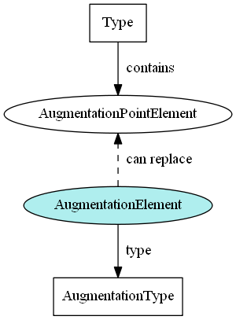
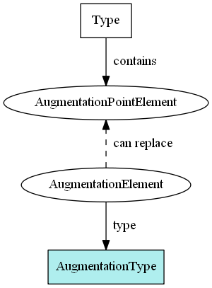

- TOC
{:toc}

## Augmentation container elements

### Name

The element name must correspond with the augmented type name, with the `"Type"` representation term being replaced by `"Augmentation"`.

> For example, the Immigration domain augmentation container element for `nc:PersonType` is `"im:PersonAugmentation"`.

### Substitution group

The element must be declared to be substitutable for an augmentation point element.

> For example, `im:PersonAugmentation` is substitutable for `nc:PersonAugmentationPoint`.

### Type

An augmentation container element must have a corresponding augmentation type.

> For example, `im:PersonAugmentation` has type `im:PersonAugmentationType`.

#### Name

The type name must correspond with the augmented container element name, with the addition of the `"Type"` representation term.

> For example, the Immigration domain augmentation container type for nc:PersonType is `im:PersonAugmentationType`.

#### Parent type

An augmentation type must extend `structures:AugmentationType`.

> For example, `im:PersonAugmentationType` extends type `structures:AugmentationType`.

#### No augmentation point element of its own

Each augmentation should be defined on the original type.  Augmentations of augmentations are not allowed.

> For example, `im:PersonAugmentationType` should not contain an augmentation point element like `im:PersonAugmentationPoint`.  Any substitutions from other namespaces should be made directly on the original augmentation point element, `nc:PersonAugmentationPoint`.
