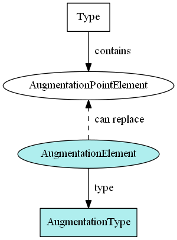
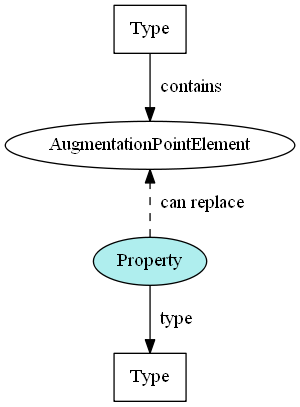

- TOC
{:toc}

## Containers



### XML example

The examples below show element nc:Person in an XML instance, with and without augmentations.

**nc:Person without augmentations:**

```xml
<nc:Person>
  <nc:PersonName>
    <nc:PersonFullName>John Smith</nc:PersonFullName>
  </nc:PersonName>
  <nc:PersonBirthDate>
    <nc:Date>1950-01-01</nc:Date>
  </nc:PersonBirthDate>
</nc:Person>
```

**nc:Person with domain and local augmentations:**

```xml
<nc:Person>

  <!-- Original nc:PersonType properties -->
  <nc:PersonName>
    <nc:PersonFullName>John Smith</nc:PersonFullName>
  </nc:PersonName>
  <nc:PersonBirthDate>
    <nc:Date>1950-01-01</nc:Date>
  </nc:PersonBirthDate>

  <!-- Justice augmentation properties -->
  <j:PersonAugmentation>
    <j:PersonAdultIndicator>true</j:PersonAdultIndicator>
    <j:PersonDEAIdentification>
      <nc:IdentificationID>1234567890</nc:IdentificationID>
    </j:PersonDEAIdentification>
  </j:PersonAugmentation>

  <!-- Maritime augmentation properties -->
  <m:PersonAugmentation>
    <m:PersonBiometricURI>https://biometric.example.com/23532356684</m:PersonBiometricURI>
  </m:PersonAugmentation>

  <!-- Local augmentation properties -->
  <ext:PersonLocalID>52d6632</ext:PersonLocalID>

</nc:Person>
```

### XML Schema example

This snippet, from a subset of the Maritime domain, shows how an augmentation container element and type are defined.

- The augmentation container element is designated as substitutable for `nc:PersonAugmentationPoint`, defined in the Core snippet above.

```xml
<xs:complexType name="PersonAugmentationType">
  <xs:annotation>
    <xs:documentation>A data type that supplements nc:PersonType.</xs:documentation>
  </xs:annotation>
  <xs:complexContent>
    <xs:extension base="structures:AugmentationType">
    <xs:sequence>
      <xs:element ref="m:PersonBiometricURI" minOccurs="0" maxOccurs="unbounded"/>
    </xs:sequence>
    </xs:extension>
  </xs:complexContent>
</xs:complexType>

<xs:element name="PersonAugmentation" type="m:PersonAugmentationType" substitutionGroup="nc:PersonAugmentationPoint" nillable="true">
  <xs:annotation>
    <xs:documentation>Additional information about a person.</xs:documentation>
  </xs:annotation>
</xs:element>
```

### XML Schema template

This template creates an augmentation container element and type.

- The type should contain references to the additional content.
- The element should be substitutable for an augmentation point element.

```xml
<!-- Augmentation type, like j:PersonAugmentationType -->
<xs:complexType name="NAMEAugmentationType">
  <xs:annotation>
    <xs:documentation>A data type for additional information about NAME</xs:documentation>
  </xs:annotation>
  <xs:complexContent>
    <xs:extension base="structures:AugmentationType">
      <xs:sequence>
        <xs:element ref="ELEMENT1" minOccurs="0" maxOccurs="unbounded"/>
        <xs:element ref="ELEMENT2" minOccurs="0" maxOccurs="unbounded"/>
      </xs:sequence>
    </xs:extension>
  </xs:complexContent>
</xs:complexType>

<!-- Augmentation container element, like j:PersonAugmentation 
(substitutable for nc:PersonAugmentationPoint) -->
<xs:element name="NAMEAugmentation" type="NAMEAugmentationType" substitutionGroup="NAMEAugmentationPoint">
  <xs:annotation>
    <xs:documentation>Additional information about NAME</xs:documentation>
  </xs:annotation>
</xs:element>
```
{: #training-aug-container }



## Direct substitutions



The following example shows a local element `PersonFictionalCharacterIndicator` that is directly substitutable for nc:PersonAugmentationPoint:

### XML example

```xml
<nc:Person>
  <nc:PersonName>
    <nc:PersonFullName>John Smith</nc:PersonFullName>
  </nc:PersonName>
  <nc:PersonBirthDate>
    <nc:Date>1950-01-01</nc:Date>
  </nc:PersonBirthDate>

  <!-- The augmentation element, substituted directly for nc:PersonAugmentationPoint -->
  <ext:PersonFictionalCharacterIndicator>true</ext:PersonFictionalCharacterIndicator>
</nc:Person>
```

### XML Schema example

The only thing that distinguishes an augmentation element that is a direct substitution is its substitution group.

```xml
<xs:element name="PersonFictionalCharacterIndicator" type="niem-xs:boolean"
  substitutionGroup="nc:PersonAugmentationPoint">
    <xs:annotation>
      <xs:documentation>True if this person is a fictional character; false otherwise.</xs:documentation>
    </xs:annotation>
</xs:element>
```

### XML Schema template

```xml
<xs:element name="ELEMENT_NAME" type="ELEMENT_TYPE" substitutionGroup="NAMEAugmentationPoint">
  <xs:annotation>
    <xs:documentation>ELEMENT_DEFINITION</xs:documentation>
  </xs:annotation>
</xs:element>
```
{: #training-aug-direct }


