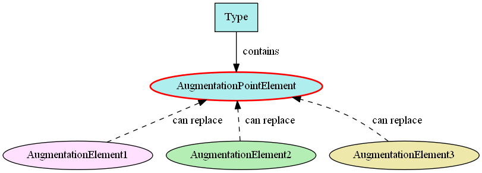

An **augmentation point** is .

- TOC
{:toc}

## Overview



## Examples

Each of the types in the table of examples below contain the augmentation point element listed next to it.

| Type | Augmentation Point Element | Definition of Augmentation Point Element |
| ---- | -------------------------- | ---------------------------------------- |
| nc:PersonType | nc:PersonAugmentationPoint | An augmentation point for PersonType |
| nc:ContactInformationType | nc:ContactInformationAugmentationPoint | An augmentation point for ContactInformationType |
| em:AccessType | em:AccessAugmentationPoint | An augmentation point for AccessType |
| it:AgentType | it:AgentAugmentationPoint | An augmentation point for AgentType |

Each of these augmentation point elements may be replaced in an instance with other content.
