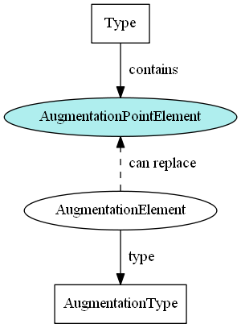

- TOC
{:toc}



## XML instances

Augmentation point elements do not appear in XML instances because they are abstract.  They may only be omitted or replaced by their concrete substitutions.

## XML Schema example

This snippet, from a subset of Core, shows how augmentation point element `nc:PersonAugmentationPoint` is defined and referenced by `nc:PersonType`:

```xml
<xs:complexType name="PersonType">
  <xs:annotation>
    <xs:documentation>A data type for a human being.</xs:documentation>
  </xs:annotation>
  <xs:complexContent>
    <xs:extension base="structures:ObjectType">
      <xs:sequence>
        <xs:element ref="nc:PersonBirthDate" minOccurs="0" maxOccurs="unbounded"/>
        <xs:element ref="nc:PersonName" minOccurs="0" maxOccurs="unbounded"/>
        <xs:element ref="nc:PersonAugmentationPoint" minOccurs="0" maxOccurs="unbounded"/>
      </xs:sequence>
    </xs:extension>
  </xs:complexContent>
</xs:complexType>

<xs:element name="PersonAugmentationPoint" abstract="true">
  <xs:annotation>
    <xs:documentation>An augmentation point for PersonType.</xs:documentation>
  </xs:annotation>
</xs:element>
```

Note that augmentation point elements are required in NIEM release schemas, but not for IEPDs.

## XML Schema template

This template shows the declaration of a complex type that references its augmentation point, and the declaration of the augmentation point element itself.

- The augmentation point element is the last element referenced in the type.

```xml
<!-- NIEM type with sub-elements, like nc:PersonType -->
<xs:complexType name="NAMEType">
  <xs:annotation>
    <xs:documentation>A data type for a(n) {$Definition}</xs:documentation>
  </xs:annotation>
  <xs:complexContent>
    <xs:extension base="PARENT_TYPE">
      <xs:sequence>
        <xs:element ref="ELEMENT1" minOccurs="0" maxOccurs="unbounded"/>
        <xs:element ref="ELEMENT2" minOccurs="0" maxOccurs="unbounded"/>
        <xs:element ref="NAMEAugmentationPoint" minOccurs="0" maxOccurs="unbounded"/>
      </xs:sequence>
    </xs:extension>
  </xs:complexContent>
</xs:complexType>

<!-- Augmentation Point Element, like nc:PersonAugmentationPoint -->
<xs:element name="NAMEAugmentationPoint" abstract="true">
  <xs:annotation>
    <xs:documentation>An augmentation point for NAMEType</xs:documentation>
  </xs:annotation>
</xs:element>
```
{: #training-aug-point }



## XML Schema partial template

Augmentation points do not actually require that many lines to create.  The majority of the template above shows how to create a type.  Only one line in the type declaration actually involves the augmentation point.

Without the rest of the type declaration, the template would look like:

```xml
<!-- Complex type declaration -->
        <xs:element ref="NAMEAugmentationPoint" minOccurs="0" maxOccurs="unbounded"/>
<!-- End of complex type declaration -->

<!-- Augmentation Point Element, like nc:PersonAugmentationPoint -->
<xs:element name="NAMEAugmentationPoint" abstract="true">
  <xs:annotation>
    <xs:documentation>An augmentation point for NAMEType</xs:documentation>
  </xs:annotation>
</xs:element>
```
{: #training-aug-point-partial }



This is much simpler: one new augmentation point element, and one reference to it from its type.
