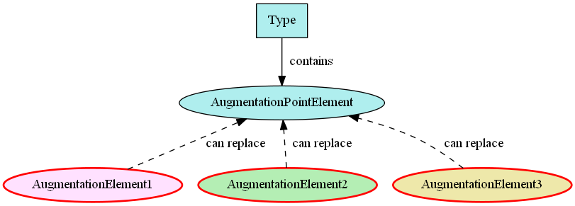
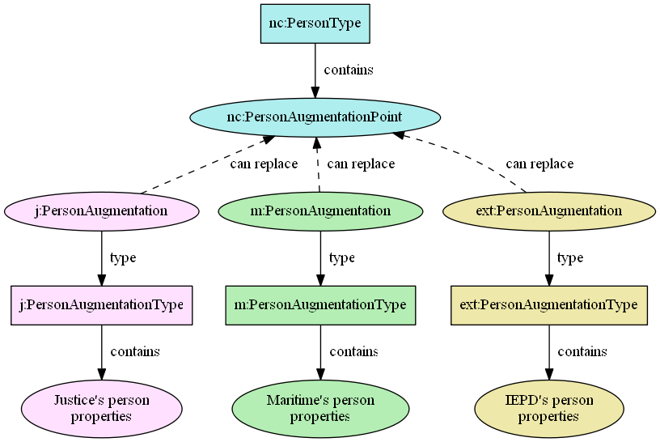
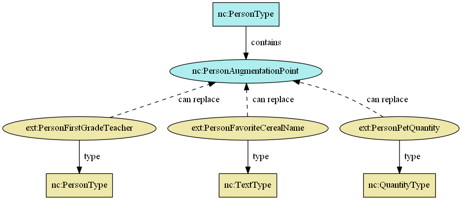

An **augmentation element** is .

- TOC
{:toc}

## Overview



## Containers

In NIEM releases, augmentations are created as containers that hold and group the additional content together.  The name of the container element corresponds to the type being augmented, with the `"Type"` representation term being replaced by `"Augmentation"`.  This augmentation element is made substitutable for the augmentation point element of the desired type.

| Augmentation Container Element | Type | Substitutable for |
| ------------------------------ | ---- | ----------------- |
| intel:PersonAugmentation | intel:PersonAugmentationType | nc:PersonAugmentationPoint |
| j:PersonAugmentation | j:PersonAugmentationType | nc:PersonAugumentationPoint |

The `intel:PersonAugmentationType` contains properties like `intel:AgencySubjectInterest` and `intel:PersonSystemIdentification`.

The `j:PersonAugmentationType` contains properties like `j:PersonAdultIndicator` and `j:PersonDrugAlcoholHistoryText`.

This diagram shows a type with an augmentation point element, substitutable by three augmentation container elements:

## Direct substitutions

In an IEPD, rather than creating a container to bundle properties together into a single augmentation container element, each property itself may be made directly substitutable for an augmentation point element.

For example, local element `PersonFirstGradeTeacher` may be defined to be substitutable for `nc:PersonAugmentationPoint`.

