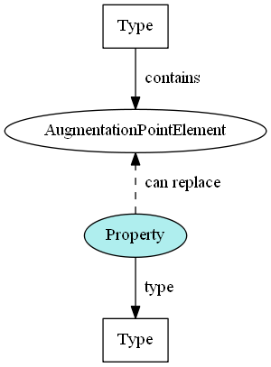

- TOC
{:toc}



The following example shows a local element `PersonFictionalCharacterIndicator` that is directly substitutable for nc:PersonAugmentationPoint:

## Instance example

```xml
<nc:Person>
  <nc:PersonName>
    <nc:PersonFullName>John Smith</nc:PersonFullName>
  </nc:PersonName>
  <nc:PersonBirthDate>
    <nc:Date>1950-01-01</nc:Date>
  </nc:PersonBirthDate>

  <!-- The augmentation element, substituted directly for nc:PersonAugmentationPoint -->
  <ext:PersonFictionalCharacterIndicator>true</ext:PersonFictionalCharacterIndicator>
</nc:Person>
```

## Schema example

The only thing that distinguishes an augmentation element that is a direct substitution is its substitution group.

```xml
<xs:element name="PersonFictionalCharacterIndicator" type="niem-xs:boolean"
  substitutionGroup="nc:PersonAugmentationPoint">
    <xs:annotation>
      <xs:documentation>True if this person is a fictional character; false otherwise.</xs:documentation>
    </xs:annotation>
</xs:element>
```

## Schema template

```xml
<xs:element name="ELEMENT_NAME" type="ELEMENT_TYPE" substitutionGroup="NAMEAugmentationPoint">
  <xs:annotation>
    <xs:documentation>ELEMENT_DEFINITION</xs:documentation>
  </xs:annotation>
</xs:element>
```
