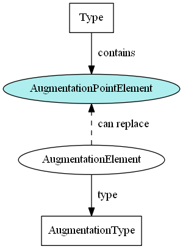

- TOC
{:toc}

### Name

The augmentation point element name must correspond with the type name it appears in, with the `"Type"` representation term being replaced by `"AugmentationPoint"`.

For example, the augmentation point element for `nc:PersonType` is `"nc:PersonAugmentationPoint"`.

### Abstract

An augmentation point element has no content of its own and is merely a construct to support additional content from other namespaces.  Making this element abstract ensures that it must be omitted or replaced in an instance by another element.

### No type

No type for an augmentation point element ensures that there will not be a type conflict when it is substituted by one or more augmentation elements.

### Sub-element position

The augmentation point element must appear as the final sub-element in its type.  This makes it easy to find and makes sure the type's original content appears in instances before the augmentations do.
