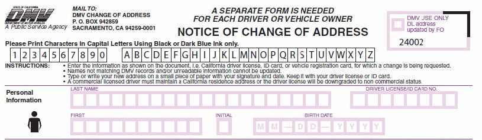

A **component** is 

- TOC
{:toc}

## Overview

A **property** is 

A **type** is 

This terminology may or may not be familiar, but the concepts behind them are simple enough.  To get the general idea, look at the following example form:

The field names in this form correspond to properties; the descriptions of allowable values for each field correspond to types:

| Properties (field names) | Types (allowable values) |
| --- | --- |
| LAST NAME | text, up to 20 characters |
| FIRST | text, up to 10 characters |
| DRIVER LICENSE/ID CARD NO | number, with 8 digits |
| INITIAL | text, with 1 character |
| BIRTH DATE | date, formatted as MM-DD-YYYY |

## Pairing properties with types

In NIEM, properties are usually paired to a specific type.  This links a conceptual idea to a concrete set of allowable values.

### Properties without types are too open-ended

The property `BIRTH DATE` above has a well-known meaning, but without type information, there are many different ways to represent the same value:

- "01/02/50"
- "01-02-1950"
- "1950-01-02"
- "02-Jan-1950"
- "02-01-1950"
- "Jan 2 1950"
- "January 2nd, 1950"

These are just a few of many possibilities.  Consistency is crucial for information sharing, so linking a property to a specific format makes it much easier to interpret the data.

### Types without properties do not carry enough semantics

The type from the example above, `MM-DD-YYYY`, is well-known as a date, but that is not enough context to be useful.  Without a corresponding property to provide the semantics, the kind of date that is expected would be unknown.  A few possibilities include:

- birthdate
- today's date
- event date
- assignment due date
- graduation date
- hire date

Alone, a type can describe the format of expected data, but it does not describe what kind of data is supposed to be represented by that given format.

**Pairing a property (a specific idea) with a type (the allowable values) creates a field with both clear semantics and a well-defined structure.**

## Complex content vs simple content types

The types described above all carried **simple content** - a single value that could be represented as text, a date, or a number.

There is one more property and type represented by the form above:

| Properties (field names) | Types (allowable values) |
| --- | --- |
| Personal information | A data structure with: - LAST NAME - DRIVER LICENSE/ID CARD NO - FIRST - INITIAL - BIRTH DATE |

From the context of the form, we can tell that the information that is expected is "Personal Information".  This means that the name fields, birth date, and license number should be those of the person submitting the form and not the information of that person's spouse, child, emergency contact, or insurance agent.

In this case, the type for "Personal Information" doesn't represent a single value (simple content), it represents a structure with a specific set of other properties.  This type has **complex content**.

Conceptually, "Personal Information" could cover many different things - the fields requested by the form, things like favorite color and what someone ate for breakfast that day, and many others.  This type with complex content narrows down all those possibilities to exactly the ones that are relevant for this form.
