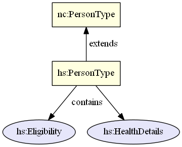
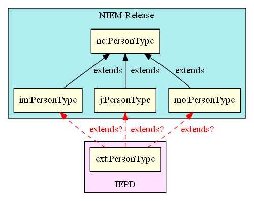
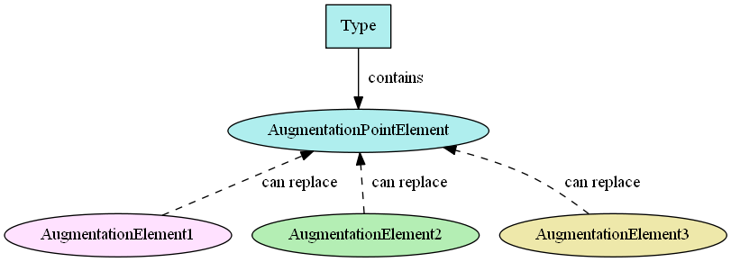
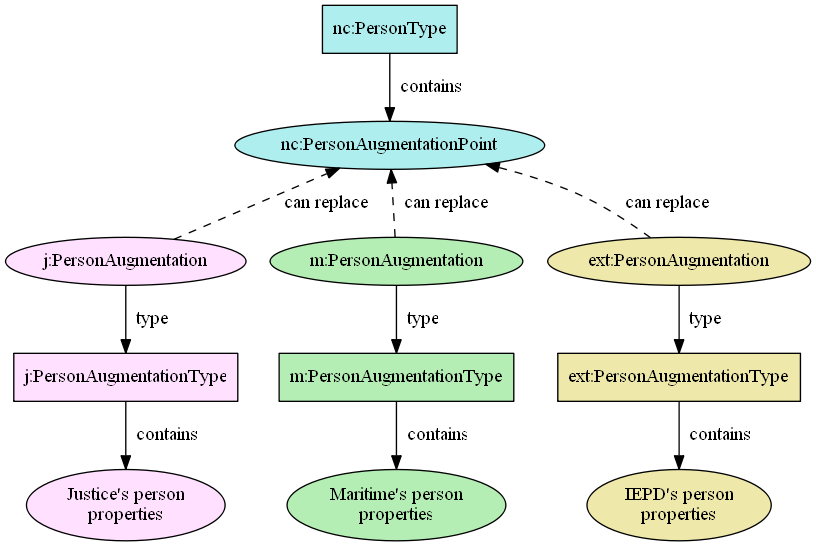
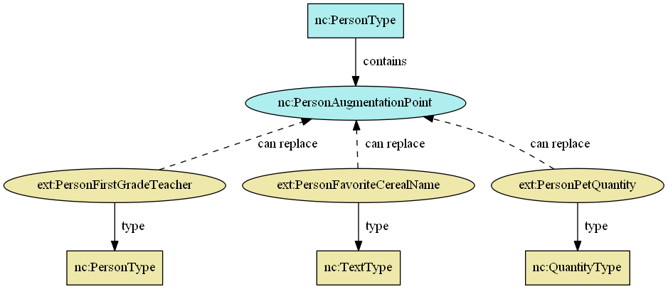

An **augmentation** is .

- TOC
{:toc}

## Background

Extension is typically the mechanism used to add additional content to another namespace's type which cannot be modified directly.  This is the approach that NIEM originally used.  For example, for a domain to add additional content to the Core `PersonType` using extension, a new domain type would be declared that extended `nc:PersonType`, and domain properties would be added to it.

Over time, several limitations were recognized with this approach.  The primary one was that extension in XML Schema does not allow for multiple inheritance.  If more than one domain extends `nc:PersonType`, IEPD developers cannot use those related but separate extensions together.  They must choose a single type to reuse or derive from.

In an effort to overcome the limitations of the extension approach and improve reusability, augmentations were introduced in NIEM 2.0 and revised for NIEM 3.0 to improve usability.

## Overview

The augmentation approach has two parts to it: the additional content itself, and the means by which it can be used with other types.  **Augmentation elements** are the additional content, and **augmentation point elements** are the means that make this approach work, via substitution.  Multiple augmentation elements can be substituted and used together.

## Augmentation point elements

Every NIEM release type that contains sub-elements also contains an augmentation point element.  These elements are abstract, have no type, and cannot appear in any instance.  They serve strictly as substitution points, to be replaced by other content - the augmentation elements.

The name of each augmentation point element corresponds to the type in which it appears, with the representation term `"Type"` being replaced by `"AugmentationPoint"`.  Each of the types in the table of examples below contain the augmentation point element listed next to it.

| Type | Augmentation Point Element | Definition of Augmentation Point Element |
| ---- | -------------------------- | ---------------------------------------- |
| nc:PersonType | nc:PersonAugmentationPoint | An augmentation point for PersonType |
| nc:ContactInformationType | nc:ContactInformationAugmentationPoint | An augmentation point for ContactInformationType |
| em:AccessType | em:AccessAugmentationPoint | An augmentation point for AccessType |
| it:AgentType | it:AgentAugmentationPoint | An augmentation point for AgentType |

Each of these augmentation point elements may be replaced in an instance with other content.

## Augmentation elements

Augmentation elements are the additional content to be used along with a type from a different namespace.  This is done by making each augmentation element substitutable for the augmentation point element of the original type.

NIEM has two different ways of creating augmentation elements. The most common is by creating a container element and type that bundles related additions together into a single block, and making the container element substitutable for the augmentation point element.  The other method is to make each of the additions individually substitutable for the augmentation point element, without being bundled together.

### Containers

In NIEM releases, augmentations are created as containers that hold and group the additional content together.  The name of the container element corresponds to the type being augmented, with the `"Type"` representation term being replaced by `"Augmentation"`.  This augmentation element is made substitutable for the augmentation point element of the desired type.

| Augmentation Container Element | Type | Substitutable for |
| ------------------------------ | ---- | ----------------- |
| intel:PersonAugmentation | intel:PersonAugmentationType | nc:PersonAugmentationPoint |
| j:PersonAugmentation | j:PersonAugmentationType | nc:PersonAugumentationPoint |

The `intel:PersonAugmentationType` contains properties like `intel:AgencySubjectInterest` and `intel:PersonSystemIdentification`.

The `j:PersonAugmentationType` contains properties like `j:PersonAdultIndicator` and `j:PersonDrugAlcoholHistoryText`.

This diagram shows a type with an augmentation point element, substitutable by three augmentation container elements:

### Direct substitutions

In an IEPD, rather than creating a container to bundle properties together into a single augmentation container element, each property itself may be made directly substitutable for an augmentation point element.

For example, local element `PersonFirstGradeTeacher` may be defined to be substitutable for `nc:PersonAugmentationPoint`.

## When to use

Augmentations should be created only when trying to add additional content to an existing type from a namespace outside of your control.  If you find a type that has the right semantics and almost meets your requirements, but it is missing some properties that you need, an augmentation should be used to add the missing content.

Specialization in NIEM is still handled via type extension.  Specialization is different because it doesn't just deal with some missing properties - the existing type itself is not the right semantic match for the requirements.

Example - If a user wants to model a train, nc:VehicleType might be the closest match but it isn't an exact match.  The semantics are different.  All trains may be vehicles, but not all vehicles are trains.  Rather than creating an augmentation to add properties like whistle, locomotive, and caboose to nc:VehicleType, a new TrainType should be created that extends nc:VehicleType and adds the train-specific properties.

Using type extension for specialization does not present the same problems that augmentations were designed to solve.  Multiple augmentations for a type may be used together in an IEPD because they are all meant to provide additional content for the same type.  Specializations do not need to be able to be combined with other specializations in instances - a single vehicle does not need to carry train, boat, and airplane properties.

## IEPD exceptions

It is not required to create augmentation point elements in IEPD extension schemas.  They are created in NIEM reference schemas for reusability across the NIEM community, but an IEPD may omit these.
