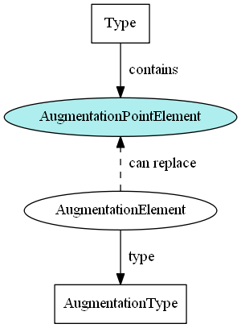
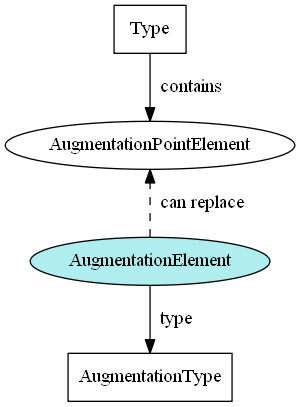
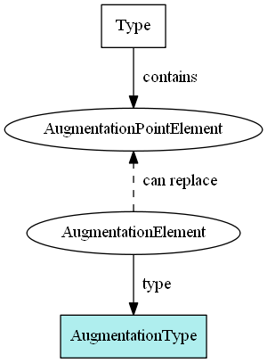

- TOC
{:toc}

The information below shows rules and guidelines for building an augmentation.

## Augmentation point elements

### Name

The augmentation point element name must correspond with the type name it appears in, with the `"Type"` representation term being replaced by `"AugmentationPoint"`.

For example, the augmentation point element for `nc:PersonType` is `"nc:PersonAugmentationPoint"`.

### No type

No type for an augmentation point element ensures that there will not be a type conflict when it is substituted by one or more augmentation elements.

### Abstract

An augmentation point element has no content of its own and is merely a construct to support additional content from other namespaces.  Making this element abstract ensures that it must be omitted or replaced in an instance by another element.

### Sub-element position

The augmentation point element must appear as the final sub-element in its type.  This makes it easy to find and makes sure the type's original content appears in instances before the augmentations do.

---

## Augmentation container elements

### Name

The element name must correspond with the augmented type name, with the `"Type"` representation term being replaced by `"Augmentation"`.

For example, the Immigration domain augmentation container element for `nc:PersonType` is `"im:PersonAugmentation"`.

### Type

An augmentation container element must have a corresponding augmentation container type.

For example, `im:PersonAugmentation` has type `im:PersonAugmentationType`.

### Substitution group

The element must be declared to be substitutable for an augmentation point element.

For example, `im:PersonAugmentation` is substitutable for `nc:PersonAugmentationPoint`.

---

## Augmentation container types

### Name

The type name must correspond with the augmented container element name, with the addition of the `"Type"` representation term.

For example, the Immigration domain augmentation container type for nc:PersonType is `"im:PersonAugmentationType"`.

### Parent type

An augmentation type must extend `structures:AugmentationType`.

### No augmentation point element of its own

Each augmentation should be defined on the original type.  Augmentations of augmentations are not allowed.
