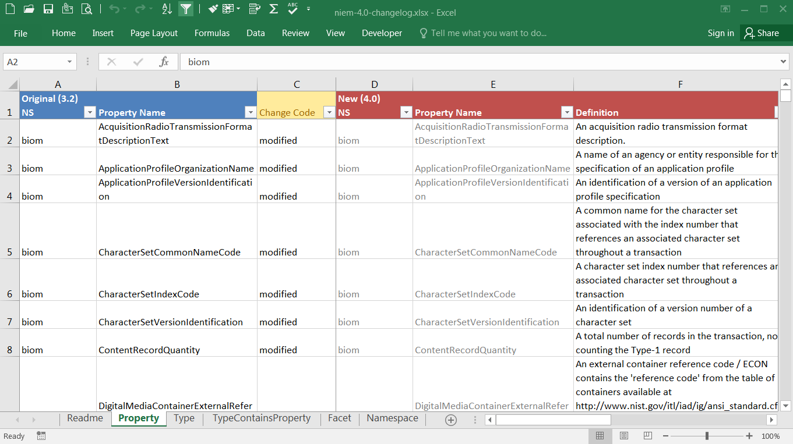

This spreadsheet documents the changes between the given release and the previous one.

Items from the previous release are identified in the left-most columns, with blue column headers.  Change information is provided under the yellow column header.  And items from the current release are provided in the right-most columns, under the red column headers.

For items marked as modified, the fields that have changed are in the standard black font.  Fields that remain the same as in the previous release are in a lighter gray font.

Note that not all changes are recorded with the same amount of details.  There are cases where changes to a component do not show up as an edit, but as separate delete and add operations.

This file is located in the root of the package or repo.  The file name is `niem-version-changelog.xlsx`.

