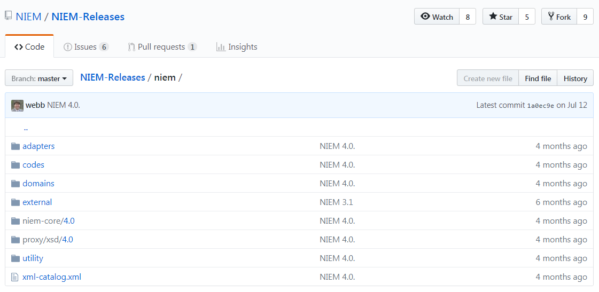
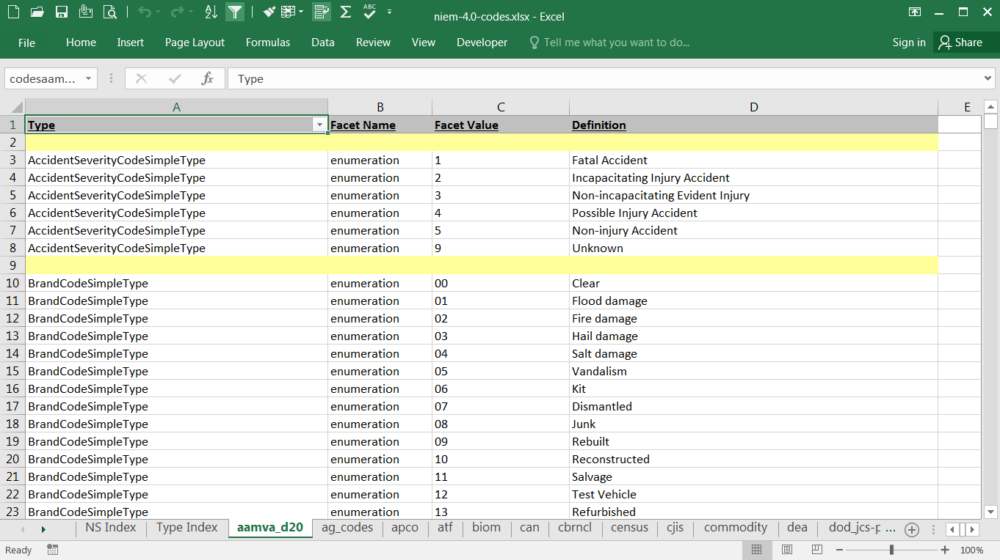
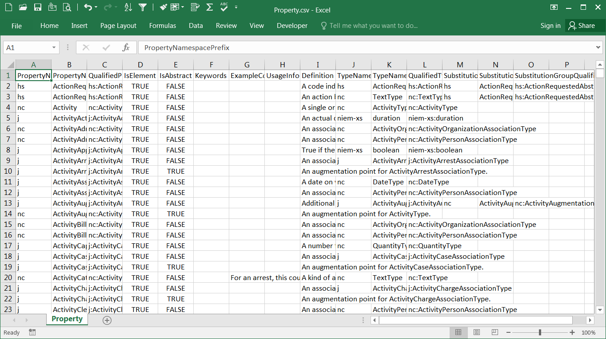

- TOC
{:toc}

## Published releases

Each NIEM release is published with a set of schemas and supporting artifacts.

Additional artifacts may also be published that are related to a release but are not part of the official package.

### release.niem.gov/niem

Release artifacts are posted to <https://release.niem.gov/niem/>.

The target namespace URIs of NIEM schemas resolve to this site.  For example, if you follow the URI <http://release.niem.gov/niem/niem-core/4.0/> for Core 4.0, you will be redirected to that schema posted on this site.

**4.0 landing page:**

### GitHub repo

Releases are now also being posted to a GitHub repository at <https://github.com/niem/niem-releases> for better developer support and release maintenance.

**NIEM/NIEM-Releases landing page:**

## Release package

### XML schemas

These schemas define the model content and the internal constructs needed to support the model.  Schemas include Core, domains, codes, external standards, structures and appinfo.

Schemas are located in the `niem` subdirectory of the package or repo:

### XML catalog

An XML catalog associates target namespace URIs with file locations.

The NIEM release schemas provide file location information in each import statement, but these are treated as merely suggestions.  Catalogs let you define or override the suggested locations.

This file is located in the `niem` subdirectory of the package or repo.

### JSON-LD context

JSON does not support namespace prefixes the same way that XML Schema does.  The JSON-LD context file is a file that associates each NIEM namespace URI with the prefix that is used.

This file is located in the `jsonld-context` folder in the root of the package or repo.

### Documentation spreadsheet

This spreadsheet provides user documentation for the properties and types of Core and the domain namespaces.

Each of these namespaces is represented in its own tab, with several supporting tabs at the end of the spreadsheet.

The main tabs are organized alphabetically by types (highlighted in yellow) and their sub-elements.  Related components are hyperlinked for easier navigation.

This file is located in the root of the package or repo.  The file name is "niem-#.xlsx", with "#" representing the release number.  For the 4.0 release, the spreadsheet is named `niem-4.0.xlsx`.

### Code list spreadsheet

This spreadsheet provides user documentation for the codes defined in NIEM.

This file is located in the root of the package or repo.  The file name is `niem-#-codes.xlsx`.

The first tab is an index of the code namespaces.  Click on the link in the first column to go directly to the tab corresponding to that namespace.  Click on the link in the second column to go to an index of code types for that namespace.

The second tab is a full index of the code types for each namespace.  Click on the type name to go directly to the codes for that type.

The remaining tabs represent each NIEM namespace that defines codes.

### Change log spreadsheet

This spreadsheet documents the changes between this release and the previous one.

Items from the previous release are identified in the left-most columns, with blue column headers.  Change information is provided under the yellow column header.  And items from the current release are provided in the right-most columns, under the red column headers.

For items marked as modified, the fields that have changed are in the standard black font.  Fields that remain the same as in the previous release are in a lighter font.

Note that not all changes are recorded with the same amount of details.  There are cases where changes to a component do not show up as an edit, but as separate delete and add operations.

This file is located in the root of the package or repo.  The file name is `niem-#-changelog.xlsx`.

### Readme

This is a text file that provides a high-level overview of the changes made in the release, and in particular the changes that affect Core.

This file is located in the root of the package or repo.  The file name is `README.md`.  

The format is "Markdown", which provides simple syntax for basic HTML formatting.  Markdown files can be viewed as plain text in any text editor, but the HTML formatting is rendered for a better display on GitHub or a markdown viewer.

## Other artifacts

### Alternate formats

These are files that contain the model content in formats alternative to the authoritative XML Schemas.  These are provided for developers who  wish to import the model content without having to parse the schemas.

The provided formats are CSVs (text files that represent tabular data), a spreadsheet, and an Access database.  Each format represents the same information.

Note that these are different from the spreadsheets described above.  The other spreadsheets are formatted to provide user-readable documentation.  These files have no formatting; they are designed so that the information may be easily imported.

For each format, there is an item (a file, tab, or table) that lists:

- properties
- types
- types with their sub-properties
- facets
- namespaces

On GitHub, the CSV formats are located in the `csv` directory off the root.  The release page on release.niem.gov contains all three formats - CSVs, the spreadsheet, and the Access database.

Property CSV:

