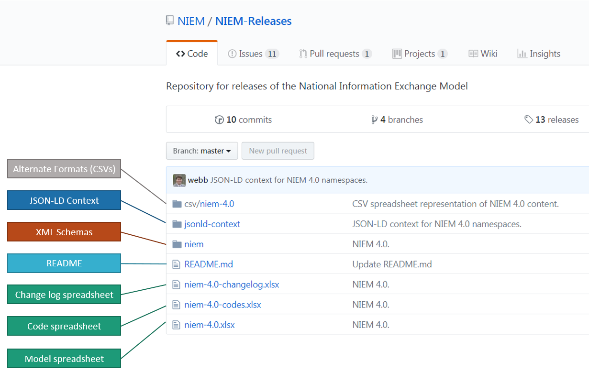

Each NIEM release contains a set of XML schemas and supporting artifacts.  The schemas are the authoritative source for the published content.

> The image below shows the NIEM 4.0 release package on GitHub, with labels superimposed to point out the various artifacts.
{:.example}

