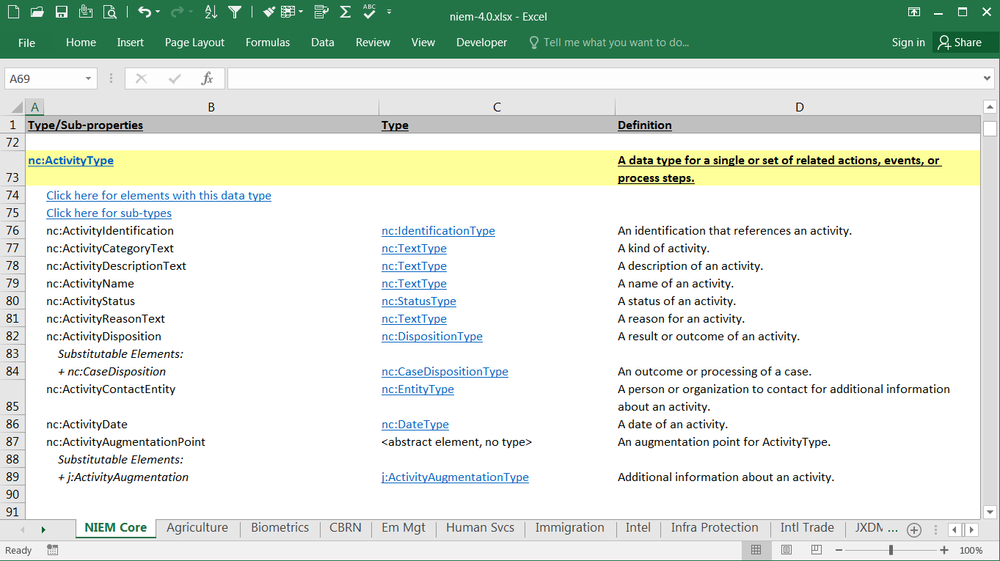

This spreadsheet provides user documentation for the properties and types of Core and the domain namespaces.

Each of these namespaces is represented in its own tab, with several supporting tabs at the end of the spreadsheet.

The main tabs are organized alphabetically by types (highlighted in yellow) and their sub-elements.  Related components are hyperlinked for easier navigation.

This file is located in the root of the package or repo.  The file name is "niem-version.xlsx", with "version" representing the release number.  For the 4.0 release, the spreadsheet is named `niem-4.0.xlsx`.

