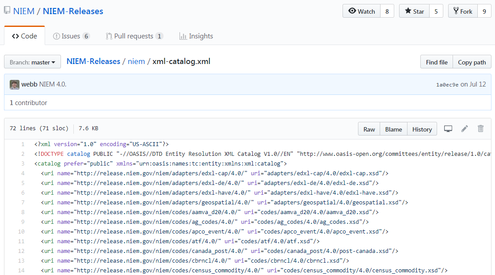

An XML catalog associates target namespace URIs with file locations.

The NIEM release schemas provide file location information in each import statement, but these are treated as merely suggestions.  Catalogs let you define or override the suggested locations.

This file is located in the `niem` subdirectory of the package or repo.

> The image below shows the XML Catalog from the NIEM 4.0 release.
{:.example}

