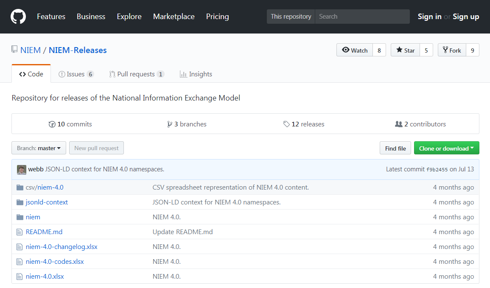
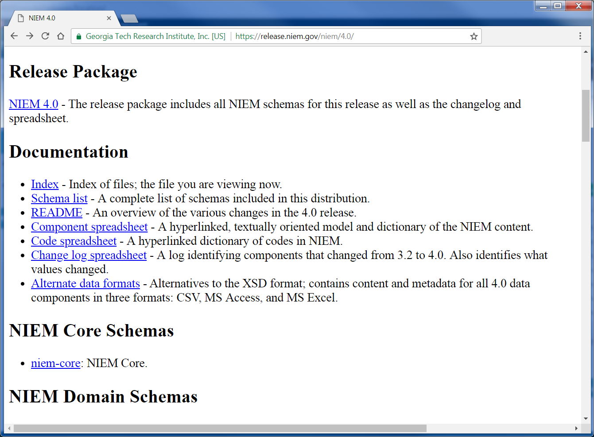

- TOC
{:toc}

## GitHub repo

Releases are now being posted to a GitHub repository at **<https://github.com/niem/niem-releases>** for better developer support and release maintenance.

**GitHub NIEM/NIEM-Releases landing page:**

{:.bordered}

The package can be downloaded in full as a zip file by clicking on the green `Clone or download` button, and then clicking `Download ZIP`.

## Traditional source

In addition to GitHub, release artifacts continue to be posted to **<https://release.niem.gov/niem/>**.  This has been the traditional site of the release package.

- The target namespace URIs of NIEM schemas resolve to this site.
- For example, if you follow the Core 4.0 target namespace URI <http://release.niem.gov/niem/niem-core/4.0/>, you will be redirected to that schema posted on this site.
{:.note}

**[4.0 landing page:](https://release.niem.gov/niem/4.0/)**

{:.bordered}
