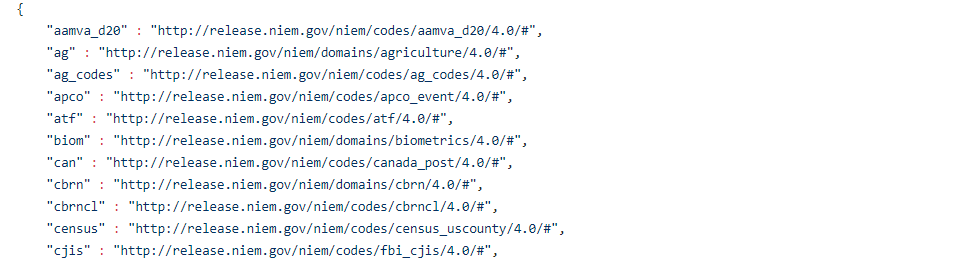

{{ page.description }}

{:.note}
> This is a required artifact when using NIEM JSON.

This is the same kind of information captured in XML via namespace prefix declarations.  Without explicitly associating namespace prefixes to URIs, it would be left to future users to have to guess or try to reverse engineer which versions of NIEM schemas were used.  Interpreting the meaning of NIEM messages should not involve guesswork.

{:.invalid}
- Reference property `nc:Location` in a JSON extension schema.
- Without assigning the prefix `nc` to the URI that identifies it, it could be from any version of NIEM Core - or from a different, non-NIEM namespace entirely.

{:.valid}
- Reference property `nc:Location` in a JSON extension schema.
- Declare the namespace prefix in the JSON-LD context file:
  - `"nc" : "http://release.niem.gov/niem/niem-core/4.0/#"`
- This is enough information for users to be able to easily tell that property `nc:Location` is from NIEM Core version 4.0.

For a NIEM release, this file is located in the `jsonld-context` folder in the root of the package or repo.

{:.example}
> This example is the beginning of the JSON-LD context file from the NIEM 4.0 release:

{:.bordered}
