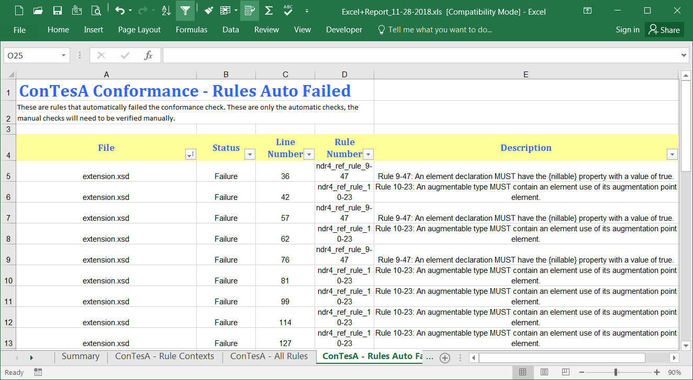

{{ page.description }}

## ConTesA Report

The [Conformance Testing Assistance (ConTesA)]({{ site.data.pages.contesa | relative_url }}) checks uploaded schemas against Schematron rules from the [Naming and Design Rules (NDR)]({{ site.data.pages.ndr | relative_url }}).

{:.example}
- The images below show portions of the spreadsheet version of the conformance report generated by `ConTesA`.
- This first image shows the summary - how many rules were run, how many rules passed, and how many rules failed.

{:.example}
- This image shows the NDR rules that failed and the schema line numbers where it occurred.

## Additional validation steps

Additional information can also be included specifying any additional steps that were taken to manually review and validate rules that are not automated, like free-text rules from the [Naming and Design Rules (NDR)]({{ site.data.pages.ndr | relative_url }}) and the [Information Exchange Package Documentation (IEPD) Specification]({{ site.data.pages.mpd | relative_url }}).  See the [IEPD Specification, Appendix D. Conformance Assertion Example]({{ site.data.links.mpd_spec}}#appendix_D) for more on what this might look like.
