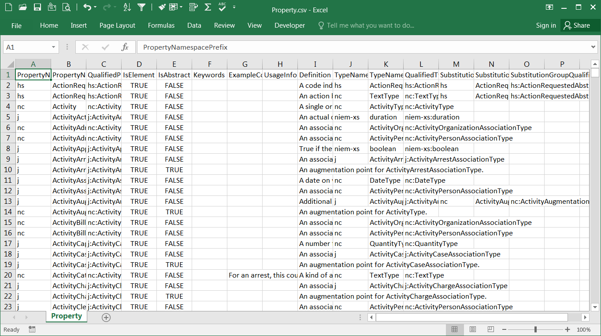

{{ page.description }}

{:.note}
> These materials are different from the spreadsheets in the release package.  The other spreadsheets are formatted to provide user-readable documentation.  These files are formatted to be machine-readable, so that the contents may be **easily imported**.

## Contents

NIEM CSVs provide information about the content in a release:

- properties
- types
- types with their sub-properties
- type unions
- facets
- namespaces
- local terminology

## Location

On GitHub, the CSV formats are located in the `csv` directory off the root.  The release page on release.niem.gov contains CSVs, plus two additional formats representing the same information: a spreadsheet and an Access database.

## Example

> Below is a snapshot from the Property CSV:
{:.example}

