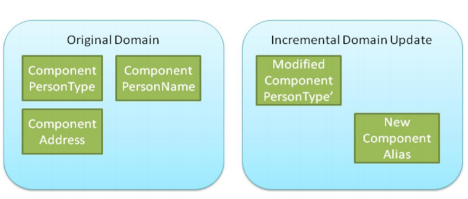
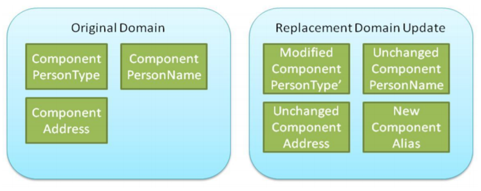

{{ page.description }}

Domain updates are published by the domain steward when it is determined to be necessary to publish additions or changes before the next release.  During the next major or minor NIEM release, these changes will be integrated back into the regular domain namespace.

## Kinds of domain updates

There are three kinds of domain updates:

### Incremental

An incremental domain update is additive in nature.  It contains only the domain components that are being added or modified.  An incremental domain update may be used in an IEPD in addition to the regular domain namespace.

An incremental domain update may be a better choice if a domain has the need to immediately publish a small set of changes.

{:.example}
- The image below shows that an incremental domain update contains only new and modified components.
- Components with no changes are not duplicated.



### Replacement

A replacement domain update represents all domain components, with additions, modifications, and deletions applied.  A replacement domain update should be used in an IEPD in lieu of the regular domain namespace if that IEPD requires the adjusted content.

A replacement domain update may be a better choice if a domain has the need to publish a large set of interdependent changes

{:.example}
- The image below shows that a replacement domain update contains the fully updated set of domain components.
- Components with no changes will also appear in the replacement schema.



### Coordinated domain update

A coordinated domain update is a set of interdependent domain updates that are published together in one package.  This allows related content that may span multiple namespaces to be updated in a more cohesive manner.

{:.note}
> Every domain update schema in a Coordinated domain update must be approved by its domain steward.  No changes to a domain can be made without steward approval.

## Key rules for a domain update

Version 1.0 of the [Domain Update Specification]({{ site.data.links.du }}) describes what a domain update is and defines a set of rules that must be followed.  The list below are highlights from the specification.

### Rule 4-2

A domain update can only make changes for namespaces under its control.  For example, a domain update cannot be used to redefine Core or another domain namespace.

### Rule 4-6

A domain update must be conformant to the applicable [NIEM Naming and Design Rules (NDR)]({{ site.data.pages.ndr | relative_url }}) reference schema document conformance target.

### Rule 4-11

The target namespace for a domain update must follow the pattern: `http://publication.niem.gov/niem/domains/{domain}/{domainVersion}/{domainUpdateNumber}`

{:.example}
> The following example shows a target namespace for sample domain update for the Immigration domain, version 4.1:

```xml
<xs:schema
  targetNamespace="http://publication.niem.gov/niem/domains/immigration/4.1/1"
>

</xs:schema>
```

### Rule 4-26

A domain update must pass the NDR conformance validation checks run by the [Conformance Testing Assistant (ConTesA)]({{ site.data.pages.contesa | relative_url }}).

## Usage

Domain updates are designed to be used in IEPDs.

- Add the domain update schemas to the schemas directory in the IEPD package.
- In an [IEPD extension schema](../../messages/extension-schema):
  - Declare a namespace prefix for the domain update schema
  - Import the domain update schema
  - Reference elements and types from the domain update schema

{:.note}
> Fore more information, see similar usage information for a [Core Supplement](../core-supplement).
