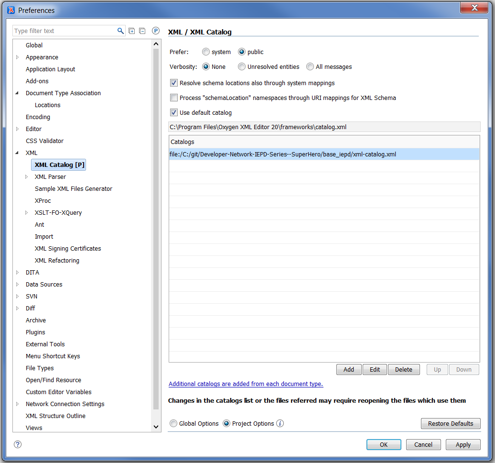
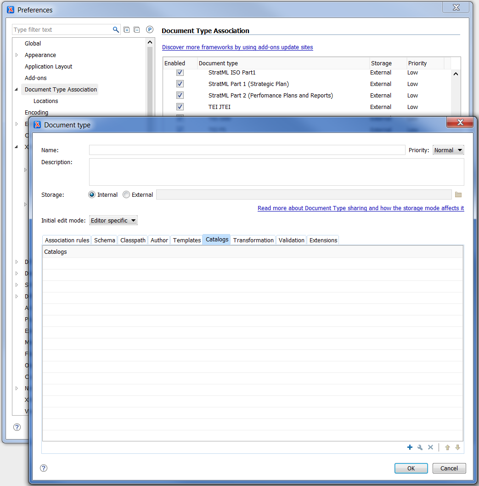

{{page.description}}

[XML catalogs](https://www.oasis-open.org/standards#xmlcatalogsv1.1) are an [OASIS](https://www.oasis-open.org/) standard.

<!--more-->

## NIEM and XML Catalogs

While XML catalogs provide a broader set of features that may be used as needed by developers and implementers for namespace resolution, the primary ways that NIEM uses XML Catalogs for releases are presented here.

A XML catalog has a root-level `catalog` element.  NIEM releases use `uri` elements under the `catalog` element to associate namespaces with file locations.  A subset of the XML Catalog file from the 4.0 release, [xml-catalog.xml](https://github.com/NIEM/NIEM-Releases/blob/niem-4.0/niem/xml-catalog.xml), is shown below.

{:.note}
- The `name` attribute holds the target namespace of the XML schema file
- The `uri` attribute holds the absolute or relative file location

```xml
<?xml version="1.0" encoding="US-ASCII"?>
<!DOCTYPE catalog PUBLIC "-//OASIS//DTD Entity Resolution XML Catalog V1.0//EN" "http://www.oasis-open.org/committees/entity/release/1.0/catalog.dtd">
<catalog prefer="public" xmlns="urn:oasis:names:tc:entity:xmlns:xml:catalog">
  <uri name="http://release.niem.gov/niem/appinfo/4.0/" uri="utility/appinfo/4.0/appinfo.xsd"/>
  <uri name="http://release.niem.gov/niem/conformanceTargets/3.0/" uri="utility/conformanceTargets/3.0/conformanceTargets.xsd"/>
  <uri name="http://release.niem.gov/niem/niem-core/4.0/" uri="niem-core/4.0/niem-core.xsd"/>
</catalog>
```

## Template

The template below may be used as a starting point for creating an XML catalog:

```xml
<?xml version="1.0" encoding="US-ASCII"?>
<!DOCTYPE catalog PUBLIC "-//OASIS//DTD Entity Resolution XML Catalog V1.0//EN" "http://www.oasis-open.org/committees/entity/release/1.0/catalog.dtd">
<catalog prefer="public" xmlns="urn:oasis:names:tc:entity:xmlns:xml:catalog">
  <uri name="" uri=""/>
</catalog>
```

## XML Catalogs and NIEM CSV Code Lists

In addition to mapping target namespaces of XML schemas to file locations, XML catalogs can also be used to map a [CSV Code List](../code-lists/) file to a source identifier.

{:.example}
> The example catalog below maps:
> - the target namespace of the NIEM Core 4.0 schema to a relative file location.
> - the source identifier for GENC 3-7 3-character country codes to a relative file location for the CSV file.

```xml
<?xml version="1.0" encoding="US-ASCII"?>
<!DOCTYPE catalog PUBLIC "-//OASIS//DTD Entity Resolution XML Catalog V1.0//EN" "http://www.oasis-open.org/committees/entity/release/1.0/catalog.dtd">
<catalog prefer="public" xmlns="urn:oasis:names:tc:entity:xmlns:xml:catalog">
  <uri name="http://release.niem.gov/niem/niem-core/4.0/" uri="niem-core/4.0/niem-core.xsd"/>
  <uri name="http://api.nsgreg.nga.mil/geo-political/GENC/3/3-7" uri="codes/genc/geo-political/3-7/genc_geo-political_3-7_char3.csv"/>
</catalog>
```

## Tools and XML Catalogs

XML Catalogs are supported by many common XML tools, such as Oxygen XML Editor, XMLSpy, and Xerces.

### Oxygen XML Editor

Oxygen has several different ways to add a catalog file.

#### XML Catalog Preferences

To add a global user-defined catalog in Oxygen via the XML Catalog preferences page:

- Go to Options > Preferences > XML > XML Catalog
- Click the "Add" button to add the new catalog
- Restart Oxygen XML Editor



#### Document Type Association

To add a user-defined catalog in Oxygen via a document type association:

- Go to Options > Preferences > Document Type Association
- Add a new Document Type for the XML file(s)
- Add the catalog in the Catalogs tab
- Add an Association Rule



#### Related Oxygen Links

For more information, please see Oxygen's catalog help files:

- [Working with XML Catalogs](https://www.oxygenxml.com/doc/versions/20.1/ug-editor/topics/using-XML-Catalogs.html)
- [XML Catalog Preferences](https://www.oxygenxml.com/doc/versions/20.1/ug-editor/topics/preferences-xml-catalog.html#preferences-xml-catalog)
- [Document Type Configuration Dialog Box](https://www.oxygenxml.com/doc/versions/20.1/ug-editor/topics/the-document-type-dialog.html)
- [Configuring XML Catalogs via a Document Type Association](https://www.oxygenxml.com/doc/versions/18/ug-editor/tasks/dg-xml-catalogs.html)

### XMLSpy

Add custom file associations to the Altova `CustomCatalog.xml` file.  Add one or more `nextCatalog` elements in order for XMLSpy to use user-created catalog files.

- Go to File > Open.
- Browse to the Altova/XMLSpy#### data directory
- Open `CustomCatalog.xml`
- Add a `nextCatalog` element that specifies the location of your catalog file (example below)
- Restart XMLSpy

```xml
<?xml version="1.0" encoding="UTF-8"?>
<!-- edited with XML Spy v5 beta 1 U (http://www.xmlspy.com) by Vladislav Gavrielov (Altova) -->
<catalog
  xmlns="urn:oasis:names:tc:entity:xmlns:xml:catalog"
  xmlns:xsi="http://www.w3.org/2001/XMLSchema-instance"
  xsi:schemaLocation="urn:oasis:names:tc:entity:xmlns:xml:catalog Catalog.xsd">

  <nextCatalog catalog="https://example.com/xml-catalog.xml"</u>/>

</catalog>
```

#### Related XMLSpy Links

For more information, please see XMLSpy's catalog help files:

- [Catalogs in XMLSpy](https://manual.altova.com/xmlspy/spyenterprise/index.html?xsdtdandxsd_catalogs.htm)
- [Altova's XML Catalog Mechanism](https://manual.altova.com/raptorxml/raptorxmlserver/index.html?rxsetup_cats_altovacatmech.htm)