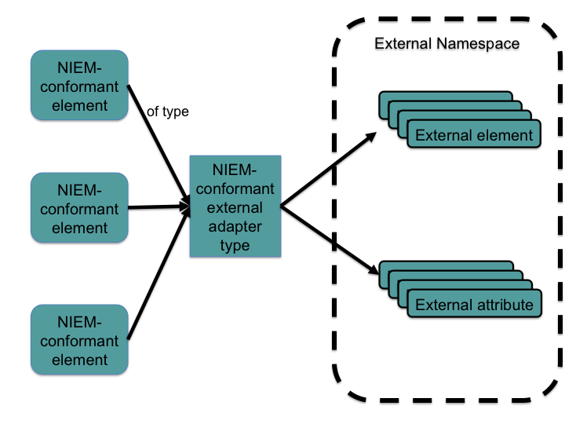

Adapters are the mechanism NIEM uses to allow content from external standards without causing conformance validation errors.

An adapter is a type that contains an external property.  It is marked as an adapter in the schema so that NIEM conformance rules skip over its external (non-conformant) contents instead of throwing errors.  Otherwise, an adapter type looks and acts like a standard NIEM type.

{: .example}
> `geo:SurfaceType` is an adapter type in NIEM that contains element `Surface` from GML, an external standard.  It can be used normally by other NIEM components.  Because it is an adapter type, NDR conformance tests will not throw errors if the element from the GML external standard does not follow NIEM rules.

<!--more-->

