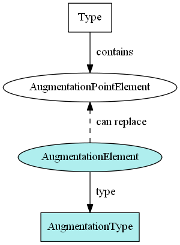

Augmentation elements are the additional content to be used along with a type from a different namespace.  This is done by making each augmentation element substitutable for the augmentation point element of the original type.

{:toc}
- TOC

NIEM has two different ways of creating augmentation elements. The most common is by creating a container element and type that bundles related additions together into a single block, and making the container element substitutable for the augmentation point element.  The other method is to make each of the additions individually substitutable for the augmentation point element, without being bundled together.

<!--more-->


## Kinds

### Containers

In NIEM releases, augmentations are created as containers that hold and group the additional content together.  The name of the container element corresponds to the type being augmented, with the `"Type"` representation term being replaced by `"Augmentation"`.  This augmentation element is made substitutable for the augmentation point element of the desired type.

| Augmentation Container Element | Type | Substitutable for |
| ------------------------------ | ---- | ----------------- |
| intel:PersonAugmentation | intel:PersonAugmentationType | nc:PersonAugmentationPoint |
| j:PersonAugmentation | j:PersonAugmentationType | nc:PersonAugumentationPoint |

The `intel:PersonAugmentationType` contains properties like `intel:AgencySubjectInterest` and `intel:PersonSystemIdentification`.

The `j:PersonAugmentationType` contains properties like `j:PersonAdultIndicator` and `j:PersonDrugAlcoholHistoryText`.

This diagram shows a type with an augmentation point element, substitutable by three augmentation container elements:


### Direct substitutions

In an IEPD, rather than creating a container to bundle properties together into a single augmentation container element, each property itself may be made directly substitutable for an augmentation point element.

For example, local element `PersonFirstGradeTeacher` may be defined to be substitutable for `nc:PersonAugmentationPoint`.


## XML Container



### Instance example

The examples below show element nc:Person in an XML instance, with and without augmentations.

**nc:Person without augmentations:**

```xml
<nc:Person>
  <nc:PersonName>
    <nc:PersonFullName>John Smith</nc:PersonFullName>
  </nc:PersonName>
  <nc:PersonBirthDate>
    <nc:Date>1950-01-01</nc:Date>
  </nc:PersonBirthDate>
</nc:Person>
```

**nc:Person with domain and local augmentations:**

```xml
<nc:Person>

  <!-- Original nc:PersonType properties -->
  <nc:PersonName>
    <nc:PersonFullName>John Smith</nc:PersonFullName>
  </nc:PersonName>
  <nc:PersonBirthDate>
    <nc:Date>1950-01-01</nc:Date>
  </nc:PersonBirthDate>

  <!-- Justice augmentation properties -->
  <j:PersonAugmentation>
    <j:PersonAdultIndicator>true</j:PersonAdultIndicator>
    <j:PersonDEAIdentification>
      <nc:IdentificationID>1234567890</nc:IdentificationID>
    </j:PersonDEAIdentification>
  </j:PersonAugmentation>

  <!-- Maritime augmentation properties -->
  <m:PersonAugmentation>
    <m:PersonBiometricURI>https://biometric.example.com/23532356684</m:PersonBiometricURI>
  </m:PersonAugmentation>

  <!-- Local augmentation properties -->
  <ext:PersonLocalID>52d6632</ext:PersonLocalID>

</nc:Person>
```

{: .note}
> Element substitution allows us to easily use properties from outside namespaces as part of `nc:Person`.

### Schema example

This snippet, from a subset of the Maritime domain, shows how an augmentation container element and type are defined.

{: .note}
> The augmentation container element is designated as substitutable for `nc:PersonAugmentationPoint`, defined in the Core snippet above.

```xml
<xs:complexType name="PersonAugmentationType">
  <xs:annotation>
    <xs:documentation>A data type that supplements nc:PersonType.</xs:documentation>
  </xs:annotation>
  <xs:complexContent>
    <xs:extension base="structures:AugmentationType">
    <xs:sequence>
      <xs:element ref="m:PersonBiometricURI" minOccurs="0" maxOccurs="unbounded"/>
    </xs:sequence>
    </xs:extension>
  </xs:complexContent>
</xs:complexType>

<xs:element name="PersonAugmentation" type="m:PersonAugmentationType" substitutionGroup="nc:PersonAugmentationPoint" nillable="true">
  <xs:annotation>
    <xs:documentation>Additional information about a person.</xs:documentation>
  </xs:annotation>
</xs:element>
```

### Schema template

This template creates an augmentation container element and type.

{: .note}
- The augmentation type should contain references to the additional content.
- The augmentation element should be substitutable for an augmentation point.

```xml
<!-- Augmentation type, like j:PersonAugmentationType -->
<xs:complexType name="NAMEAugmentationType">
  <xs:annotation>
    <xs:documentation>A data type for additional information about NAME</xs:documentation>
  </xs:annotation>
  <xs:complexContent>
    <xs:extension base="structures:AugmentationType">
      <xs:sequence>
        <xs:element ref="ELEMENT1" minOccurs="0" maxOccurs="unbounded"/>
        <xs:element ref="ELEMENT2" minOccurs="0" maxOccurs="unbounded"/>
      </xs:sequence>
    </xs:extension>
  </xs:complexContent>
</xs:complexType>

<!-- Augmentation container element, like j:PersonAugmentation
(substitutable for nc:PersonAugmentationPoint) -->
<xs:element name="NAMEAugmentation" type="NAMEAugmentationType" substitutionGroup="NAMEAugmentationPoint">
  <xs:annotation>
    <xs:documentation>Additional information about NAME</xs:documentation>
  </xs:annotation>
</xs:element>
```

## XML Direct Substitution


The following example shows a local element `PersonFictionalCharacterIndicator` that is directly substitutable for nc:PersonAugmentationPoint:

### Instance example

```xml
<nc:Person>
  <nc:PersonName>
    <nc:PersonFullName>John Smith</nc:PersonFullName>
  </nc:PersonName>
  <nc:PersonBirthDate>
    <nc:Date>1950-01-01</nc:Date>
  </nc:PersonBirthDate>

  <!-- The augmentation element, substituted directly for nc:PersonAugmentationPoint -->
  <ext:PersonFictionalCharacterIndicator>true</ext:PersonFictionalCharacterIndicator>
</nc:Person>
```

### Schema example

The only thing that distinguishes an augmentation element that is a direct substitution is its substitution group.

```xml
<xs:element name="PersonFictionalCharacterIndicator" type="niem-xs:boolean"
  substitutionGroup="nc:PersonAugmentationPoint">
    <xs:annotation>
      <xs:documentation>True if this person is a fictional character; false otherwise.</xs:documentation>
    </xs:annotation>
</xs:element>
```

### Schema template

```xml
<xs:element name="ELEMENT_NAME" type="ELEMENT_TYPE" substitutionGroup="NAMEAugmentationPoint">
  <xs:annotation>
    <xs:documentation>ELEMENT_DEFINITION</xs:documentation>
  </xs:annotation>
</xs:element>
```

## JSON

Augmentation container elements are important for XML schema validation, but have no role in the conceptual model, so they do not appear in the JSON representation.  Additional content appears directly on their objects.

### Instance examples

The examples below show element nc:Person in JSON, with and without augmentations.

**nc:Person without augmentations:**

```json
{
  "nc:Person" : {
    "nc:PersonName" : {
      "nc:PersonFullName": "John Smith"
    },
    "nc:PersonBirthDate" : {
      "nc:Date": "1950-01-01"
    }
  }
}
```

**nc:Person with domain and local augmentations.**

```json
{
  "nc:Person" : {

    "nc:PersonName" : {
      "nc:PersonFullName": "John Smith"
    },
    "nc:PersonBirthDate" : {
      "nc:Date": "1950-01-01"
    },

    "j:PersonAdultIndicator": true,
    "j:PersonDEAIdentification": {
      "nc:IdentificationID": "123456789"
    },

    "m:PersonBiometricURI": "https://biometric.example.com/23532356684",

    "ext:PersonLocalID": "52d6632"
  }
}
```
