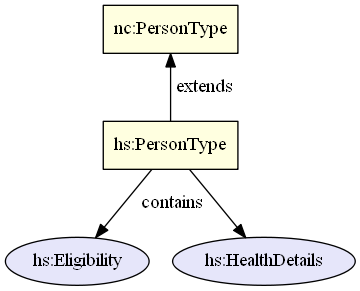

Augmentations are NIEM's mechanism to add additional content to a type defined by another namespace.

{:toc}
- TOC

Augmentations are done via element substitution (in XML).  Almost every type with complex content (sub-properties) in NIEM contains an augmentation point element.  These augmentation point elements serve solely as hooks, to be later replaced by additional content defined elsewhere.

{: .example}
> If a domain or an IEPD wanted to define additional properties about a person, it would create a new augmentation element and substitute it for `nc:PersonAugmentationPoint` (contained by `nc:PersonType`).  Any place nc:PersonType is used, the new augmentation may be used as well.

An augmentation may be either the new property to add (e.g., `my:PersonCustomCode`) or a container (e.g., `my:PersonAugmentation`) that has a set of sub-properties.

Adding additional content to a type is typically done using type extension, but NIEM abandoned that approach due to its limitations.  Type extension is limited to a single parent type; augmentations from several different namespaces can be used together because element substitution allows multiple occurrences.

<!--more-->

## Type extension issues

For example, for a domain to add additional content to the Core `PersonType` using extension, a new domain type would be declared that extended `nc:PersonType`, and domain properties would be added to it.

The issue with this is that type extension does not allow for multiple inheritance.  If more than one domain extends `nc:PersonType`, IEPD developers cannot use those related but separate extensions together.  They must choose a single type to reuse or derive from.

Additionally, type derivation can cause the unintended side effect of cascading extensions.  If you are unable to use type substitution in your instance, then once you extend the type you want, you will also need to create a new property of that new type.  If the original property is contained by another type you are using, you would then need to extend that type, and then the property of that type, and so on, all the way up the chain.

Augmentations were introduced in NIEM 2.0 to address these issues raised by the NIEM community, and revised in NIEM 3.0 to make them easier to use.

## Basic Approach

The augmentation approach has two parts to it: the additional content itself, and the means by which it can be used with other types.  **Augmentation elements** are the additional content defined in other namespaces, and **augmentation point elements** are the means that make this approach work, via substitution.  Multiple augmentation elements can be substituted and used together.

{: .note}
- Type and AugmentationPointElement are defined in the same namespace.
- AugmentationElements 1, 2, and 3 are each defined in separate namespaces.

## Example

This example shows the diagram above with actual properties and types from NIEM:

The augmentation element j:PersonAugmentation contains additional person-related properties that the Justice domain may need.  Similar augmentation elements are created here for the Maritime domain and an IEPD extension namespace.  These augmentations can be used separately or together any time nc:PersonType is used.

## When to use

Augmentations should be created only when trying to add additional content to an existing type from a namespace outside of your control.  If you find a type that has the right semantics and almost meets your requirements, but it is missing some properties that you need, an augmentation should be used to add the missing content.

Specialization in NIEM is still handled via type extension.  Specialization is different because it doesn't just deal with some missing properties - the existing type itself is not the right semantic match for the requirements.

{: .example}
> If a user wants to model a train with additional properties like whistle, locomotive, engineer, and caboose, nc:VehicleType might be the closest match but it isn't an exact match.  The semantics are different.  All trains may be vehicles, but not all vehicles are trains.  Rather than creating an augmentation for nc:VehicleType, a new TrainType should be created that extends nc:VehicleType and adds the train-specific properties.

Using type extension for specialization does not present the same problems that augmentations were designed to solve.  Multiple augmentations for a type may be used together in an IEPD because they are all meant to provide additional content for the same thing.  Specializations do not need to be able to be combined with other specializations in instances - a regular vehicle property does not need to contain train, boat, and airplane properties.

## IEPD exceptions

Because IEPDs do not have to be built with the same degree of flexibility and reusability as NIEM release schemas, they may use either augmentations or extensions. Augmentations may be easier to use in certain circumstances, such as trying to add additional content to a nested object which might otherwise require cascading extensions.

## See more

This section is split into two sub-sections:


