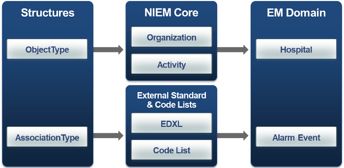

Namespaces act like collections that logically group related properties and types.  Namespaces represent content from an authoritative source or standard, such as a domain or the NIEM Business Architecture Committee (NBAC), which collaboratively manages the Core namespace.  They also have additional characteristics, like a target namespace URI (a unique ID) and a namespace prefix (used as shorthand for the URI).

{:toc}
- TOC

## Overview

Components are often referred to by their qualified names, like `nc:Person`.  Using the namespace prefix in front of the component name helps to identify and distinguish it, especially in cases where the same name may appear in multiple namespaces.

{: .example}
>
>- The `Human Services` domain is a namespace.
>- The full identifier (`targetNamespace` attribute in XML) for this namespace in NIEM 4.0 is `http://release.niem.gov/niem/domains/humanServices/4.0/`
>- In the 4.0 release, it uses the namespace prefix `hs` as shorthand for the full namespace identifier and defines components like property `hs:RequestedService` and type `hs:PlacementType`.

NIEM primarily creates namespaces in order to group components together based on governance.

- Core contains content typically too general to belong to any one domain, so it is managed by the NIEM Business Architecture Committee (NBAC), a governance body with cross-domain and community representation.
- Domain namespaces are managed by governance bodies in specific subject areas.
- Code namespaces typically reflect standards managed outside of NIEM.

A domain or IEPD may reuse any component from any NIEM release namespace.  Reuse is not limited to only Core and the most closely-related domains.

<!--more-->

Namespaces are sometimes referred to at a high level (like "Core") when the release version is already known or doesn't matter in the given context. To be unambiguous, the version should also be included (e.g., "Core 4.0").

### Categories

By convention, NIEM categorizes release namespaces.  This makes schemas easier to find in the release packages.  In the 4.0 release, the categories are the following:

| Namespace | Count | Description |
| --------- |:-----:| ----------- |
| Core      |  1 | Defines general properties and types (e.g., person, organization, activity) that do not belong to a specific subject area. Objects defined in Core leverage base XML objects defined in the Proxy and Structures schemas, and can be used as base objects for definitions in domain-specific schemas as well as extension schemas. |
| Domain    | 14 | Defines properties and types specific to a given subject area. |
| Code      | 36 | Provides NIEM-conformant representations of code sets that are typically defined and managed outside of NIEM. |
| Adapter   |  4 | Defines adapter components (the NIEM mechanism to reuse non-conformant external standards in a conformant way). |
| External  | 5* | Defines a namespace from an external standard that is not NIEM conformant. External standards are integrated into NIEM through the schemas in this namespace. |
| Proxy     |  1 | Defines complex types corresponding to standard XML Schema simple types. |
| Utility   |  4 | Provides components needed to support NIEM methodologies. |
| Support | 1 | Defines the underlying standardized structure for data objects in NIEM. Each of the data objects in the other namespaces reuse the basic data objects in Support:<br>`structures` contains NIEM base types to provide a set of generic types from which all types should derive.<br>`appinfo` contains definitions used in high-level data modeling and also for validation of NIEM-conformant instances. |

\* - External standards are sometimes made up of multiple namespaces.  The count above simply lists the number of external standards in NIEM, not the total number of namespaces they represent.

- See the [5.0 NIEM release](https://www.github.com/niem/niem-releases/tree/niem-5.0) on GitHub to review the full set of schemas.
- See the [training content pages](../../content) to get an overview of the content in these namespaces.

An IEPD is typically made up of subsetted versions of NIEM release namespaces, and one or more local namespaces that contain user-defined properties and types.  These user-defined namespaces are often referred to as **extension** namespaces.

{:.example}
>The Domain namespace category provides a mission-based and domain-specific layer of data objects that specialize base objects from the NIEM Core and Structures namespaces.
>

### Persistence

NIEM release namespaces are persistent.  Once a release is published, its schemas will not be overwritten with future changes.  Changes go into new schemas.  This ensures that existing exchanges do not break when NIEM publishes a new release.

{: .note}
> Because release namespaces are persistent, exchanges do not have to be updated when a new release is published.  Older release schemas can continue to be used indefinitely.

## Modeling guidance

A namespace defines content in the form of [properties](../property) and [types](../type).  Details about these components are provided in their own sections.

### Identifier

All NIEM-conformant namespaces are assigned an identifier, formatted as an absolute URI.

- In NIEM XML, this identifier appears in the schema's `targetNamespace` attribute.
- In NIEM JSON, this identifier appears in the JSON-LD context.

{: .example}
> The Core 4.0 namespace identifier is [`https://release.niem.gov/niem/niem-core/4.0/`](https://release.niem.gov/niem/niem-core/4.0/).

**Identifiers must by unique**

A target namespace acts as the unique ID for a namespace.  Each namespace must have its own target namespace.  This makes all schemas easy to reference individually and prevents one namespace from being defined across multiple files.

**Identifiers must be absolute URIs**

A target namespace must be an absolute URI.  Relative URIs are not allowed. An absolute URI, such as a URL or a URN, is universally identifiable.

Absolute URL example:

> http://release.niem.gov/niem/niem-core/4.0/
{:.valid}

Relative path URL:

> niem/niem-core/4.0/
{:.invalid}

Relative root URL :

> /niem/niem-core/4.0/
{:.invalid}

Relative protocol URL:

> //niem/niem-core/3.2/
{:.invalid}

**URI conventions**

For NIEM release namespaces, the target namespace URI typically follows the format:

{: .box}
> `base / category / name / version /`

{: .example}
> `http://release.niem.gov/niem/domains/immigration/4.0/`<br>
> `-------------base-----------/--cat--/---name----/ver/`

{: .note}
> The category is included only if there are multiple schemas for that kind of namespace. <br> Since there is only one Core namespace, the URI for Core omits the category.

More examples:

| Namespace | Target namespace URI |
| --------- | -------------------- |
| Core 3.2  | http://release.niem.gov/niem/niem-core/3.2/ |
| Core 4.0  | http://release.niem.gov/niem/niem-core/4.0/ |
| Immigration 4.0 domain | http://release.niem.gov/niem/domains/immigration/4.0/ |
| USPS 4.0 codes | http://release.niem.gov/niem/codes/usps_states/4.0/ |

User-defined namespaces can follow different conventions for their URIs.

**URI bases**

NIEM release namespaces use identifiers that begin with the base `http://release.niem.gov/niem/` because the NIEM Management Office owns this web domain.  For user-defined namespaces, like IEPD extension schemas, a different URI base should be chosen - preferably a domain that the user owns.

{: .box}
> Replace `http://release.niem.gov/niem/` with a different domain for namespaces that are not part of a NIEM release.

### Prefix

Namespace prefixes act as abbreviations for the full namespace URI.

{: .example}
> The namespace prefix for Core 4.0 is `nc`.

Target namespace URIs uniquely identify a namespace, but they are lengthy and can be awkward to use when referring to components (option 1, below).  Namespace prefixes allow use to use a much simpler syntax (option 2).

{: .box}
- option 1: `{https://release.niem.gov/niem/niem-core/4.0/}PersonType`
- option 2: `nc:PersonType`

The URIs are still necessary, however, for two reasons:

- Namespace prefixes are not unique.
- Namespace prefixes are locally assigned.

The NIEM 3.0 release uses `nc` as the namespace prefix for Core.  The 4.0 release does the same.  This is done on purpose since it requires less work to update IEPDs and documentation among other things.  The side effect, however, is that `nc` does not refer to any one specific version of Core.  Furthermore, an IEPD could choose to assign a completely different prefix to whichever version of Core it is using.

All of this leads to the following guidance:

> For formal usage, a namespace prefix must be linked to the URI that it represents.

This enables us to use the simpler syntax provided by the prefixes while maintaining the precision provided by the URIs.

### Version

A namespace version field is used to distinguish different drafts or updates of a namespace.  This version does not have to correspond with the release version or any versioning information in the URI.

{: .example}
> During the alpha 1 stage of the 4.0 development process, the Core namespace version was **alpha1**.

When the 4.0 NIEM schemas were under development, this version attribute was set to the corresponding pre-release stage - "alpha1", "beta1", "rc2", etc.

{: .example}
> In the final release, the Core 4.0 namespace has version **1**.

Version "1" represents that this is the first published version of the 4.0 Core namespace.  NIEM has not published follow-up versions (e.g., "2") to any namespace at the same URI, but it is an (unlikely) option for changes that do not affect schema validation or model semantics.

### Definition

Each namespace must have a definition that describes what it is.

### Language - [new in 5.0]

Each namespace must define the language in which its components are defined.  The language for NIEM release schemas is `en-US`.

### Conformance Targets

Each NIEM namespace must define one more conformance targets.  This explicitly identifies which rule sets should be applied for conformance validation.  A conformance target is identified by a URI.

For conformance to the NDR, the target will look like:

{: .box}
https://reference.niem.gov/niem/specification/naming-and-design-rules/VERSION/#TARGET

VERSION should be the version of the NDR:

- **3.0** - for schemas based on NDR 3.0 rules, like those in the NIEM 3.0, 3.1, and 3.2 releases.
- **4.0** - for schemas based on NDR 4.0 rules, like those in the NIEM 4.0 release.
- **5.0** - for schemas based on NDR 5.0 rules, like those in the NIEM 5.0 release.

TARGET should be a target defined by the NDR:

- **ReferenceSchemaDocument** - for schemas following the NDR's stricter rule set, like the NIEM release schemas.
- **ExtensionSchemaDocument** - for schemas following the NDR's less rigid rule set.

{: .example}
> A NIEM 3.2 schema using NDR extension rules would use the conformance target:
> https://reference.niem.gov/niem/specification/naming-and-design-rules**/3.0/#ExtensionSchemaDocument**

{: .example}
> A NIEM 4.0 schema using the NDR reference rules would use the conformance target:
> https://reference.niem.gov/niem/specification/naming-and-design-rules/**4.0/#ReferenceSchemaDocument**

{: .note}
> Release schemas must follow the reference rules, but locally-defined namespaces (like extension schemas) may choose which rule set to target.

See the section about the [Conformance Targets Attribute Specification](../../specifications/conformance-targets/) for more information.

## XML

### Full Templates

Templates for a 4.0 and a 5.0 NIEM namespace are provided below.

This should help give an overview of how a NIEM namespace looks in XML Schema, but each part will be broken out and explained in the section that follows.

Placeholders appear in upper case.  A few common namespace prefixes and import statements for 4.0 and 5.0 are also provided, but the relative paths in the import statements will need to be adjusted based on local directory layouts.

{: .tip}
> In order to use extension schema rules rather than reference schema rules, like for an IEPD extension namespace, change the end of the ct:conformanceTargets value from `#ReferenceSchemaDocument` to `#ExtensionSchemaDocument`.

**4.0 template**

```xml
<?xml version="1.0" encoding="US-ASCII"?>
<xs:schema
  targetNamespace="URI" version="VERSION"

  xsi:schemaLocation="http://release.niem.gov/niem/appinfo/4.0/ ../niem/utility/appinfo/4.0/appinfo.xsd
  http://release.niem.gov/niem/conformanceTargets/3.0/ ../niem/utility/conformanceTargets/3.0/conformanceTargets.xsd"

  ct:conformanceTargets="http://reference.niem.gov/niem/specification/naming-and-design-rules/4.0/#ReferenceSchemaDocument"

  xmlns:PREFIX="URI"
  xmlns:appinfo="http://release.niem.gov/niem/appinfo/4.0/"
  xmlns:ct="http://release.niem.gov/niem/conformanceTargets/3.0/"
  xmlns:nc="http://release.niem.gov/niem/niem-core/4.0/"
  xmlns:niem-xs="http://release.niem.gov/niem/proxy/xsd/4.0/"
  xmlns:structures="http://release.niem.gov/niem/structures/4.0/"
  xmlns:xs="http://www.w3.org/2001/XMLSchema"
  xmlns:xsi="http://www.w3.org/2001/XMLSchema-instance">

  <xs:annotation>
    <xs:documentation>NAMESPACE_DEFINITION</xs:documentation>
    <xs:appinfo>
      <appinfo:LocalTerm term="TERM1" literal="LITERAL1"/>
      <appinfo:LocalTerm term="TERM2" definition="DEFINITION2"/>
    </xs:appinfo>
  </xs:annotation>

  <xs:import schemaLocation="IMPORT_PATH" namespace="IMPORT_URI"/>
  <xs:import schemaLocation="../niem/niem-core/4.0/niem-core.xsd"
             namespace="http://release.niem.gov/niem/niem-core/4.0/"/>
  <xs:import schemaLocation="../niem/utility/structures/4.0/structures.xsd"
             namespace="http://release.niem.gov/niem/structures/4.0/"/>

  <!-- element, attribute, and type declarations -->

</xs:schema>
```

**5.0 template**

```xml
<?xml version="1.0" encoding="US-ASCII"?>
<xs:schema
  targetNamespace="URI" version="VERSION" xml:lang="en-US"

  xsi:schemaLocation="http://release.niem.gov/niem/appinfo/5.0/ ../utility/appinfo.xsd
  http://release.niem.gov/niem/conformanceTargets/3.0/ ../utility/conformanceTargets.xsd"

  ct:conformanceTargets="http://reference.niem.gov/niem/specification/naming-and-design-rules/5.0/#ReferenceSchemaDocument"

  xmlns:PREFIX="URI"
  xmlns:appinfo="http://release.niem.gov/niem/appinfo/5.0/"
  xmlns:ct="http://release.niem.gov/niem/conformanceTargets/3.0/"
  xmlns:nc="http://release.niem.gov/niem/niem-core/5.0/"
  xmlns:niem-xs="http://release.niem.gov/niem/proxy/xsd/5.0/"
  xmlns:structures="http://release.niem.gov/niem/structures/5.0/"
  xmlns:xs="http://www.w3.org/2001/XMLSchema"
  xmlns:xsi="http://www.w3.org/2001/XMLSchema-instance">

  <xs:annotation>
    <xs:documentation>NAMESPACE_DEFINITION</xs:documentation>
    <xs:appinfo>
      <appinfo:LocalTerm term="TERM1" literal="LITERAL1"/>
      <appinfo:LocalTerm term="TERM2" definition="DEFINITION2"/>
    </xs:appinfo>
  </xs:annotation>

  <xs:import namespace="IMPORT_URI" schemaLocation="IMPORT_PATH"/>
  <xs:import namespace="http://release.niem.gov/niem/niem-core/5.0/" schemaLocation="../niem-core.xsd"/>
  <xs:import namespace="http://release.niem.gov/niem/structures/5.0/" schemaLocation="../utility/structures.xsd"/>

  <!-- element, attribute, and type declarations -->

</xs:schema>
```

{: .note}
[Local terminology](../local-term), [elements](../property/element), [attributes](../property/attribute), and [types](../type), which appear in the template above, are described in their own sections.

### Parts of the template

The following goes into more detail about parts of the templates given above.

#### URI, Version, and Language

The target namespace URI, version, and language are declared as schema attributes:

{:.note}
> `xml:lang` is a newly-added requirement to NDR 5.0.

```xml
targetNamespace="URI"
```

```xml
version="VERSION"
```

```xml
xml:lang="LANG"
```

Core 5.0 example:

```xml
<xs:schema targetNamespace="http://release.niem.gov/niem/niem-core/5.0/" version="1" xml:lang="en-US">
  ...
</xs:schema>
```

#### xsi:SchemaLocation

`xsi:schemaLocation` is used to bind one or more URIs to their locations.  NIEM uses this in places where a namespace is referenced but does not have to be imported (metadata on the schema itself).

The value of the attribute is a string of one or more "URI LOCATION" pairs.

```xml
xsi:schemaLocation="URI1 LOC1 URI2 LOC2 ..."
```

In 4.0, `xsi:schemaLocation` is used for the conformance targets namespace and the appinfo namespace.

```xml
<xs:schema
  xsi:schemaLocation="http://release.niem.gov/niem/appinfo/4.0/ ../niem/utility/appinfo/4.0/appinfo.xsd
  http://release.niem.gov/niem/conformanceTargets/3.0/ ../niem/utility/conformanceTargets/3.0/conformanceTargets.xsd">
  ...
</xs:schema>
```

#### Conformance Targets

Conformance targets are URIs that identify rules to apply to check conformance.

```xml
ct:conformanceTargets="URI"
```

If there are multiple conformance targets, separate each URI with a space.

```xml
ct:conformanceTargets="URI1 URI2 ..."
```

The namespace prefix `ct` corresponds to URI `http://release.niem.gov/niem/conformanceTargets/3.0/`

{: .note}
> The conformance targets namespace did not change in the NIEM 4.0 release, so it remains at version 3.0.

NIEM 4.0-based example of a namespace targeting the NDR 4.0 reference rules:

```xml
<xs:schema
  ct:conformanceTargets="http://reference.niem.gov/niem/specification/naming-and-design-rules/4.0/#ReferenceSchemaDocument"
  >
  ...
</xs:schema>
```

NIEM 4.0-based example of a namespace (like an extension schema) targeting the NDR 4.0 extension rules:

```xml
<xs:schema
  ct:conformanceTargets="http://reference.niem.gov/niem/specification/naming-and-design-rules/4.0/#ExtensionSchemaDocument"
  >
  ...
</xs:schema>
```

See the section about the [Conformance Targets Attribute Specification](../../specifications/conformance-targets/) for more information.

#### Namespace prefixes

Prefixes should be assigned for each namespace that is referenced, and also for the current namespace.

```xml
xmlns:PREFIX="URI"
```

This statement binds the prefix to the given URI, so the prefix may be used in the schema as an abbreviation for the full URI.

Core 4.0 namespace prefix example:

```xml
<xs:schema
  xmlns:nc="http://release.niem.gov/niem/niem-core/4.0/">
  ...
</xs:schema>
```

Prefixes should be assigned for:

- the current namespace
- imported namespaces
- xsi:schemaLocation namespaces
- the XML Schema namespace (xs)
- the XML Schema Instance namespace (xsi)

NIEM namespaces that are not required but that are commonly used include:

- Core
- niem-xs
- structures

The target and imported namespaces will vary based on the given schema, but the remaining ones from the lists above appear as the following in NIEM 4.0:

```xml
<xs:schema
  xmlns:appinfo="http://release.niem.gov/niem/appinfo/4.0/"
  xmlns:ct="http://release.niem.gov/niem/conformanceTargets/3.0/"
  xmlns:nc="http://release.niem.gov/niem/niem-core/4.0/"
  xmlns:niem-xs="http://release.niem.gov/niem/proxy/xsd/4.0/"
  xmlns:structures="http://release.niem.gov/niem/structures/4.0/"
  xmlns:xs="http://www.w3.org/2001/XMLSchema"
  xmlns:xsi="http://www.w3.org/2001/XMLSchema-instance">
</xs:schema>
```

#### Definition

A definition for the namespace is required.

```xml
<xs:annotation>
  <xs:documentation>DEFINITION</xs:documentation>
</xs:annotation>
```

The definition is represented as annotation documentation on the xs:schema root node.

CBRN 4.0 domain example:

```xml
<xs:schema>
  <xs:annotation>
    <xs:documentation>Chemical, Biological, Radiological, and Nuclear Domain</xs:documentation>
  </xs:annotation>
  ...
</xs:schema>
```

#### Imports

Import statements (or catalog files) are required in order to reuse content from other namespaces.

An import statement lists the URI and either the absolute or the relative path of the namespace to be imported.

```xml
<xs:import schemaLocation="IMPORT_PATH" namespace="IMPORT_URI"/>
```

Example import of Core 4.0:

```xml
<xs:import schemaLocation="../niem/niem-core/4.0/niem-core.xsd"
           namespace="http://release.niem.gov/niem/structures/4.0/"/>
```

### NIEM's profile of XML Schema

To promote consistency across a broad community, NIEM limits some of the features available in XML Schema that provide flexibility but may hurt interoperability or reusability.

A few of the key restrictions on the usage of XML Schema are listed below.  See the NDR for more.

**No local elements**

Local elements and attributes cannot be reused outside of the type in which they are defined, which conflicts with the NIEM principle of maximizing reusability.

**No anonymous types**

Types defined anonymously can only be used by the elements that define them, which conflicts with the NIEM principle of maximizing reusability.

**No xs:include**

Include statements are declared to combine multiple schema files into a single logical namespace with one target namespace.  Import statements are declared to reuse content from a schema with a target namespace.

NIEM requires that each XML Schema must have its own target namespace to provide unambiguous identification of content, so include statements may not be used.

**No xs:choice (ref only)**

The use of `xs:choice` can lead to ambiguity in some circumstances and are thus not allowed in NIEM reference schemas.  Element substitution is a common alternative.

Extension schemas are allowed to use `xs:choice`.

## JSON

### Schema template

```json
{
  "$schema": "http://json-schema.org/draft-04/schema#",
  "additionalProperties": false,
  "properties": {
    ...
  },
  "definitions": {
    ...
  }
}
```

`$schema` defines which draft of the JSON Schema specification that this schema should conform to.

`additionalProperties` specifies whether or not properties in addition to the ones defined in this schema are allowed in instances.

`properties` contains the NIEM property declarations.  See more in the [Properties section](../property).

`definitions` contains the NIEM type declarations.  See more in the [Types section](../type).

### Schema example

The example below shows an example JSON schema, based on current guidance.

<!--
  Run make in the current directory to update the examples from the json directory.  Jekyll does not include relative files from parent directories.
  -->

```json

```

### JSON-LD Context

Additional context information is needed to associate the namespace prefixes used by NIEM with their URIs.

The NIEM 4.0 release provides this context association in the file niem-4.0-context.jsonld, a subset of which is provided below:

```json
{
    "aamva_d20": "http://release.niem.gov/niem/codes/aamva_d20/4.0/#",
    "ag": "http://release.niem.gov/niem/domains/agriculture/4.0/#",
    "nc": "http://release.niem.gov/niem/niem-core/4.0/#",
    "usps": "http://release.niem.gov/niem/codes/usps_states/4.0/#"
}
```

This is a simple JSON file assigning target namespaces, followed by the "#" symbol, to each namespace prefix used in the release.

The hash symbol is used as part of JSON pointer notation.

## NDR references

The following provides information about namespaces in the [Naming and Design Rules (NDR) Specification]({{ site.data.pages.ndr | relative_url }}).

### General-purpose



### XML-specific


