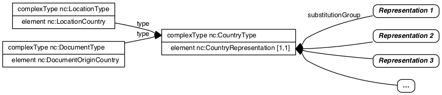

In NIEM, multiple representations of a concept are typically handled via abstract elements and substitution groups.  This allows for replacement of the abstract element in an instance with one or more of the substitutions.

{:toc}
- TOC

## Overview

{:.example}
> Abstract element nc:PersonHairColorAbstract has multiple substitutions, allowing for free-text or code value representations.

In cases where the concept not only has multiple representations but also additional properties describing the concept, a new type is needed to bundle the representations and additional properties together.  This is the representation pattern.

{:.example}
- Type nc:DateType contains...
  - An abstract date representation element
  - Additional date-related properties

The major difference between the two examples is that there are other date-related properties in addition to the multiple date representations; hair color has multiple representations only.

<!--more-->

### Abstract vs Representation

The table below shows an example outlining the difference between regular abstract elements + substitutions versus the representation pattern.

{:.note}
- Multiple representations are handled the same in both cases - an abstract element with multiple substitutions.
- The representation pattern adds additional content and a type to bundle it with the abstract element.

<table>
  <thead>
    <tr>
      <th>Pattern</th>
      <th>Abstract Element + Substitutions</th>
      <th>Representation Pattern</th>
    </tr>
  </thead>
  <tr>
    <td>Type</td>
    <td>n/a</td>
    <td>nc:DateType</td>
  </tr>
  <tr>
    <td>--Multiple representations</td>
    <td>
      nc:PersonHairColorAbstract
      <ul>
        <li>substitutions:</li>
        <li>nc:PersonHairColorText</li>
        <li>j:PersonHairColorCode</li>
      </ul>
    </td>
    <td>
      nc:DateRepresentation
      <ul>
        <li>substitutions:</li>
        <li>nc:Date</li>
        <li>nc:DateTime</li>
        <li>nc:ZuluDateTime</li>
        <li>...</li>
      </ul>
    </td>
  </tr>
  <tr>
    <td>--Additional Content</td>
    <td>n/a</td>
    <td>
      <ul>
        <li>nc:DateAccuracyAbstract</li>
        <li>nc:DateMarginOfErrorDuration</li>
      </ul>
    </td>
  </tr>
</table>

{:.note}
> Just because an abstract element is contained in a type does not mean it follows the representation pattern.  Element nc:PersonHairColorAbstract is used in type nc:PersonType, but hair color is simply a property of a person, not a full representation of a person.

## Country codes example

Country codes are one example of the representation pattern in NIEM.

Two of the authoritative sources for country codes in the NIEM 4.0 release are **GENC** (Geopolitical Names, Entities, and Codes) and **ISO 3166-1**.  Both of these standards have 2-character, 3-character, and numeric representations.  In addition to these, NIEM also includes a text representation.

In NIEM 4.0, country codes were refactored in order to use the representation pattern.  This provided multiple benefits:

- It simplified the creation of new country code elements.
- It reduced the number of existing elements with the same semantic meaning.
- It improved consistency, by making the same set of substitutions easily reusable.

{:.note}
> See [Country Code Representations]({{ site.data.pages.code-lists | relative_url }}) for information about the different representation formats used with country codes, including CSV files for GENC codes.

### Representation Pattern

Because NIEM (1) has multiple representations for country codes and (2) country codes are used in many different contexts throughout the model, they were a good candidate for the representation pattern.

#### Before

In NIEM 3.2, before the representation pattern was used, a new country code element was created for each usage of a code set.  These elements include:

| NIEM 3.2 Element | Type |
| ---------------- | ---- |
| nc:DocumentCountryISO3166Alpha2Code | iso_3166:CountryAlpha2CodeType |
| nc:LocationCountryISO3166Alpha2Code | iso_3166:CountryAlpha2CodeType |
| nc:LocationCountryGENCCode | genc:CountryAlpha3CodeType |
| nc:MilitaryCountryGENCCode | genc:CountryAlpha3CodeType |
| nc:PersonCitizenshipISO3166Alpha2Code | iso_3166:CountryAlpha2CodeType |
| nc:PersonNationalityISO3166Alpha2Code | iso_3166:CountryAlpha2CodeType |
| biom:ForensicSourceCountryISO3166Alpha2Code | iso_3166:CountryAlpha2CodeType |
| biom:RecordingSourceCountryISO3166Alpha2Code | iso_3166:CountryAlpha2CodeType |
| mo:FacilityAllegianceCountryCode | genc:CountryAlpha3CodeType |

#### After

In order to simplify and enable reuse, the representation pattern was used in NIEM 4.0 and type `nc:CountryType` was created.  This type contains abstract element `nc:CountryRepresentation`, which allows for substitution by GENC and ISO 3166 code elements, as well as other NIEM and local elements.

Using the representation pattern, NIEM 4.0 country code elements include:

| NIEM 4.0 Element | Type |
| ---------------- | ---- |
| nc:DocumentCountry | nc:CountryType |
| nc:LocationCountry | nc:CountryType |
| nc:MilitaryCountry | nc:CountryType |
| biom:ForensicSourceCountry | nc:CountryType |
| biom:RecordingSourceCountry | nc:CountryType |
| mo:FacilityAllegianceCountry | nc:CountryType |

This approach adds greater consistency with less duplication.  Any element of type `nc:CountryType` may use one or more of the different country code representations.  And each semantic concept only has to be defined once.

#### Comparison

In NIEM 4.0, the addition of `nc:CountryType` made it possible to reuse multiple representations, rather than requiring a new element to be created for each usage.

<table>
  <thead>
    <tr>
      <th>Release</th>
      <th>Location Country Elements</th>
      <th>Types</th>
    </tr>
  </thead>
  <tr>
    <td>
      <ul>
        <li>NIEM 3.2</li>
      </ul>
    </td>
    <td>
      <ul>
        <li>nc:LocationCountryISO3166Alpha2Code</li>
        <li>nc:LocationCountryGENCCode</li>
      </ul>
    </td>
    <td>
      <ul>
        <li>iso_3166:CountryAlpha2CodeType</li>
        <li>genc:CountryAlpha3CodeType</li>
      </ul>
    </td>
  </tr>
  <tr>
    <td>
      <ul>
        <li>NIEM 4.0</li>
      </ul>
    </td>
    <td>
      <ul>
        <li>nc:LocationCountry</li>
      </ul>
    </td>
    <td>
      <ul>
        <li>nc:CountryType</li>
      </ul>
    </td>
  </tr>
</table>

### Diagram

The following diagram shows type `nc:CountryType`, which carries representations of a country across NIEM exchanges.

{:.note}
- type `nc:CountryType` is used by `nc:LocationType` and `nc:DocumentType`
- `nc:CountryType` has an element `nc:CountryRepresentation`,
which may be replaced in an instance by a number of ways to identify a country.



### XML Examples

#### Schema

The example below shows the declaration of type `nc:CountryType` and one element that uses this type:

```xml
<xs:complexType name="CountryType">
  <xs:annotation>
    <xs:documentation>A data type for a country, territory, dependency, or other such geopolitical subdivision of a location.</xs:documentation>
  </xs:annotation>
  <xs:complexContent>
    <xs:extension base="structures:ObjectType">
      <xs:sequence>
        <xs:element ref="nc:CountryRepresentation" minOccurs="0" maxOccurs="unbounded"/>
        <xs:element ref="nc:CountryAugmentationPoint" minOccurs="0" maxOccurs="unbounded"/>
      </xs:sequence>
    </xs:extension>
  </xs:complexContent>
</xs:complexType>

<xs:element name="LocationCountry" type="nc:CountryType" nillable="true">
  <xs:annotation>
    <xs:documentation>A country, territory, dependency, or other such geopolitical subdivision of a location.</xs:documentation>
  </xs:annotation>
</xs:element>
```

#### Instance example

The following shows three different examples of element `nc:LocationCountry`, each using a different representation provided by `nc:CountryType`:

```xml
<nc:LocationCountry>
  <nc:LocationCountryISO3166Alpha2Code>US</nc:LocationCountryISO3166Alpha2Code>
</nc:LocationCountry>

<nc:LocationCountry>
  <nc:CountryCode>USA</nc:CountryCode>
</nc:LocationCountry>

<nc:LocationCountry>
  <nc:LocationCountryName>United States</nc:LocationCountryName>
</nc:LocationCountry>
```

### Other representations

In addition to the GENC and ISO 3166 representations, other representations may be used with NIEM 4, either by additional substitutions for `nc:CountryRepresentation`, or by providing additional code list URIs with `nc:CodeType` ([see Code Lists for more]({{ page.code_lists | relative_url }})).

An IEPD (information exchange package definition), which specifies a message, may include one or more of these representations to convey countries. Which representations are used is determined by the community of interest developing the message specification.

## Modeling guidance

### Type

A representation pattern is modeled by a type that contains an abstract representation element and one or more additional properties.

### Representation Element

#### Abstract

The representation element must be abstract.  This allows for substitution by the alternate representations.

#### Name

The name of the representation element must end with "Representation".

## XML

### Instance example

The example below shows an element with type nc:DateType.

{:.note}
- Element "nc:Date" substitutes for abstract element nc:DateRepresentation.
- The date also includes a margin of error duration.  In this cases, the date is plus or minus a period of 3 months.

```xml
<nc:ActivityDate>
  <nc:Date>2017-06-01</nc:Date>
  <nc:DateMarginOfErrorDuration>P3M</nc:DateMarginOfErrorDuration>
</nc:ActivityDate>
```

### Schema example

The example below shows..

- The declaration of type nc:DateType, which follows the representation pattern.
- The declaration of the representation element nc:DateRepresentation (abstract) and several substitutions.

```xml
<xs:complexType name="DateType">
  <xs:annotation>
    <xs:documentation>A data type for a calendar date.</xs:documentation>
  </xs:annotation>
  <xs:complexContent>
    <xs:extension base="structures:ObjectType">
      <xs:sequence>
        <xs:element ref="nc:DateRepresentation" minOccurs="0" maxOccurs="unbounded"/>
        <xs:element ref="nc:DateAccuracyAbstract" minOccurs="0" maxOccurs="1"/>
        <xs:element ref="nc:DateMarginOfErrorDuration" minOccurs="0" maxOccurs="1"/>
        <xs:element ref="nc:DateAugmentationPoint" minOccurs="0" maxOccurs="unbounded"/>
      </xs:sequence>
    </xs:extension>
  </xs:complexContent>
</xs:complexType>

<xs:element name="DateRepresentation" abstract="true">
  <xs:annotation>
    <xs:documentation>A data concept for a representation of a date.</xs:documentation>
  </xs:annotation>
</xs:element>

<xs:element name="Date" type="niem-xs:date" substitutionGroup="nc:DateRepresentation" nillable="true">
  <xs:annotation>
    <xs:documentation>A full date.</xs:documentation>
  </xs:annotation>
</xs:element>

<xs:element name="DateTime" type="niem-xs:dateTime" substitutionGroup="nc:DateRepresentation">
  <xs:annotation>
    <xs:documentation>A full date and time.</xs:documentation>
  </xs:annotation>
</xs:element>
```

### Schema template

```xml
<xs:complexType name="NAMEType">
  <xs:annotation>
    <xs:documentation>A data type for ...</xs:documentation>
  </xs:annotation>
  <xs:complexContent>
    <xs:extension base="structures:ObjectType">
      <xs:sequence>
        <xs:element ref="nc:NAMERepresentation" minOccurs="0" maxOccurs="unbounded"/>
        <xs:element ref="..." minOccurs="0" maxOccurs="unbounded"/>
        <xs:element ref="nc:NAMEAugmentationPoint" minOccurs="0" maxOccurs="unbounded"/>
      </xs:sequence>
    </xs:extension>
  </xs:complexContent>
</xs:complexType>

<xs:element name="NAMERepresentation" abstract="true">
  <xs:annotation>
    <xs:documentation>A data concept for a representation of a ...</xs:documentation>
  </xs:annotation>
</xs:element>

<xs:element name="REPRESENTATION-1" type="TYPE" substitutionGroup="nc:NAMERepresentation" nillable="true">
  <xs:annotation>
    <xs:documentation>DEFINITION</xs:documentation>
  </xs:annotation>
</xs:element>

<xs:element name="REPRESENTATION-2" type="TYPE" substitutionGroup="nc:NAMERepresentation" nillable="true">
  <xs:annotation>
    <xs:documentation>DEFINITION</xs:documentation>
  </xs:annotation>
</xs:element>

```

## JSON

### Instance example

The example below shows an element with type nc:DateType.

{:.note}
- Property "nc:Date" is used as the representation of a date.
- The date also includes a margin of error duration.  In this cases, the date is plus or minus a period of 3 months.

```json
{
  "nc:ActivityDate": {
    "nc:Date": "2017-06-01",
    "nc:DateMarginOfErrorDuration": "P3M"
  }
}
```

### Schema example

The example below shows..

- The declaration of type nc:DateType, which follows the representation pattern.
- The declaration of several representation element.

{:.note}
> Because JSON Schema does not support substitution groups, representation properties should be added directly to the type.  In XML Schema, the representations would be created as substitutable for an abstract element instead.

```json
{
  "$schema": "http://json-schema.org/draft-04/schema#",
  "additionalProperties": false,
  "properties": {
    "nc:Date": {
      "description": "A full date.",
      "oneOf": [
        {
          "$ref": "#/definitions/niem-xs:date"
        },
        {
          "type": "array",
          "items": {
            "$ref": "#/definitions/niem-xs:date"
          }
        }
      ]
    },

    "nc:DateTime": {
      "description": "A full date and time.",
      "oneOf": [
        {
          "$ref": "#/definitions/niem-xs:dateTime"
        },
        {
          "type": "array",
          "items": {
            "$ref": "#/definitions/niem-xs:dateTime"
          }
        }
      ]
    }
  }

  "definitions": {
    "nc:DateType": {
      "description": "A data type for a calendar date.",
      "allOf": [
        {
          "$ref": "#/definitions/_base"
        },
        {
          "type": "object",
          "properties": {
            "nc:Date": {
              "$ref": "#/properties/nc:Date"
            },
            "nc:DateTime": {
              "$ref": "#/properties/nc:DateTime"
            },
            "nc:ZuluDateTime": {
              "$ref": "#/properties/nc:ZuluDateTime"
            },
            "nc:DateMarginOfErrorDuration": {
              "$ref": "#/properties/nc:DateMarginOfErrorDuration"
            }
          }
        }
      ]
    }
  }
}
```

### Schema template

The template belows shows the declaration of a type following the representation pattern, plus two representation properties.

```json
{
  "$schema": "http://json-schema.org/draft-04/schema#",
  "additionalProperties": false,
  "properties": {
    "REPRESENTATION-1": {
      "description": "DEFINITION",
      "oneOf": [
        {
          "$ref": "#/definitions/TYPE"
        },
        {
          "type": "array",
          "items": {
            "$ref": "#/definitions/TYPE"
          }
        }
      ]
    },

    "REPRESENTATION-2": {
      "description": "DEFINITION",
      "oneOf": [
        {
          "$ref": "#/definitions/TYPE"
        },
        {
          "type": "array",
          "items": {
            "$ref": "#/definitions/TYPE"
          }
        }
      ]
    }
  }

  "definitions": {
    "REPRESENTATION-TYPE": {
      "description": "A data type for ...",
      "allOf": [
        {
          "$ref": "#/definitions/_base"
        },
        {
          "type": "object",
          "properties": {
            "REPRESENTATION-1": {
              "$ref": "#/properties/REPRESENTATION-1"
            },
            "REPRESENTATION-2": {
              "$ref": "#/properties/REPRESENTATION-2"
            },
            "ADDITIONAL-CONTENT": {
              "$ref": "#/properties/ADDITIONAL-CONTENT"
            }
          }
        }
      ]
    }
  }
}
```

## NDR references


