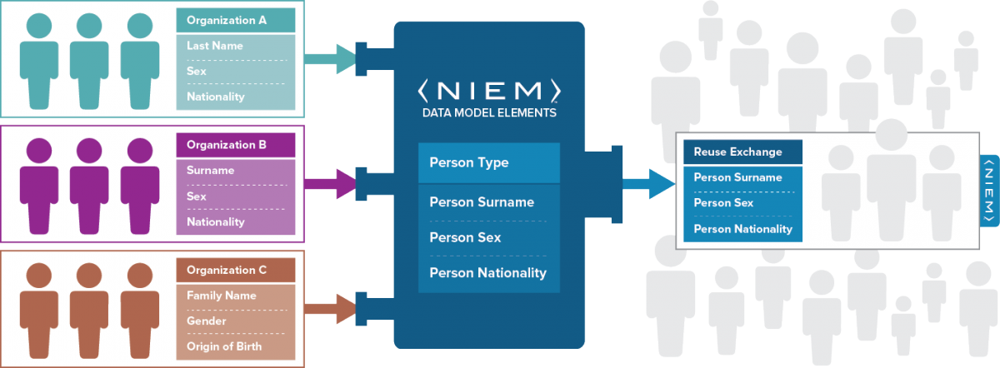
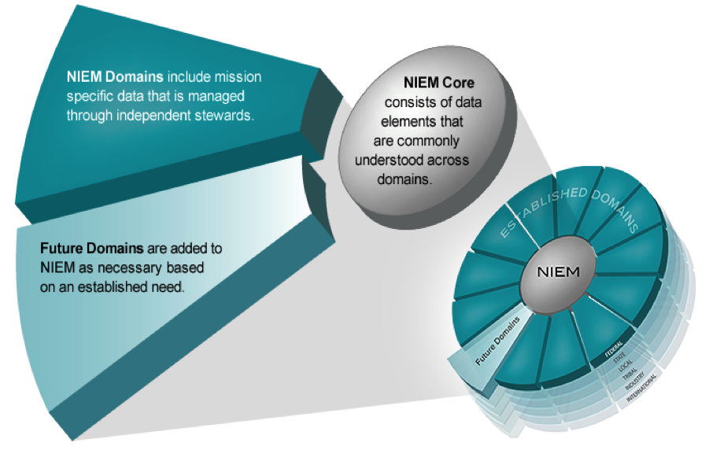

The National Information Exchange Model (NIEM) is a data model that defines rules and reusable components to enables efficient information exchange across diverse organizations, public or private. The purpose of NIEM is to provide the ablitity to create information exchanges with clear semantics and a higher degree of consistency across the community of stackholders.

If I say "vessel" and you say "boat", and he says "ship" and she says "conveyance", we may mean the same thing, but we have no way to tell our computer systems to treat the words as having the same meaning. Until we do, we'll all have separate facts about the same world—pieces of the big puzzle—but no common understanding or way to connect them. NIEM lets our systems speak—even if they've never spoken before—by ensuring that information carries the same, consistent, meaning.

Words are to a dictionary as elements are to a reference model. The NIEM model consists of two related vocabularies: core elements that are commonly agreed to by all of the communities who use NIEM, and community-specific elements that align to individual NIEM domains.

## The NIEM Framework

Explore the components of the NIEM framework and learn about their use.


