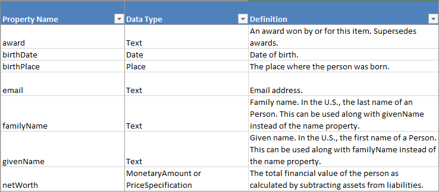
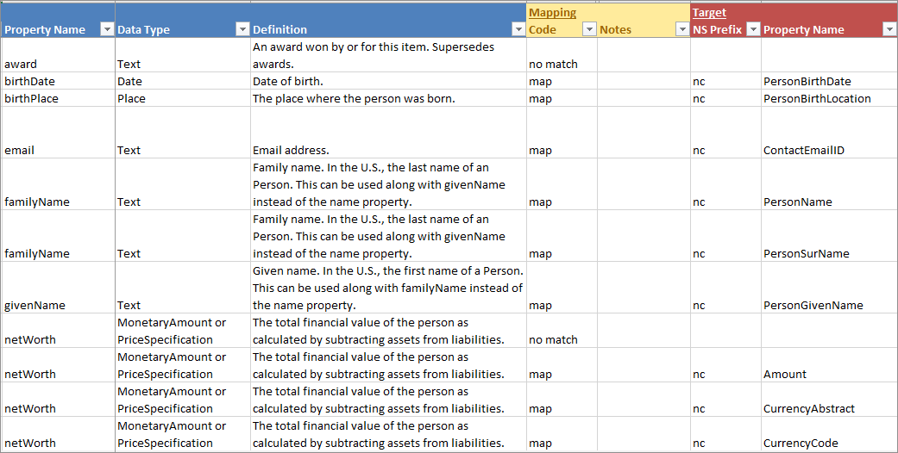
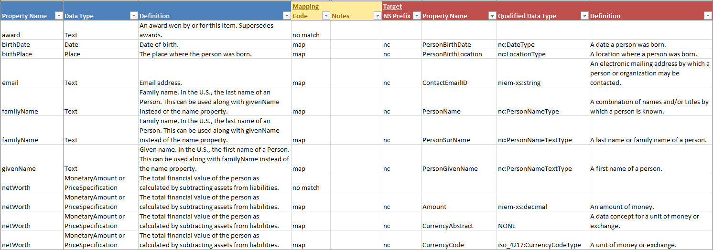
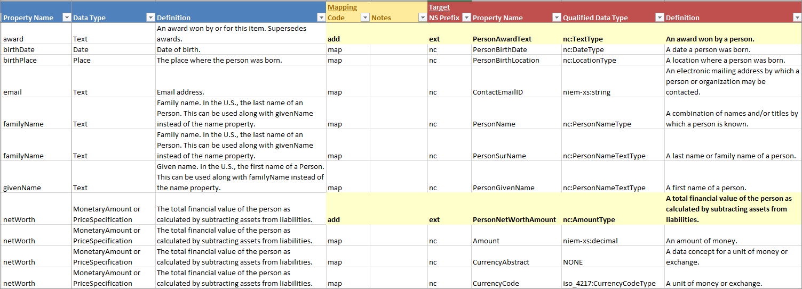

{{ page.description}}

{:toc}
- TOC

This is the same template that can be used to submit change requests for NIEM release content.  There are additional tabs and columns to support this level of detail, but to just use this spreadsheet for mappings, focus on the "Property" tab.  Customize the spreadsheet by hiding column and tabs that aren't being used.

Note that at this time, this spreadsheet is for documentation purposes only.  There currently is no automated support for generating a NIEM subset or building extension schemas from a mapping spreadsheet.

Download the **[template](assets/niem-mapping-template.xlsx)** and **[example spreadsheet](assets/iepd-requirements-example.xlsx)** - *last updated 2021-07-19*.

## Mapping examples

### Data requirements

The image below shows some examples of how data requirements can be captured in the spreadsheet.

### Simple mappings

The image below shows how the data requirements

{:.tip}
- It may be necessary to map one data requirement to multiple properties in NIEM.  Repeat the data requirement information if necessary.

### Detailed mappings

While not required, if it's helpful for review, include definition and type information for NIEM properties.

## Modeling examples

In addition to documenting whether or not local requirements map to NIEM, it's also possible to use the spreadsheet to model the extensions.

### Property tab

For data requirements that do not map to NIEM ("no match"), fill in the following fields:

**Property name**

- Add a NIEM-conformant property name.
- See [Property -- Naming]({{ "/reference/concepts/property/#naming" | relative_url }}) for naming tips.

**Property type** ("Qualified Data Type")

- Reuse an existing type from NIEM if one is suitable
- Add a new name if a new extension type will need to be created.
- Make sure that the type name starts with a namespace prefix so the source of the type can be identified.

**Property definition**

- Add a NIEM-conformant property definition.
- See [Property -- Definitions]({{ "/reference/concepts/property/#definitions" | relative_url }}) for definition tips.

**Mapping code**

- Change the mapping code from "no match" to "add" once the extension has been modeled.

The image below shows how two extension properties will be modeled in a forthcoming extension schema.  They are in bold text and highlighted in yellow to stand out here, but do not have to be formatted differently in the actual spreadsheet itself - the "add" mapping code and the different namespace prefix will distinguish these rows from the properties that actually exist in NIEM.

### Additional tabs

Additional tabs can be used to model extensions:

- **Type tab** - Add basic information about types, including names, namespace prefixes, definitions, styles, and parent or base types.

- **Type-has-property** - Nest properties under a type.  For example, for a person name type, the properties that would appear under the type would include first name and last name.

- **Codes \| Facets tab** - Add codes and definitions, or other kinds of facets (e.g., patterns, min or max limits on a number).  Each facet row should include the namespace prefix and name of the simple type that will define it.

- **Namespace tab** - Add basic information about new namespaces that will be created, including the namespace prefix, URI, definition, and file name.

- **Local terminology tab** - Add acronyms, abbreviations, or other local terminology and provide either their literals or their definitions.
