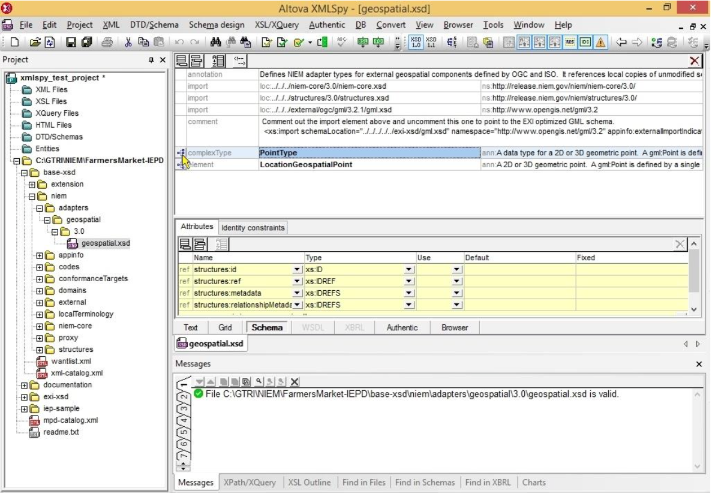

It is sometimes necessary to specify an alternate schema file for a particular namespace. For example, when one of the NIEM subset schemas must be modified. Directly altering the NIEM subset schema is not a good idea because it may be regenerated during the development process. This would require the modifications to be reapplied each time a new NIEM subset is generated. When this is the case, a new version of the schema that must be modified should be stored outside of the NIEM subset directory.

One way to specify an alternate schema location, without modifying the existing schemas, is through an XML catalog. With a catalog, a different schema location can be assigned, for a particular namespace, that will overrule import statements for that namespace.

As an example, refer to the FarmersMarket IEPD. This IEPD has an alternate schema for the GML namespace that should be used whenever EXI is used to encode the FarmersMarket instances. FarmersMarket-IEPD/exi- xsd/gml.xsd is a subset of the GML schemas and has only the GML components needed for the FarmersMarket IEPD as well as modifications. FarmersMarket-IEPD/exi-xsd/exi-xml-catalog.xml is a simple XML catalog file that can be used point occurences of the GML namespace to gml.xsd. This is done by using the following element:

<pre><code>&lt;uri name=<strong><u>"http://www.opengis.net/gml/3.2"</u></strong> uri=<strong>"./gml.xsd"</strong>/&gt;</code></pre>

The name attribute is the namespace as it appears in the IEPD schemas. The uri attribute is the relative path of the schema file.

<h4 id="ctas" style="padding-top: 65px; margin-top: -65px;">How to redifine a schema location using a catalog file</h4>

Step 1: Create, or determine, the alternate schema to be assgned to the namespace
	
* The alternate schema used in this example is FarmersMarket-IEPD\exi-xsd\gml.xsd</li>
* It is a subset of the GML schemas found in FarmersMarket-IEPD\base-xsd\niem\external\ogc\gml\

Step 2: Create a catalog XML instance

<ol type= "a">
    <li>Open a text editor and create the base catalog instance, the example below can be pasted directly into
the text editor.</li>

<pre><code>&lt;?xml version=<strong>"1.0"</strong> encoding=<strong>"US-ASCII"</strong>?&gt;
&lt;!DOCTYPE catalog PUBLIC "-//OASIS//DTD Entity Resolution XML Catalog V1.0//EN" <u>"http://www.oasis-open.org/committees/entity/release/1.0/catalog.dtd"</u>&gt;
&lt;catalog prefer=<strong>"public"</strong> xmlns=<strong>"urn:oasis:namestc:en:tity:xmlns:xml:catalog"</strong>&gt;
    
&lt;/catalog&gt;</code></pre>

	<li>Add the uri element with the attribute name set to the namespace and the attribute uri set to the path of the alternate schema. This path should be relative to the location of the catalog file. In this example the catalog file and the alternate schema are in the same directory. The example below shows what the final catalog file should look like.</li>
    
  <pre><code>&lt;?xml version=<strong>"1.0"</strong> encoding=<strong>"US-ASCII"</strong>?&gt;
&lt;!DOCTYPE catalog PUBLIC "-//OASIS//DTD Entity Resolution XML Catalog V1.0//EN" <u>"http://www.oasis-open.org/committees/entity/release/1.0/catalog.dtd"</u>&gt;
&lt;catalog prefer=<strong>"public"</strong> xmlns=<strong>"urn:oasis:namestc:en:tity:xmlns:xml:catalog"</strong>&gt;

	&lt;uri name=<strong><u>"http://www.opengis.net/gml/3.2"</u></strong> uri=<strong>"./gml.xsd"</strong>/&gt;
    
&lt;/catalog&gt;</code></pre>
     

</ol>

This catalog file can now be used to redirect any occurrence of the GML namespace ("http://www.opengis.net/gml/3.2") to the alternate schema.

<h4 id="model-package" style="padding-top: 65px; margin-top: -65px;">How to load a custom catalog file into XMLSpy</a></h4>

Step 1: Locate CustomCatalogs.xml and open in a text editor

* With XMLSpy 2015 this is located in MyDocuments\Altova\XMLSpy

Step 2: Add nextCatalog element to CustomCatalogs.xml, as shown in the example below.

<pre><code>&lt;?xml version=<strong>"1.0"</strong> encoding=<strong>"UTF-8"</strong>?&gt;
&lt;!-- edited with XML Spy v5 beta 1 U <u>(http://www.xmlspy.com)</u> by Vladislav Gavrielov (Altova) --&gt;
&lt;catalog xmlns=<strong>"urn:oasis:names:tc:entity:xmlns:xml:catalog"</strong> xmlns:xsi=<strong><u>"http://www.w3.org/2001/XMLSchema-instance"</u></strong> xsi:schemaLocation=<strong>"urn:oasis:names:tc:entity:xmlns:xml:catalog
Catalog.xsd"</strong>&gt;

&lt;nextCatalog catalog=<strong>"C:\GTRI\NIEM\FarmersMarket-IEPD\exi-xsd\exi-xml-catalog.xml"</u></strong>/&gt;
    
&lt;/catalog&gt;</code></pre>

Step 3: Start XMLSpy

* If it is already running, restart XMLSpy

Step 4: Import IEPD into XMLSpy

<ol type= "a">
	<li>Create a new project</li>
	<li>Import the IEPD: "Project->Add External Folder to Project..."</li>
</ol>

Step 5: Verify that the alternate schema is loaded

<ol type= "a">
<li>Open "FarmersMarket-IEPD\base-xsd\niem\adapters\geospatial\3.0\geospatial.xsd"</li>
<li>Click the browse tree button to the left of the PointType definition as shown in the image below.</li> 

 
<li>Right click the gml:Point node and select "Go To Definition" as shown in image below. The modified gml.xsd schema should open.</li> 

 
<li>Hover the mouse cursor over the gml.xsd tab to show the full path. The displayed path should match the alternate schema path defined in exi-xml-catalog.</li> 

</ol>

Note: This process will redirect the namespace schema location for all schemas used in XMLSpy, not just those in this example.

<h4 id="ndr" style="padding-top: 65px; margin-top: -65px;">Related Links</h4>
<a href="http://manual.altova.com/xmlspy/spyenterprise/index.html?xsdtdandxsd_catalogs.htm">Altova Online Help: Catalogs in XMLSpy</a> 
<a href="chrome-extension://ecnphlgnajanjnkcmbpancdjoidceilk/https://www.oasis-open.org/committees/download.php/14810/xml-catalogs.pdf">OASIS XML Catalogs Standard</a>