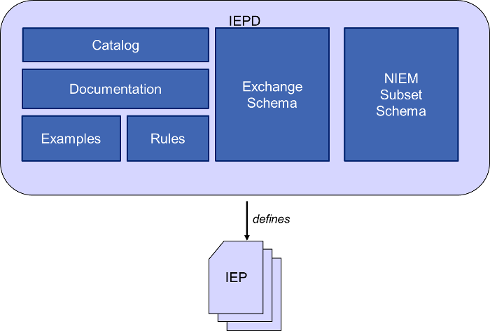
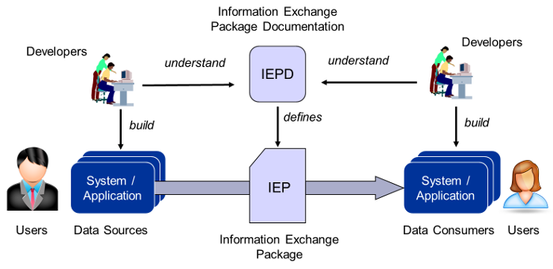

## Overview

{{ page.description }}

{:toc}
- TOC

{:.note}
- The rules for constructing IEPDs are defined by the [Information Exchange Package Documentation (IEPD) Specification]({{ site.data.links.mpd_spec | relative_url }}).
- IEPDs are composed from other NIEM artifacts, including subset schemas, extension schemas, sample instances, and an IEPD catalog.
- IEPDs provide a self-contained definition for derived information exchanges, thus they must be self documenting.

<!--more-->

An Information Exchange Package Documentation (IEPD) is a NIEM message specification. It is a set of artifacts that define and document a message, using applicable content from NIEM and custom content as needed. Extra work goes into creating an IEPD so that it contains all of the information needed by developers to implement it.

To NIEM, the IEPD is considered the point of interoperability. Creation and management of IEPDs is the responsibility of their stakeholders and developers. As such, IEPDs have their own versioning processes, and are managed independently of NIEM and NIEM Domains. The NIEM Management Office defines IEPD conformance, but IEPD development and management fall outside its scope.

An IEPD contains a NIEM-conformant Schema Document Set (SET) that may include portions of NIEM Core and Domain Reference Schema Documents (REFs), and enterprise-specific or IEPD-specific Extension Schema Documents (EXTs). The schema documents contained in an IEPD work together to define one or more classes of instance documents that consistently encapsulate data for meaningful information exchanges. Any instance document that is valid for the SET, and that satisfies the conditions which define an IEP, is a member of a class of IEPs.

Schema documents in an IEPD conform to the NIEM Naming and Design Rules and may use or extend data component definitions drawn from NIEM. An IEPD may also incorporate and use schema documents from other standards that do not conform to NIEM. An IEPD consists of a set of artifacts (schema documents, documentation, sample instance documents, etc.) that together define and describe one or more implementable information exchanges. An IEPD should contain all materials necessary to:

- Understand information exchange context, content, semantics, and structure.
- Create and validate documents defined by the IEPD, and used for information exchanges.
- Identify the lineage of the IEPD itself and optionally its artifacts.

## IEPs

Information Exchange Packages (IEPs) are the actual messages that carry data and are exchanged between stakeholders.  The format and meaning of an IEP or message is specified by its Information Exchange Package Documentation (IEPD), which includes schemas, documentation, and other artifacts needed to fully describe the structure and semantics of the message.

## See more


