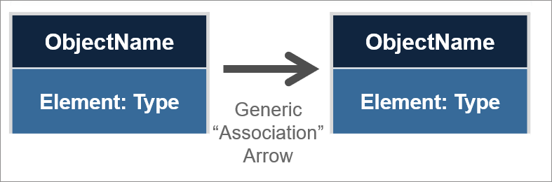
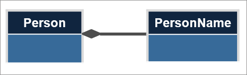
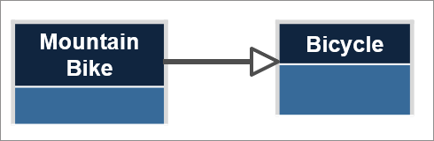
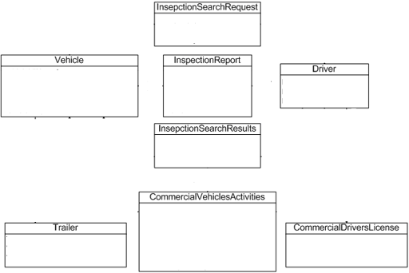
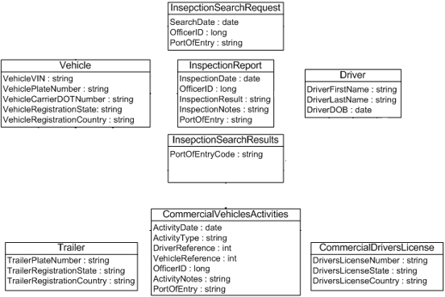
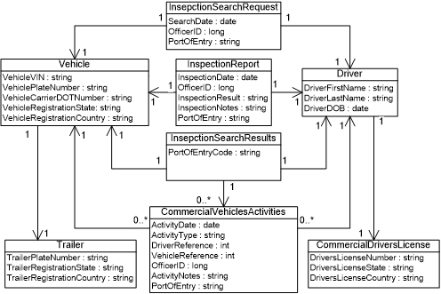

{{ page.description }}

{:toc}
- TOC

After planning out the scenario for the information exchange at a higher level, the next phase involves analyzing the exchange requirements at a more detailed level.  This includes capturing data requirements, business rules, and other detailed requirements of the exchange.

Data requirements

: Data requirements describe the actual data that will be shared in the exchange.

  {:.example}
  > The exchange will need to capture information about a student, including the student's first, middle, and last name and date of birth.

Business rules

: Business rules are specific qualifications for data that refer to how it should be structured (e.g., field length, constraints).

  {:.example}
  > A student's enrollment status is not available or is unknown. The assumption is they are not enrolled, and an information-needed flag will be added by setting X element to the value of TRUE.

Compile as much information as possible about the data requirements and business rules.  This includes documenting existing field names, data types, definitions, cardinality, sample values, and code sets in current exchanges or data sources.  Plans for new fields or modifications to existing ones should be documented as well.

Information about these data requirements can come from a variety of sources, including schemas or API documentation for current or related exchanges, and database fields.  Sometimes a lot of details will be available; at other times, only minimal documentation will exist.  Collect what's available and fill in the blanks as much as possible.

Two common ways of capturing this kind of information are via spreadsheets and UML diagrams.

## Requirements spreadsheet

### Example fields

Data requirements can be captured in a spreadsheet

{:.example}
> The following shows how a few simple data requirements might be documented in a spreadsheet:

Field | Type | Definition | Min | Max | Constraints | Comments
--- | --- | --- | --- | --- | --- | ---
first | string | First name | 1 | 1
middle | string | Middle name | 0 | unbounded
last | string | Last name | 1 | 1
DOB | date | Birthday  | 0 | 1 | Valid only between 1900-01-01 and current date | Check to see if this field needs to be required
eye color | code set | | 0 | 1

A spreadsheet like this can be expanded as needed to add additional information.  In some cases, data requirements may come from multiple sources and may sometimes overlap.  Columns can be added to record the source of the requirement and to capture how they map to other requirements.  If the current requirements are structured so that elements are nested in a hierarchy, columns can be added to capture the parent class or path of the field as well.

### Example codes

{:.example}
> The following shows how code sets might be documented in a spreadsheet:

Type | Code | Definition
--- | --- | ---
eye color | BLK | black
eye color | BRN | brown
eye color | BLU | blue
eye color | GRN | green
eye color | HZL | hazel
eye color | OTH | other or unknown
{:.table-auto}

One benefit of using a spreadsheet is that it can be easily used in the next phase of the IEPD lifecycle when capturing mappings of data requirements to components in NIEM.

## UML class diagrams

Data requirements can also be captured in Unified Modeling Language (UML) class diagrams.

### Components in a diagram

The following is the major kinds of information that will appear in a class diagram:

#### Objects

- Something that represents a physical or conceptual thing; person, place, location, idea, etc.
- These are structured and able to contain instances of themselves and elements
- In a class diagram, these are represented by a rectangle with the object name at the top.

#### Elements

- Defines the unique characteristics of an object
- In a class diagram, these are represented inside the object's rectangle, in a separate panel under the object, and notated with the element name and type (e.g., `age: number`)

#### Associations

- Defines the relationships between objects
- Many different types of associations exist to relate one object to another
- Associations use types of directional arrows to represent the role of each object to the other (e.g., relates-to, contains-a, has-a)
- A good practice is to name / label associations in a class diagram to make relationships clearly understood

The kinds of associations typically used in class diagrams to describe exchanges include:

##### Generic

- Generic associations are non-specific relationships between objects.
- These are drawn with a solid line from one object to another. In NIEM, they are typically unidirectional with an open-ended arrow but can be bidirectional.

##### Aggregation

- Aggregation associations depict a non-exclusive relationship between the parent and child objects, where the child object may exist independently of the specific parent object.
- For example, aggregation could be used to describe the association between an airplane and an engine - an engine can exist independently from an airplane and could appear under other kinds of conveyances.
- These are drawn using a solid line with an empty diamond arrowhead at the parent and no arrowhead at the child.

##### Composition

- Composition associations depict an exclusive relationship between the parent and child objects, where the child object would not exist without the parent object.
- For example, composition could be used to describe the relationship between a person object and the person name object.
- These are drawn using a solid line with a filled diamond arrowhead at the parent and no arrowhead at the child.

##### Specialization

- Specialization associations depict a special kind of object that inherits and extends attributes from its parent.  Can also be referred o as inheritance or generalization.
- For example, a mountain bike is a kind of bicycle and should inherit from it.
- These are drawn using a solid line with an open triangle arrowhead at the parent and no arrowhead at the child.

#### Cardinality

- Defines the number of occurrences between objects, elements, and associations
- In a class diagram, this can be represented by:
  - one number that defines the exact number of occurrences (e.g., `1`)
  - two numbers that represent the minimum and maximum number of occurrences (e.g., `0..1`)
  - use an asterisk to represent many occurrences (e.g., `0..*`).

### Steps

The recommended steps for representing data requirements as a content model in a UML class diagram are:

- Identify and draw objects
- Identify and draw elements
- Identify and draw associations

The end result is a visual representation of the data objects and elements that will be included within an exchange

### Example

The following example demonstrates how to build a content model in a UML class diagram for the Customs Commercial Vehicle Tracker information exchange.

#### Identify and draw objects

After planning out the exchange scenario, the following objects have been identified as the major categories of data requirements:

- Driver
- Commercial Driver License
- Vehicle
- Commercial Vehicle Activities
- Trailer
- Inspection Search Request
- Inspection Search Result
- Inspection Report

For each object, add a segmented rectangle to the class diagram with the object name in the top panel, as shown below:

{:.bordered}

#### Identify and draw elements

After identifying the objects and drawing the objects, determine the specific characteristics of each object.  For example, the Driver object can have the following elements:

- Driver First Name : string
- Driver Surname :  string
- Driver DOB :  date

Similarly, identify the elements for each of the remaining objects.

After identifying the elements of each object, fill in the element names and types in their corresponding object rectangles as shown below:

{:.bordered}

#### Identify and draw associations

After identifying and drawing the objects and elements of an exchange in a class diagram, the relationships between the objects should be captured.  In this case, we find that all the objects are associated through inheritance. After finalizing the type of association between each object, determine the cardinality of such association.

Draw the appropriate arrows for the given association type and add cardinality as shown below:

{:.bordered}

## Output

Documentation of data requirements and business rules should be included in the final IEPD package, whether specified via spreadsheet, UML class diagram, or another format.  If a spreadsheet is used, that can help feed into the next phase of IEPD development, *Map and Model*.
