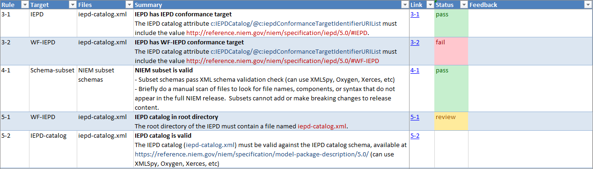

{{ page.description}}

{:toc}
- TOC

During this process, it may be necessary to go back to earlier steps to fix bugs, update schemas, fill in missing mappings, etc.

## Document

At this stage, the schemas and sample instances for the IEPD should be complete.  It's time to finish up the rest of the artifacts and documentation for the IEPD.

See [IEPD Artifacts](../../artifacts/) for information about the required artifacts and optional artifacts for an IEPD.

Among the other documentation that is being prepared, make sure to prepare the following required artifacts:

- [IEPD catalog](../../artifacts/iepd-catalog/)
- [Change log](../../artifacts/#change-log)
- [Readme](../../artifacts/#readme)

## Assemble

Once all IEPD artifacts have been prepared, the the next step is to compile and archive the final package:

See [IEPD Artifacts -- Recommended folder layout](../../artifacts/#recommended-folder-layout) for the recommended layout of the IEPD directory.

## Review

An IEPD Review Process is a good practice to maintain a consistent standard of quality in documents that are accepted for publication in support of organizational information sharing initiatives.

Benefits:

- Promotes IEPD Artifact consistency
- Minimizes redundant or inconsistent details between IEPDs
- Increases higher quality IEPD delivery
- Increases confidence in IEPD information
- Increases a standardized information sharing environment
- Promotes an ease of search, discovery and reuse of IEPDs

A review process will help to decrease the occurrence of published IEPDs that are difficult to reuse. Peer participation in an IEPD review group also increases individual knowledge of information exchanges and will promote accountability in verifying that the exchange meets established requirements.

### Basic checks

- The readme contains documentation necessary to effectively describe the information exchange
- The IEPD Catalog (XML file)
  - validates against the IEPD catalog schema, defined by the IEPD Specification
  - resides in the root directory of the IEPD bearing the file name "iepd-catalog.xml"
- The change log
  - is included in the root directory of the IEPD
  - has a file name that begins with "changelog"
  - records the change history from previous IEPDs
- Extension schemas and sample instances validate
- Extension schemas conform to the [NIEM Naming and Design Rules]({{ site.data.pages.ndr | relative_url }})
  - *See [Extension schema - Checking conformance]({{ site.data.pages.check-conformance | relative_url }}) for more*

### IEPD review checklist

While the [NIEM Naming and Design Rules (NDR)]({{ site.data.pages.ndr | relative_url }}) provides conformance rules and guidances for NIEM schemas and instance documents, it does not address IEPDs.  NDR conformance is only part of the requirement for full NIEM IEPD conformance.

The **[NIEM IEPD Specification]({{ site.data.pages.mpd | relative_url }})** provides rules and guidance about the IEPD as a whole, including which artifacts are required and what kind of metadata should be provided.

Checking IEPD conformance is an additional review step that must be taken after the IEPD is fully assembled.  Thus, it is not one of the validation steps described in the previous *Build and Validate* phase of the IEPD lifecycle.

IEPD conformance rules are not automated.  [ConTesA]({{ site.data.pages.contesa | relative_url }}) only checks NDR Schematron rules for schemas and instances.  IEPD conformance rules must be checked manually.

To make it easier to identify rules from the IEPD specification and record the results, an IEPD review checklist has been provided.  This is a spreadsheet that includes:

- Rule summaries from the IEPD specification and information about to evaluate them
- Additional QA tests that can be useful in assessing an IEPD
- Columns to capture the manual review results and additional comments or feedback

**Download an IEPD review checklist**

- [IEPD 5.0 review checklist](assets/iepd-5.0-checklist.xlsx) - for IEPDs using NIEM 5.0 or a more recent release
- [MPD 3.0 review checklist](assets/mpd-3.0-checklist.xlsx) - for IEPDs using a release between NIEM 3.0 and NIEM 4.2

*Checklists last updated 2021-06-25.*

The image below shows several rows from the checklist, along with some example rule status codes filled in.

{:.bordered}

"Pass" and "fail" status codes are fairly standard for results.  "Review" is provided as an additional option to make it easy to identify rows that need to be returned to later for further review.

### Peer review

Some organizations use an IEPD Peer Review Process to establish a standard process for reviewing IEPDs.

Submit
: IEPD is provided to the reviewing group for review

Preliminary Review
: IEPD developer briefs the reviewing group on the IEPD

Detailed Review
: IEPD is critically assessed by member(s) of the reviewing group  
  IEPD developer provides assistance to the review process, if necessary  
  IEPD is reviewed against business requirements and NIEM specifications

Accept
: The IEPD is updated as needed and finally accepted by the review group

During this review process, IEPD developer responsibilities include:

- Review the IEPD Package prior to submission to check for conformance
- Submit IEPD to the governing authority for review
- Provide brief overview of IEPD to the governing authority, if necessary, to answer any questions and clear any concerns with the submission of the package.
- Coordinate with review team to include all recommended changes that are agreed upon in the revised IEPD
- Submit revised IEPD for reviewing authority, if applicable

Responsibilities for the review team include:

- Review IEPDs in accordance with organizational guidelines
- Coordinate with IEPD developer(s) during the review process to incorporate all feedback into the document as necessary
- Coordinate status updates to the IEPD developer and best practice briefings for the NIEM community of interest
- Submit the finalized IEPD to exchange stakeholders

## Output

By the end of this stage, the IEPD should be complete.  The package should contain all required artifacts, including extension and NIEM subset schemas, an IEPD catalog, a readme, a change log, and a conformance assertion.  Many other kinds of documentation and artifacts can be included as well.  The final package should be zipped and ready for distribution and implementation.
