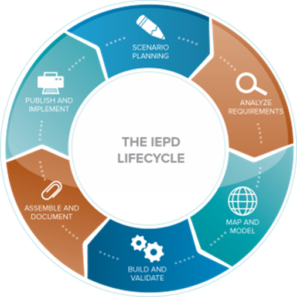

{{ page.description}}

## Lifecycle Phases

1. **[Scenario Planning](scenario-planning/ "Scenario Planning")**: {{ site.data.iepd.lifecycle.scenario }}

2. **[Analyze Requirements](analyze-requirements/ "Analyze Requirements")**: {{ site.data.iepd.lifecycle.analyze }}

3. **[Map and Model](map-and-model/ "Map and Model")**: {{ site.data.iepd.lifecycle.map }}

4. **[Build and Validate](build-and-validate/ "Build and Validate")**: {{ site.data.iepd.lifecycle.build }}

5. **[Assemble and Document](assemble-and-document/ "Assemble and Document")**: {{ site.data.iepd.lifecycle.assemble }}

6. **[Publish and Implement](publish-and-implement/ "Publish and Implement")**: {{ site.data.iepd.lifecycle.publish }}
