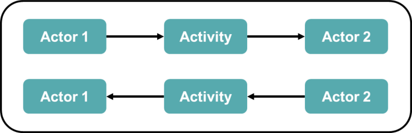
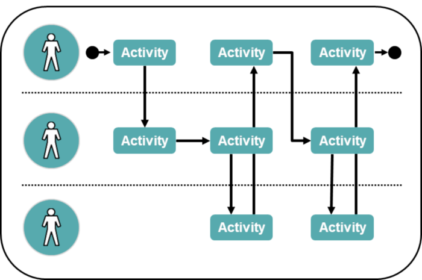
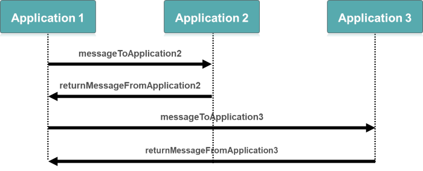

{{ page.description}}

{:toc}
- TOC

## Getting Started

Develop a high level scope and goal of the intended exchange. Decide what information needs to be a part of it. Interview stakeholders to gain an understanding of the information exchange environment. Stakeholders can include the organizations with whom you are exchanging information, community stakeholders in the same mission space, and practitioners from your organization.

### Describe the scenario

Review existing documentation and ask exchange stakeholders questions such as the following:

{:.box}
- What information do you want to exchange?
- How much of this information do you exchange now; what changes need to be made?
- Who are the intended exchange partners?
- How are the current exchanges documented or specified?
- Are there any related NIEM IEPDs that could be reused or leveraged?
- Is there a subject matter expert group that has relevant expertise?
- What is the timeline and resources for development?

### Identify areas of concern

Beyond the basic questions, consider complicating factors that may need to be addressed:

{:.box}
- jurisdictional boundaries
- privacy concerns
- sharing restrictions
- identity of participants
- people problems
- technical characteristics (e.g., types of data, number of data objects, physical and logical data structure)
- use of external standards

### Determine whether to use NIEM

Determine if NIEM is right for this particular exchange.

Reasons to use NIEM include:

- Improve consistency and minimize redundancy in definition of data objects
- Reusability across multiple exchanges leads to cost reduction
- Better interoperability if NIEM is already being used within the organization or across the exchange partners
- The subject matter of the exchange aligns with content in NIEM, or is not already represented by a well-established standard
- Data is not managed consistently with an organization and NIEM could provide standard data objects and modeling guidance for internal systems to leverage when sharing data with other internal systems

Reasons why NIEM might not be right for the exchange:

- The subject matter of the exchange is already represented by another well-established standard or system that meets current needs
- Reusability does not provide value in this context

### Define business requirements

Business requirements are the drivers for an information exchange that are primarily operational or functional requirements.

{:.example}
>
> The verification service shall respond only to search requests issued by the client application, the Verification Information System (VIS).

**Developing business requirements**

Follow a formal process to define and validate business requirements and accurately document an information exchange:

- Gather user requirements
- Define security and privacy requirements
- Specify exchange requirements

Not all requirements for an exchange are applicable to an IEPD. Some requirements are related to implementation and fall out of the scope of NIEM and IEPDs.

{:.example}
> A large, urban city identified the need to create a series of exchanges that would allow parents, city-wide, to apply online for their children's school meals program and automate the processing of the request between the Human Services Agency and the school.
>
> This will be implemented via a web-based service that, upon submission, will automatically check the city's Human Services agency database to ensure the applicant is from a low-income family and qualifies for the school meals program. If qualified, the web-based service will then notify the respective school to add the child to the meal program.
>
> Currently, the only means the city has to process school meal program applications is through paper-based applications at the city Human Services Agency office. Once approved, the Human Services Agency faxes approved applications to the particular school where the child attends. Overall, it is a manual process that inhibits timely delivery of citizen services.

{:.solution}
> Examples of good business requirements from the business case above include:
>
> **Candidate Message Exchange Packages**
> - Request from Parent to Human Services Agency for meal program
> - Eligibility request from Human Services Agency web-based service to eligibility system
> - Eligibility reply from Human Services Agency to parent
> - Notification to add child to meal program from Human Services Agency to school
> - Request from school to Human Services Agency for monthly report
> - Monthly report reply from Human Services Agency to school
>
> **Performance Requirements**
> - The web-based service will notify parents via email whether or not their child qualifies for the school meals program ten minutes after receiving their application.
> - A school will receive notification within 24 hours of a new qualified child within their school.
>
> **Reporting Requirements**
> - Each school in the city shall be able to receive a monthly report of every child in their school who is currently enrolled in the school meals program.
>
> *Note: Data Quality Requirements should be taken into consideration once above requirements are discussed.*

### Assess effort level

Differences in exchange complexity will have an effect on the resources required to develop the IEPD and will assist in determining which IEPD artifacts should be developed as part of the exchange.

IEPD development efforts tend to be lower in the following situations:

- An exchange currently exists but needs to be updated or converted to NIEM
- Requirements are already known and well-documented
- NIEM is already being used in other exchanges

The following situations can lead to a higher level of effort required to develop or update and exchange:

- A new exchange is being developed
- An existing exchange or service needs to be converted to NIEM, but is poorly documented
- The exchange is very large and complex

All stakeholders associated with this exchange should be involved in determining the complexity so that all factors are understood and taken into account when planning the exchange.

## Build scenario models

An effective scenario is informative, strategic, and comprehensive. A model is a graphical representation of information exchange requirements and is essential to depict the scenario that will ultimately drive the building of the information exchange. Use diagrams to create business scenarios as an effective first step to accomplish this.

Recommended diagram types include the following:

- **Use Case** - describes functionality
- **Business Process** - describes activity sequencing
- **Sequence** - describes message flow

### Use Case Diagrams

A use case diagram graphically represents the functionality of a particular information exchange as perceived by an external observer.

**Components**

A use case diagram has the following components:

| **Actor** | Depicts system interactions; a role that a human, device, or system "plays" within the diagram. |
| **Use Case** | Depicts system functionality such as main or sub functionality, a user goal, or an activity system. |
| **Relationship** | Depicts the relationships actors have with use cases and each other. |
| **System** | Contains all functionality and limits scope of the diagram. |

Several of these simple diagrams can form a [more complex diagram]({{ "/training/iepd-developer/scenario-planning/" | relative_url }}).

### Business Process Diagrams

A business process diagram shows the graphical and sequential activities involved in an exchange. It is similar to a workflow diagram.

**Components**

A business process diagram has the following components:

| **Stakeholder** | Any person, organization, or system directly or indirectly involved in the information exchange. |
| **Activity** | Correlates the data being exchanged with any activity that drives it. |
| **Gateway-Event Based** | Activities that force a decision upon a stakeholder. |
| **Flow** | Connects business processes and events to show the direction of activities in the diagram. |
| **Start Event/Stop Event** | Acts as an activity trigger or represents the result or completion of an activity. |

**Steps to develop a business process diagram:**

1. Identify the stakeholders involved in the information exchange.
2. Create a box to serve as a frame to contain your diagram.
3. Divide the box into horizontal rows ("swim lanes") for each of the stakeholders in the process.
4. Draw a line dividing the header section to indicate each stakeholder from the section that will contain the stakeholder's activities.
5. Insert each of the stakeholders into the header section so that they have their own "swim lane" in the diagram.
6. Create a starting node on the diagram in the far left of the swim lane for the stakeholder that initiates the process for the information exchange.
7. Fill in the business process diagram from left to right, beginning after the starting node, with each of the activities or events, in chronological order, involved in the information exchange.  Also make sure to insert a terminal node that indicates the end of the process.
8. Fill in the arrows that connect each of the activities in the diagram.
9. Review the diagram to ensure that it matches the process described in the scenario.

### Sequence Diagrams

A sequence diagram shows how applications or systems operate with one another. It displays the sequential order of operational processes or messages between applications as horizontal arrows between the parallel, vertical lines that are used for applications. This allows the specification of simple runtime scenarios in a graphical manner.

**Components**

A typical sequence diagram should include the following elements:

| **Applications** | Any application involved in sending messages within the information exchange. |
| **Messages** | Any message being sent between applications within the information exchange. |

## Output

At the end of this phase, high-level information about the IEPD can begin to be documented and captured.  While this is not required and the information can continue to be updated and refined during the rest of the IEPD development process, it can be useful to start recording thoughts and decisions now.

### IEPD catalog basic data

An [IEPD Catalog]({{ "/reference/iepd/artifacts/iepd-catalog/" | relative_url }}) is one of the required artifacts of an IEPD.  This will be filled in during the *Assemble and Document* phase of the IEPD lifecycle (Phase 5), but some basic data that will be needed can begin to be collected now.

Field | Description
--- | ---
IEPD name | A name or title for the IEPD
IEPD version | Identifier for a specific release of an IEPD.  "1.0" is typical for new exchanges.
NIEM release | Determine which NIEM release should be used.  Typical to use the current NIEM release unless an older release is already in use within the organization or by the exchange partners.  This will determine   (1) which release will be used for the NIEM subset in the IEPD   (2) which version of the Naming and Design Rules (NDR) should be used for conformance testing   (3) whether the IEPD should follow the 3.0 or 5.0 version of the MPD / IEPD specification
Related IEPDs | Capture information about any related IEPDs that may be extended, reused, or otherwise leveraged
Message names | One IEPD can be built that defines multiple kinds of related messages.  One example is a request / response pair of messages.  Document the names and descriptions of each kind of message if more than one will be built.
Authoritative source | What organization will serve as the authoritative source for the IEPD?  Will need a name and point of contact information.
Keywords | Common aliases, terms, or phrases that would help other users discover this IEPD
Subject matter domain | The community in which this IEPD is applicable or used.  This does not need to correspond to a domain that already exists in NIEM or will be used in the IEPD.
Purpose | A description of the intended usage and reason for the IEPD
Exchange pattern | A description of the transaction or design pattern by which information will be shared
Exchange partners | Names or kinds of the organizations that will use this IEPD to share data.

### Readme basic data

A [Readme]({{ "/reference/iepd/artifacts/#readme" | relative_url }}) is another required artifact in an IEPD.  This will serve as the introductory human-readable documentation and should include the following:

{:.box}
- Purpose of the IEPD
- Scope of its deployment, usage, and information content
- Business value and rationale for developing it
- Type of information it is intended to exchange, in business terms
- Identification (or types) of senders and receivers
- Typical interactions between senders, receivers, and systems
- References to other documentation within the IEPD
- Links to external documents that may be needed to understand and implement the IEPD

### Diagrams and other documentation

Any of the diagrams or documents created to analyze and document the exchange scenario should also be included in the final IEPD package.  Keep these together and update as needed during the IEPD development process.
