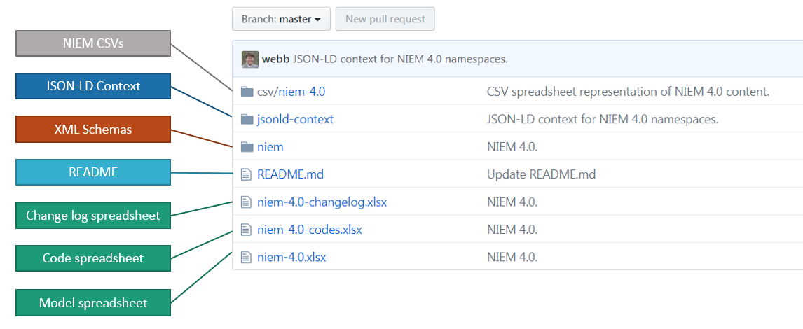
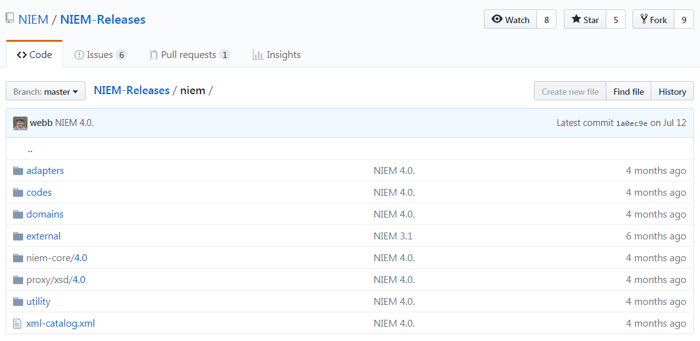
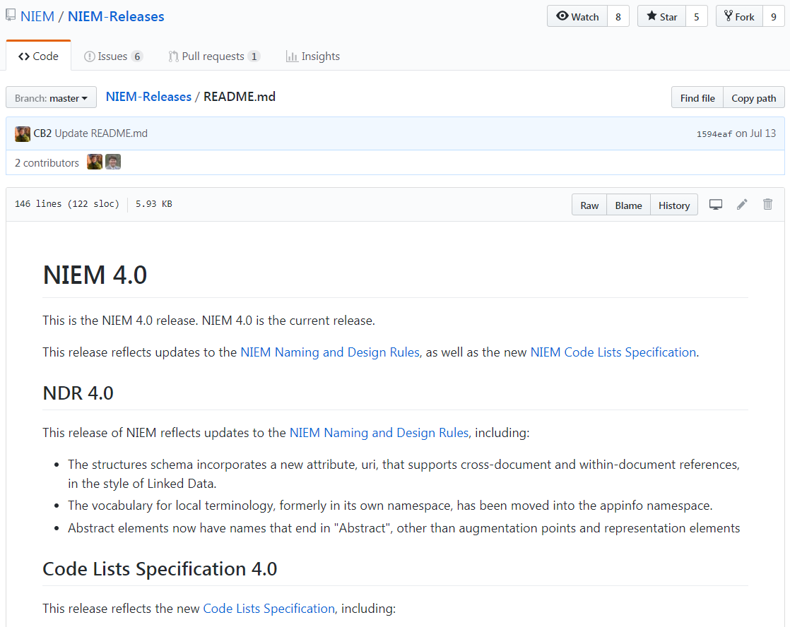
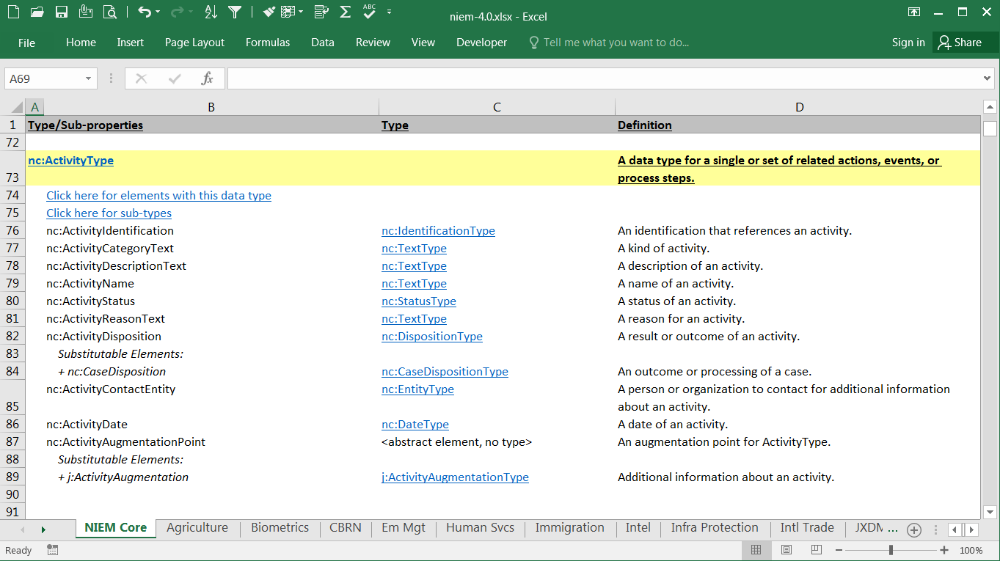
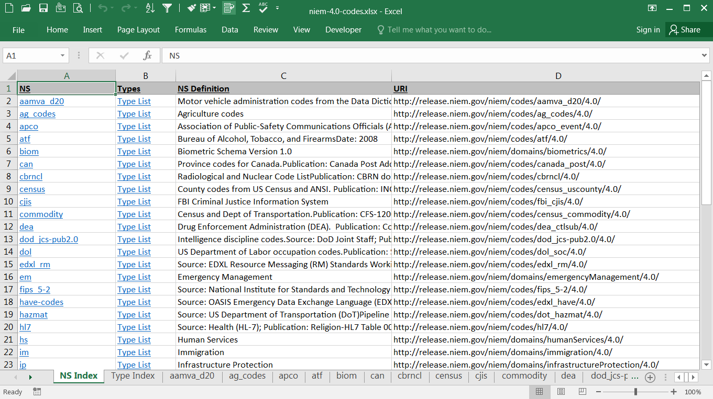
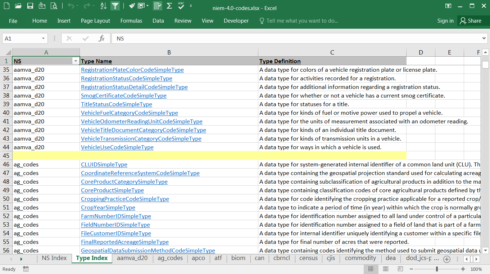
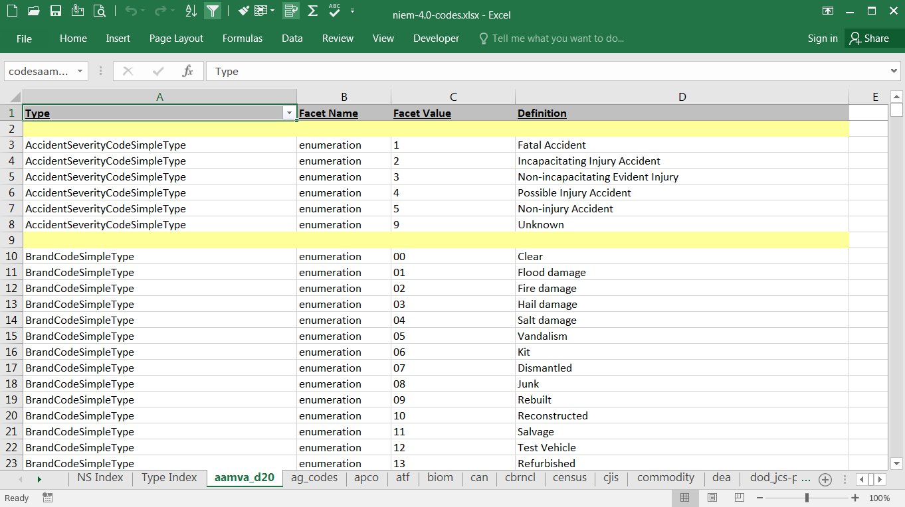
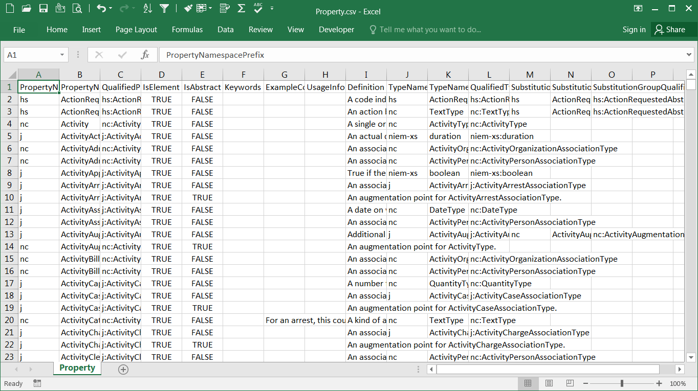

{{ page.description }}

{:toc}
- TOC

{:.example}
> The image below shows the [NIEM 4.0 release package]({{ site.data.links.release_repo}}/tree/maintain-niem-4.0) on GitHub, with labels superimposed to point out the various artifacts.

{:.bordered}

## XML Schemas

The NIEM release XML Schemas define the model content and the internal constructs needed to support the model.  Schemas include Core, domains, codes, external standards, structures and appinfo.

Schemas are located in the `niem` subdirectory of the package or repo.

> The image below shows the schema layout of NIEM 4.0.  The XML catalog is also present.
{:.example}

## Readme

The release README file is a text file that provides a high-level overview of the changes made in the release, and in particular any changes that might affect Core.

This file is located in the root of the package or repo.  The file name is `README.md`.

The format is "Markdown", which provides simple syntax for basic HTML formatting.  Markdown files can be viewed as plain text in any text editor, but the HTML formatting is rendered for a better display on GitHub or a markdown viewer.

## Model spreadsheet

The NIEM model spreadsheet provides user documentation for the properties and types of Core and the domain namespaces.

Each of these namespaces is represented in its own tab, with several supporting tabs at the end of the spreadsheet.

The main tabs are organized alphabetically by types (highlighted in yellow) and their sub-elements.  Related components are hyperlinked for easier navigation.

This file is located in the root of the package or repo.  The file name is "niem-version.xlsx", with "version" representing the release number.  For the 4.0 release, the spreadsheet is named `niem-4.0.xlsx`.

## Code spreadsheet

The NIEM Code spreadsheet provides user documentation for the codes defined in a NIEM release.

This file is located in the root of the package or repo.  The file name is `niem-[version]-codes.xlsx`.

**Namespace index tab**

The first tab is an index of the code namespaces.  Click on the link in the first column to go directly to the tab corresponding to that namespace.  Click on the link in the second column to go to an index of code types for that namespace.

**Type index tab**

The second tab is a full index of the code types for each namespace.  Click on the type name to go directly to the codes for that type.

**Code tabs**

The remaining tabs represent each NIEM namespace that defines codes.

## Change log spreadsheet

The NIEM change log spreadsheet documents the changes between the given release and the previous one.

Items from the previous release are identified in the left-most columns, with blue column headers.  Change information is provided under the yellow column header.  And items from the current release are provided in the right-most columns, under the red column headers.

For items marked as modified, the fields that have changed are in the standard black font.  Fields that remain the same as in the previous release are in a lighter gray font.

Note that not all changes are recorded with the same amount of details.  There are cases where changes to a component do not show up as an edit, but as separate delete and add operations.

This file is located in the root of the package or repo.  The file name is `niem-version-changelog.xlsx`.

## CSVs

NIEM CSVs provide an alternate, non-authoritative representation of the NIEM schema content in a tabular format.  They are made available to support developers who wish to import the model content without having to parse the schemas.

{:.note}
> These materials are different from the spreadsheets in the release package.  The other spreadsheets are formatted to provide user-readable documentation.  These files are formatted to be machine-readable, so that the contents may be **easily imported**.

NIEM CSVs provide information about the content in a release:

- properties
- types
- types with their sub-properties
- type unions
- facets
- namespaces
- local terminology

On GitHub, the CSV formats are located in the `csv` directory off the root.  The release page on release.niem.gov contains CSVs, plus two additional formats representing the same information: a spreadsheet and an Access database.

> Below is a snapshot from the Property CSV:
{:.example}

## Other artifacts

Other standard artifacts in a NIEM release are:


