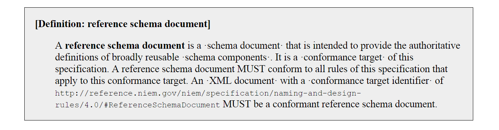
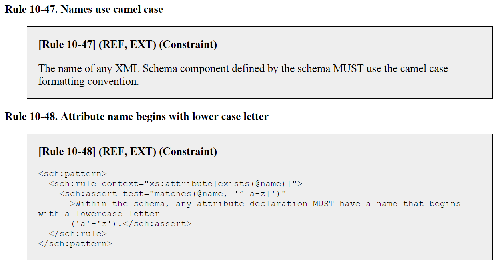

The **[NIEM Conformance Specification]({{ site.data.links.conformance }})** introduces NIEM conformance and provides a general normative definition for its meaning, how it applies, and to what it does and does not apply.  It describes the benefits of conformance, and refers to sources of information, tools, and help.

- TOC
{:toc}

The term *conformance* is often used very broadly, but it has a very specific meaning within NIEM.  Artifacts, like schemas and IEPDs, can be built so that they conform to a specific conformance target.  Conformance targets and their associated rules are defined by NIEM specifications.

System, tools, or databases may have capabilities designed to specifically support the development of NIEM-conformant artifacts, but those systems art not, themselves, NIEM-conformant.  Such tools or systems are considered NIEM-aware or NIEM-supporting.

## Specification Resources



## Conformance vs Compliance

NIEM-conformance does not imply NIEM compliance.  Compliance indicates enforcement and the existence of an official certification process that verifies conformance or level of conformance. NIEM does not currently define compliance.

Early in the development of NIEM (and its predecessor), governance committees discussed the language to be used in solicitations (such grants, RFPs, etc.) that require use of NIEM. They considered both terms, and concluded that the term compliance does not convey appropriate intent; it is too regulatory (for example, U.S. citizens and residents must comply with the U.S. tax code). The objectives of NIEM are to facilitate and support interoperability, NOT to force or regulate it.

## Conformance Targets

A `conformance target` is a special class of artifact, defined by a NIEM specification, with an applicable set of normative rules.

{:.example}
- The [NDR 5.0 specification]({{ site.data.links.ndr }}) defines 4 conformance targets, including
  - **[Reference schema document (REF)]({{ site.data.links.ndr }}#definition_reference_schema_document)**
  - **[Extension schema document (EXT)]({{ site.data.links.ndr }}#definition_extension_schema_document)**   
- The [IEPD 5.0 specification]({{ site.data.links.mpd_spec }}) defines 7 conformance targets, including
  - **[Information Exchange Package Documentation (IEPD)]({{ site.data.links.mpd_spec }}#definition_information_exchange_package_documentation)**
  - **[IEPD catalog document (IEPD-catalog)]({{ site.data.links.mpd_spec}}#definition_IEPD_catalog_document)**   
- The [Code Lists 4.0 specification]({{ site.data.links.code_list_spec }}) defines 6 conformance targets, including
  - **[CSV code list document (CSV-CLD)]({{ site.data.links.code_list_spec}}#definition_CSV_code_list_document)**

In addition to describing what a conformance target is, NIEM specifications assign unique IDs (conformance target identifiers) and define normative rules for each.

{:.example}
> The images below show information about conformance target `reference schema document (REF)` from the NDR 4.0 specification.
>
> - The first image shows the definition of the conformance target and its conformance target identifier.
> - The second image shows two of the normative rules for the REF conformance target.  Note that the first rule is free text and must be checked manually; the second rule is written in Schematron and can be validated using [ConTesA]({{ site.data.pages.contesa | relative_url }}).

{:.bordered}

{:.bordered}

A NIEM artifact will declare its applicable conformance targets by referencing the associated conformance target identifier(s).

{:.example}
- An XML schema can declare the `Extension schema document` conformance target from the NDR 5.0 specification.
- An IEPD can declare the `IEPD` conformance target from the IEPD 5.0 specification.
- A CSV code list can declare the `CSV Code List Document` conformance target from the Code Lists 4.0 specification.

See the [Conformance Targets Attribute Specification]({{ site.data.pages.ctas | relative_url }}) for more information on how this is done.

## NIEM Artifact Conformance

An artifact is NIEM-conformant if and only if it:

1. has a named Conformance Target
2. adheres to all design and structural rules applicable to its Conformance Target
3. references the namespaces of any NIEM components used in its definition

## NIEM Conformance Practices

NIEM developed a set of practices for information exchanges, which include:

**1. Reuse existing NIEM data components when appropriate**

Reuse NIEM elements and types whenever possible rather than creating new ones.

In an IEPD extension schema, this means reference NIEM elements and types that are declared in a full NIEM release or in a NIEM subset.  Do not recreate elements in the extension schema with NIEM names and definitions.

**2. Extend and augment NIEM data components as needed**

If a type like `nc:PersonType` does not contain all of the properties that are needed for an exchange, create [extensions](../../concepts/type/ccc) or [augmentations](../../concepts/augmentation/element/).

**3. Construct new components when necessary**

Construct new data components to express any concepts specific to an exchange or community which the NIEM model does not cover.

**4. Use NIEM techniques for data modeling**

Use NIEM techniques for common data modeling needs.  For example, NIEM describes:

- [references](../../concepts/reference/) - create links between data items
- [associations](../../concepts/association/) - express complex relationships that carry their own data
- [augmentations](../../concepts/augmentation/element/) - add characteristics to already-defined classes of objects
- [adapters](../../concepts/adapter/) - carry non-NIEM data in a NIEM message
- [roles](../../concepts/role/) - express a role or function of an entity

**5. Make IEPDs precise**

Make the specifications for information exchanges precise, so that tools and systems can support the use and comprehension of messages, as well as ensuring each messages obeys the rules of their specifications

**6. Make IEPDs consistent and unambiguous**

Construct messages so tools and systems can ensure they follow their specifications    and reuse NIEM terms (namespaces and local names), so the identity and expected content of messages are consistent and unambiguous

## Support for NIEM-Conformance

NIEM has practices, methods, and formats for the pieces that compose an information exchange. These are expressed as a set of specifications. Specifications  define the rules and procedures for creating content which is NIEM-conformant.

We encourage developers to use tools provided by the NIEM program to construct and validate their information exchanges as NIEM-conformant, including:

- The [NIEM Schema Subset Generation Tool (SSGT)]({{ site.data.pages.ssgt | relative_url }}) to find and assemble NIEM data components into subset schemas.
- A schema development environment or editor to construct Extension Schemas and express additional concepts needed for an exchange.  See the [Concepts](../../concepts/) section for NIEM modeling techniques.
- Ensure IEPDs and schemas follow the NIEM rules by using the [Conformance Testing Assistant (ConTesA)]({{ site.data.pages.contesa | relative_url }}).
