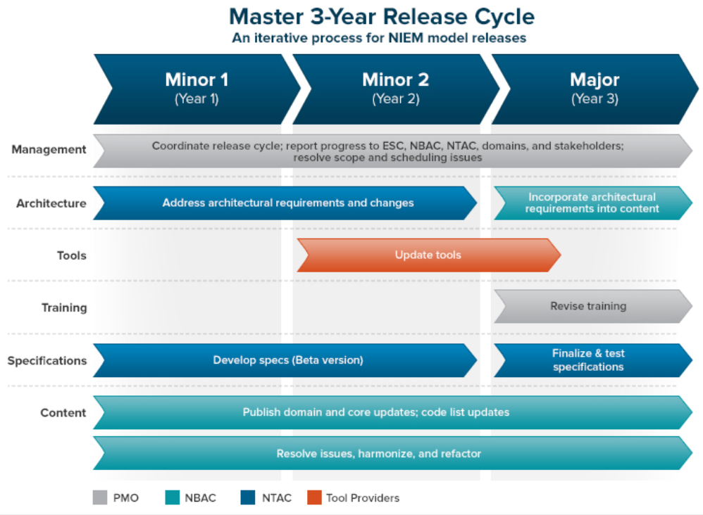

The **[NIEM High-Level Version Architecture (HLVA) Specification]({{ site.data.links.hlva }})** identifies the processes, artifacts, and responsibilities required to produce new releases of the NIEM model.  It also establishes a regular release cycle for predictable and manageable NIEM updates.

- TOC
{:toc}

## Resources



## Objectives

The HLVA was designed to meet the following objectives:

- A domain may issue a [domain update](../../artifacts/releases/domain-update) as needed to publish content changes outside of the regular release cycle.
- IEPDs may reuse content from NIEM releases and domain updates.
- Domain updates are incorporated into the next NIEM release.
- A clear process is available for domains to participate in Core-related harmonization and issue resolution.
- A reliable schedule exists for releases and release activities.
- All NIEM content changes are visible, via uniquely identified schemas and from change logs.

## Definitions

The HLVA frequently refers to the concept of harmonization and coherence.

**Harmonization**

The HLVA describes `harmonization` as the process of modifying schemas in an incremental fashion for the purpose of improving the quality with respect to some criteria. For example, schemas may be harmonized to reduce semantic overlap of its components. Schemas may also be harmonized to ensure uniformity of the vocabulary used in component names and definitions.

Harmonization will be an ongoing process.  As new domains, requirements, and content are added, existing NIEM components may need to be adjusted.

{:.note}
> The purpose of harmonization is to reduce duplication, but not necessarily to reduce cross-domain dependencies.  Domains can and should reuse content from another domain if it  is considered to be the authoritative source for the information.  Content should only be refactored into Core if there is no clear, single authoritative source for it and would be better managed by the [NBAC]({{site.data.links.nbac}}).

**Coherence**

The HLVA describes `coherence` as a set of schemas that are complete (no references to missing schemas) and that contain only a single version of each semantic component.

{:.invalid}
> One or more schemas that reference a missing namespace, like Core or the NIEM structures namespace, is not coherent.

{:.invalid}
> A set of schemas that contains the full Core 3.0 namespace and Core Supplement 3.0.1 is not coherent.  Core Supplement 3.0.1 provides updates for state code elements and types, so this set of schemas contains multiple versions of these state code components (the original and the updated versions).

{:.valid}
> The 4.0 major release is an example of a coherent set of schemas.  All necessary schemas are included in the package, and the changes represented in all of the 3.0-series Core Supplements were merged into the Core 4.0 namespace.

## Responsibilities

### Core Content

The [NIEM Business Architecture Committee (NBAC)]({{ site.data.links.nbac }}) is responsible for the content of Core and for the publication of major and minor releases and Core Supplements, along with the [NIEM Management Office]({{ site.data.links.niem_governance }}).

Community feedback on the content of a NIEM release may be entered into the [NIEM Release issue tracker]({{ site.data.links.release_issues }}) or may be [emailed directly]({{ site.data.links.niem_comments}}).

### Domain Content

The NIEM model is decentralized.  Individual domains are responsible for managing their respective content.  Community feedback may be channeled directly through the domain's point of contact, or may be sent via the Core feedback methods listed above for the appropriate distribution.

The NBAC will ensure that domain namespaces meet NIEM conformance rules for major and minor releases.

### Architecture

The [NIEM Technical Architecture Committee (NTAC)]({{ site.data.links.ntac | relative_url }}) is responsible for the architecture of the NIEM model, as defined by the [NIEM Naming and Design Rules (NDR)]({{ site.data.pages.ndr | relative_url }}) and other [NIEM specifications](../).

## Release processes

The following are activities and processes relating to updating NIEM releases:

**Domain Update Process**

A domain may publish updates to its schemas.  A domain update proposes changes for a future NIEM release.

**Domain Reconciliation**

During this process, changes in a domain update are reconciled and incorporated into the primary domain namespace.  This results in a coherent domain for the next major or minor release.

**Cross-Domain Harmonization**

During this process, the NBAC may create tiger teams or working groups to resolve inconsistencies, overlaps, and other semantic issues between the domains and Core.  Changes to a domain may be published with the next major or minor release.  Changes to Core will be staged for the next major release.

**Core Supplement Process**

A process by which the NBAC publishes adjustments to Core as a supplemental artifact, outside of a major release.  A Core Supplement will never replace or modify the actual Core namespace from a NIEM release.

**Core Synchronization**

During this process, NBAC-approved changes are applied to Core and any outstanding Core supplements are merged into the namespace.  Domains will be adjusted and synchronized to the new Core content and namespace.  This set of Core and domain changes will form a major release.

## Release artifacts

The HLVA defines various kinds of artifacts, including:

- [NIEM release](../../artifacts/releases/release)
- [Domain Update](../../artifacts/releases/domain-update)
- [Core Supplement](../../artifacts/releases/core-supplement)

The HLVA also defines the difference between a major and a minor release:

**Major release**

A NIEM release in which the NIEM Core namespace has changed since the previous release.  A major release may also contain architectural changes, as defined by the [NIEM Naming and Design Rules (NDR)](../ndr) and other [NIEM Specifications](../).

The first integer of the release number will indicate the major release series; for example, NIEM versions 1.0, 2.0, and 3.0 are different major releases.

**Minor release**

A NIEM release in which the NIEM Core namespace has not changed from previous releases in the series, but at least one or more domain namespaces has changed.

If non-zero, the second digit in the release number indicates the minor release (for example, NIEM version 2.1).  Note also that major version 2.0 and minor version 2.1 are in the same series (i.e., series 2) and contain the same NIEM core schema document.

## Release Cycle

NIEM publishes an annual release in a 3-year release cycle: Two minor releases (domain content changes) are followed by a major release (Core and domain content changes, plus architecture changes).

This cycle allows NIEM to represent changing data requirements in a timely manner, while leaving more time between architectural changes that will require specification, tool, and training updates.

{:.bordered}

A release is developed in the following stages:

### Alpha

Major content submissions and issues should be submitted by the input deadline for the alpha stage.  This is to ensure there is adequate time available to review, integrate, and harmonize the changes into the release.

Alpha releases are published internally to the NIEM committees and domains, who are free to share the package with their communities for review and comment.

### Beta

After major changes and issues have been submitted during the alpha stage, the beta stage allows harmonization between the domains.  Issue resolutions and smaller changes can occur during this stage.

Beta releases are announced and distributed to the NIEM community for public review and feedback.

### Release Candidate

A release candidate acts as a draft of the final release.  This stage allows for that draft to be double-checked before publication.  Only bug fixes are considered during this stage; other submitted comments and requests will be queued for the following release.
