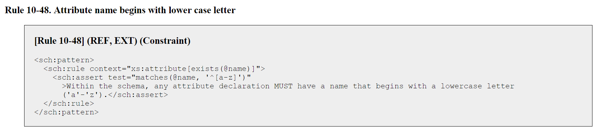
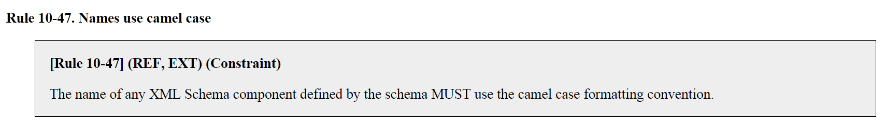
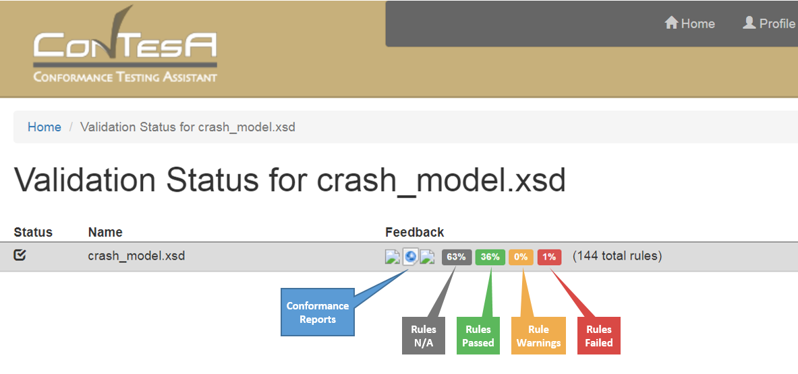
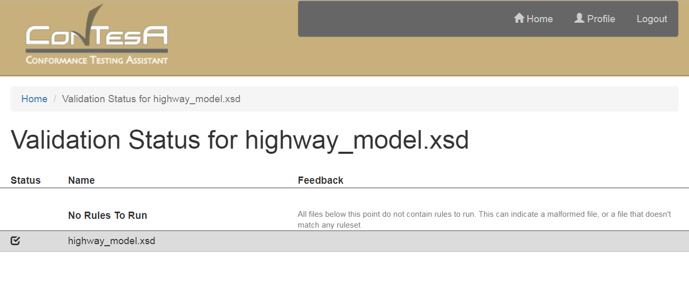
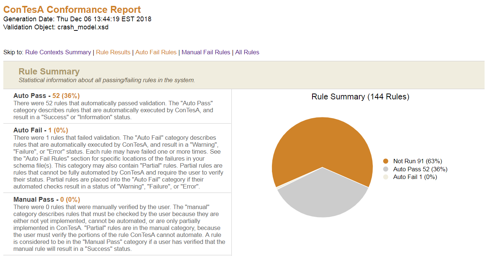

The **[Conformance Testing Assistant (ConTesA)]({{ site.data.links.contesa | relative_url }})** enables users to test NIEM XML schemas against the automated rules from the [NIEM Naming and Design Rules (NDR)]({{ site.data.pages.ndr | relative_url }}).  This is an important first step in verifying [NIEM conformance]({{ site.data.pages.conformance | relative_url }}).

The current version of ConTesA works for NIEM XML schemas based on version 3.0 of the [NDR]({{ site.data.pages.ndr | relative_url }}) or later.

{:.features}
- Validates XML schemas against the automated rules of the NIEM NDR.
- Generates a conformance report available in spreadsheet, HTML, and XML formats.
- Tests single XML schemas or multiple schemas bundled in a zip file.
- Saves conformance reports to the user accounts.

{:.note}
> Do not upload sensitive, classified, or distribution-restricted materials to ConTesA.

{:toc}
- TOC

<!--more-->

## Scope

### NDR Schematron rules

Some of the rules that the [NDR]({{ site.data.pages.ndr | relative_url }}) defines are written in Schematron.  ConTesA is able to run automated validation on all such rules.

{:.example}
> The image below shows a rule written in Schematron from the NDR:

{:.bordered}

## Out of scope

### NDR text rules

ConTesA cannot verify that a schema is fully NIEM conformant; only that it passes the set of automatable Schematron rules from the NDR.  The NDR also has free-text rules that cannot be automated and must be checked manually.

{:.example}
> The image belows shows a rule written in free text from the NDR:

{:.bordered}

### IEPDs

ConTesA can check the NDR conformance of the XML schemas within an IEPD.  The [IEPD specification]({{ site.data.pages.mpd | relative_url }}), however, defines an additional set of conformance rules for IEPDs and for some of the artifacts within.  Ensuring that an IEPD meets all applicable rules currently requires [manual review]({{ "/reference/iepd/lifecycle/assemble-and-document/#iepd-review-checklist" | relative_url }}).

### XML validation

ConTesA does not check for XML schema or instance validation.  This is required for NIEM conformance, but there are many tools available that already do this, including XMLSpy, Oxygen XML Editor, and Xerces.

### JSON

There is no current automated support for NIEM JSON conformance validation.

## Usage

**Log in**

Register for a new account or log in.

**Upload a file**

This can be either a single NIEM XML schema or a set of schemas packaged together in a zip file.

{:.note}
> Because ConTesA does not perform XML schema validation, it is not necessary to upload a NIEM release or NIEM subset along with your own files.

**Review results**

After ConTesA has finished validation, review the status panel for highlights and the conformance reports.  You may need to refresh the page to get the links for the conformance reports.

{:.example}
> The image below shows the validation status panel for a single schema that was uploaded to ConTesA, `crash_model.xsd`.  There, you can see an overview of the results and view or download a conformance report for more information.

{:.bordered}

{:.note}
> There may be some or many rules from the NDR that will not be applicable to your schema.  For example, if your schema does not include any simple union types, then no NDR rules related to simple union types will be executed.  This is the "Rules not executed" count that is represented in the gray box.  This is a different count than the number of NDR rules that require manual review, which is not reported.

**Confirm all applicable files were tested**

The [NDR]({{ site.data.pages.ndr | relative_url }}) requires a `ct:conformanceTargets` attribute on all NIEM XML schemas.  The value of this attribute informs ConTesA of which rule set(s) to use for testing.  Without this attribute, no conformance tests will be run.

{:.note}
> See the section about the [Conformance Targets Attribute Specification]({{ site.data.pages.ctas | relative_url }}) for more information about this attribute and examples of how to define it.

Any file that does not include the `ct:conformanceTargets` attribute, or any file that was not able to be tested for other reasons (such as not being well-formed XML), will appear under the line for **"No Rules to Run"**.  Be sure to check this list, fix all applicable schemas that should be tested, and re-run them in ConTesA.

{:.example}
- The image below shows example schema `highway_model.xsd` that did not include a `ct:conformanceTargets` attribute and was therefore unable to be validated by ConTesA.
- The missing attribute should be added to the schema and then it should be retested.

{:.bordered}

## Conformance Report

A conformance report will be available in three formats: HTML, spreadsheet, and XML.

**Summary**

The conformance report will include a summary section, listing the number of rules that passed and failed.

{:.bordered}

**Auto Fail Rules**

The key section to review from the conformance report lists the rules that the schema did not pass.  Use the line number from the report to help track down the error or warning, and look up the rule number in the [NDR]({{ site.data.pages.ndr | relative_url }}) if you need more information about it.

{:.bordered}

## FAQ

**I can't logout of ConTesA?**

{:.answer}
> Try deleting your browser's data cache and cookies.

**Where are my files?**

{:.answer}
> The files uploaded for conformance testing are not stored on the ConTesA servers. Data exists temporarily in memory on the servers while the files are being processed; once processing is complete the data is cleared from memory.

**What is my username?**

{:.answer}
> Your *username* is the email address you used for registration with the ConTesA site.

**I don't remember my registration email, how do I login?**

{:.answer}
> Unfortunately, we cannot retrieve your user information without record of the email address you used to register.

**Where is my user data stored?**

{:.answer}
> Your user data is securely stored on the ConTesA servers.

**What user data do you have?**

{:.answer}
> ConTesA only stores the user data entered for registration as well as a record of the file names and their associated conformance reports.
