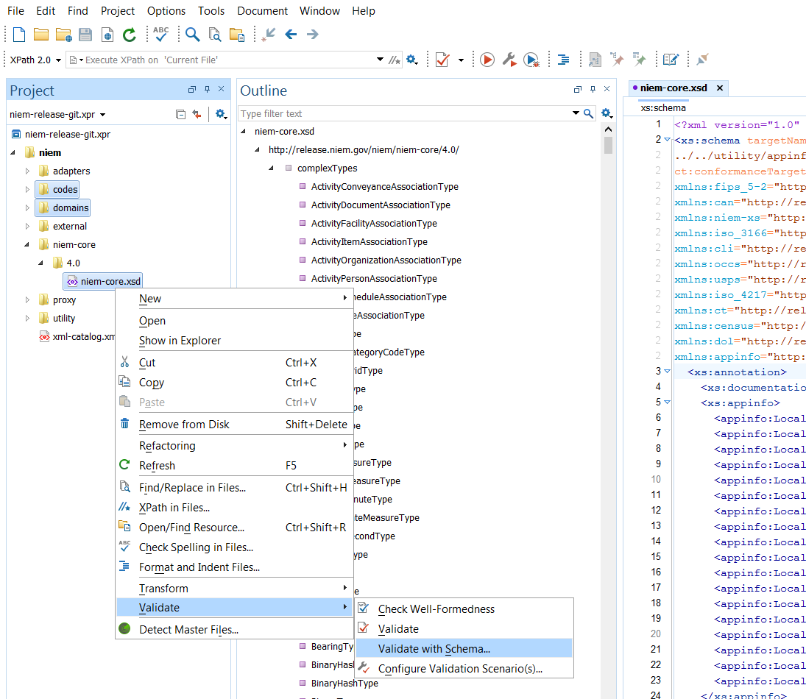

{:.note}
> [ConTesA]({{ site.data.pages.contesa | relative_url }}) is a free web tool provided by the NIEM program that also may be used to check NDR conformance.

## Setup

Download the NDR schematron rules.  These are available in the [NDR zip file]({{ site.data.links.ndr_folder }}) and on the [NDR GitHub repo]({{ site.data.links.ndr_repo}}).

Schematron files have a `.sch` file extension.

The Schematron file(s) will be needed each time you test NDR conformance.  The two key files for this task are:

- `ndr-rules-conformance-target-ext.sch` - Schematron rules for EXT schemas
- `ndr-rules-conformance-target-ref.sch` - Schematron rules for REF schemas

## Schematron Validation

- In Oxygen, open the NIEM XML schema to test for NDR conformance.  This might be an IEPD extension schema or a NIEM domain schema under development.

- Open the "Validate with..." dialog box.  There are three different ways of doing this:

  - (Option 1) From the menu bar, click on Document > Validate > Validate with...

  - (Option 2) Click the drop-down on the `Validate` (check mark) button and select `Validate with...`, as shown below.

      {:.bordered}
      

  - (Option 3) From an open Oxygen project, right-click on one or more selected schema files or folders, as shown below.

      {:.bordered}
      

- In the `Validate with` dialog box...
  - Change the `Schema Type` field from `XML Schema` to `Schematron`.

    {:.bordered}
    

  - In the `URL` field, browse to the downloaded Schematron file.  Make sure to choose the appropriate file (REF or EXT) for your NIEM schema.

    - *IEPD extension schemas typically use EXT rules.*
    - *Domain schemas use REF rules.*

    {:.bordered}
    

  - Click OK to run the conformance validation.

## Review Conformance Errors

Conformance errors and warnings will appear in the `Results` panel.

{:.note}
- The NDR rule number appears, along with the rule title, so that the NDR may be easily referenced for more information about the rule.
- Double-click on an error or warning to jump to that line in the schema.

The image below shows several modifications to a local copy of Core in order to demonstrate errors:

{:.bordered}

After making corrections, rerun the steps above to test conformance on the updated schema.

## Related Links

Please see [Oxygen's video](https://www.oxygenxml.com/demo/Schematron_Validation.html) for more information about Schematron validation in Oxygen.
