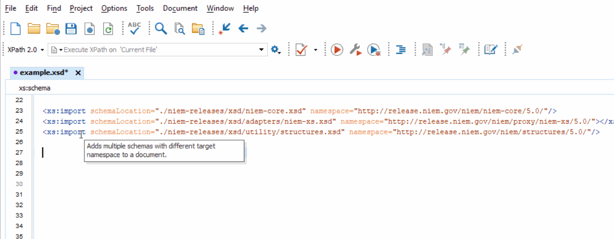
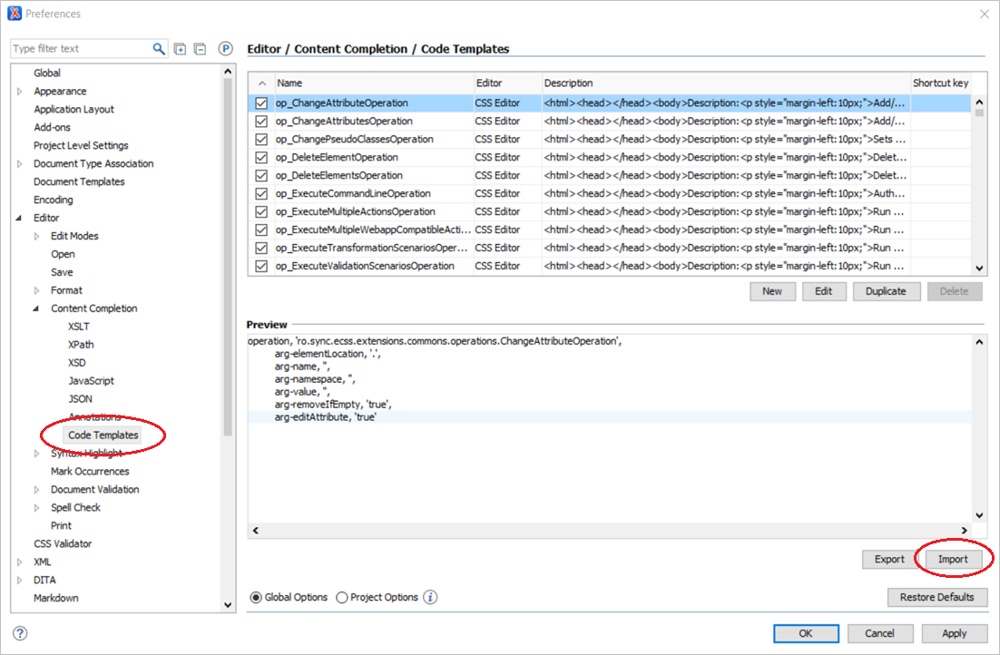
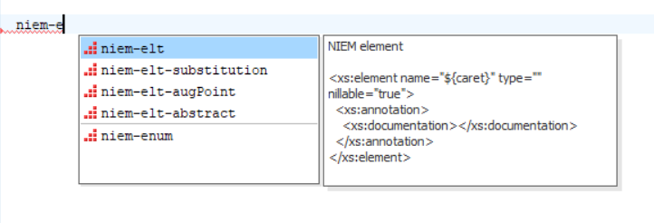
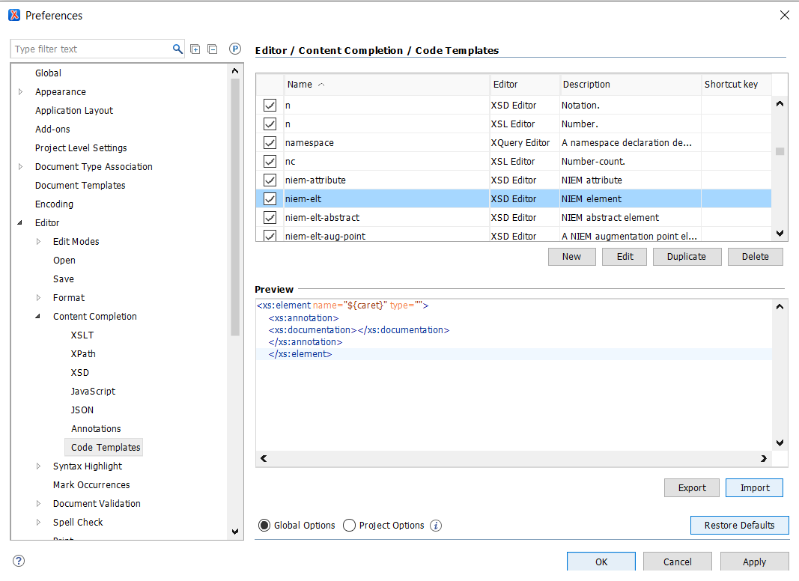
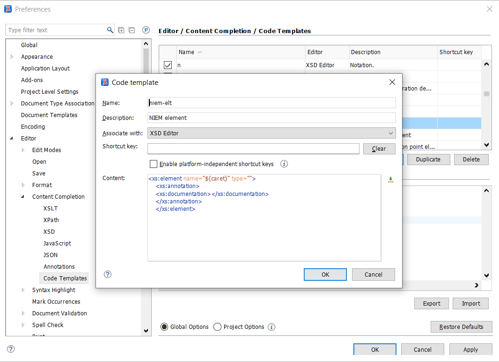

{{ page.description }}

## Contents
{:.no_toc}

{:toc}
- TOC

## Demo

Load NIEM snippets into Oxygen in order to easily insert common templates into NIEM domain or IEPD extension schemas:

- Load NIEM snippets (see instructions below)
- Type `niem` into an XML schema file
- Hit Ctrl + Space (Windows) or Cmd + Space (Mac) to see a list of applicable snippets with names that begin with "niem"
- Find and select the appropriate snippet
- Fill in the empty or partially-filled fields; update default values as necessary

## Available NIEM snippets

{:.note}
> Snippets include some commonly-used default values but these may be modified as necessary.  Change default values as the snippet is used, or edit the snippet template itself to fill in better default values for your particular requirements.

### Property snippets

The following snippets provide template for various kinds of NIEM properties.

<table>
  <thead>
    <th style="width: 20%">Label</th>
    <th style="width: 35%">Description</th>
    <th style="width: 35%">Example pattern</th>
    <th style="width: 10%">Info</th>
  </thead>
  <tr>
    <td>niem-elt</td>
    <td>NIEM element</td>
    <td><a href="https://github.com/NIEM/NIEM-Releases/blob/niem-5.0/xsd/domains/agriculture.xsd#L222-L226">ag:AgricultureProductionPlan</a></td>
    <td><a href="https://niem.github.io/reference/concepts/property/element/">Info</a></td>
  </tr>
  <tr>
    <td>niem-elt-abstract</td>
    <td>NIEM abstract element</td>
    <td><a href="https://github.com/NIEM/NIEM-Releases/blob/niem-5.0/xsd/domains/st.xsd#L1578-L1582">st:RoadwayGradeAbstract</a></td>
    <td><a href="https://niem.github.io/reference/concepts/property/abstract/">Info</a></td>
  </tr>
  <tr>
    <td>niem-elt-augPoint</td>
    <td>NIEM augmentation point element (abstract)</td>
    <td><a href="https://github.com/NIEM/NIEM-Releases/blob/niem-5.0/xsd/domains/infrastructureProtection.xsd#L214-L218">ip:SectorAugmentationPoint</a></td>
    <td><a href="https://niem.github.io/reference/concepts/augmentation/point/">Info</a></td>
  </tr>
  <tr>
    <td>niem-elt-substitution</td>
    <td>NIEM substitutable element</td>
    <td><a href="https://github.com/NIEM/NIEM-Releases/blob/niem-5.0/xsd/domains/st.xsd#L1583-L1587">st:RoadwayGradeCode</a></td>
    <td><a href="https://niem.github.io/reference/concepts/property/substitutable/">Info</a></td>
  </tr>
  <tr>
    <td>niem-attribute</td>
    <td>NIEM attribute</td>
    <td><a href="https://github.com/NIEM/NIEM-Releases/blob/niem-5.0/xsd/domains/mo.xsd#L2362-L2366">mo:codespaceID</a></td>
    <td><a href="https://niem.github.io/reference/concepts/property/attribute/">Info</a></td>
  </tr>
</table>

### Type snippets

The following snippets provide templates for various kinds of NIEM types.

<table>
  <thead>
    <th style="width: 20%">Label</th>
    <th style="width: 35%">Description</th>
    <th style="width: 35%">Example pattern</th>
    <th style="width: 10%">Info</th>
  </thead>
  <tr>
    <td>niem-type-object</td>
    <td>NIEM object type  (has sub-properties)</td>
    <td><a href="https://github.com/NIEM/NIEM-Releases/blob/niem-5.0/xsd/domains/infrastructureProtection.xsd#L87-L102">ip:SectorType</a></td>
    <td><a href="https://niem.github.io/reference/concepts/type/ccc/">Info</a></td>
  </tr>
  <tr>
    <td>niem-type-csc</td>
    <td>NIEM complex type with simple content  (has a value and attributes)</td>
    <td><a href="https://github.com/NIEM/NIEM-Releases/blob/niem-5.0/xsd/domains/st.xsd#L622-L631"> st:MedianCategoryCodeType</a></td>
    <td><a href="https://niem.github.io/reference/concepts/type/csc/">Info</a></td>
  </tr>
  <tr>
    <td>niem-type-simple</td>
    <td>NIEM simple type  (has a value)</td>
    <td><a href="https://github.com/NIEM/NIEM-Releases/blob/niem-5.0/xsd/domains/mo.xsd#L776-L787">mo:MGRSCoordinateStringSimpleType</a></td>
    <td><a href="https://niem.github.io/reference/concepts/type/csc/">Info</a></td>
  </tr>
  <tr>
    <td>niem-type-enum</td>
    <td>NIEM simple type with enumerations (has a value from a given set of codes)</td>
    <td><a href="https://github.com/NIEM/NIEM-Releases/blob/niem-5.0/xsd/domains/st.xsd#L570-L621"> st:MedianCategoryCodeSimpleType</a></td>
    <td><a href="https://niem.github.io/reference/concepts/type/simple/">Info</a></td>
  </tr>
  <tr>
    <td>niem-type-list</td>
    <td>NIEM simple list type  (has a space-separated list of values)</td>
    <td><a href="https://github.com/NIEM/NIEM-Releases/blob/niem-5.0/xsd/niem-core.xsd#L2286-L2291">nc:IntegerListSimpleType</a></td>
    <td><a href="https://niem.github.io/reference/concepts/type/simple/list/">Info</a></td>
  </tr>
  <tr>
    <td>niem-type-union</td>
    <td>NIEM simple union type  (combines codes from multiple types)</td>
    <td><a href="https://github.com/NIEM/NIEM-Releases/blob/niem-5.0/xsd/domains/biom.xsd#L5402:L5407">biom:FrictionRidgePositionCodeSimpleType</a></td>
    <td><a href="https://niem.github.io/reference/concepts/type/simple/union/">Info</a></td>
  </tr>
  <tr>
    <td>niem-type-adapter</td>
    <td>NIEM adapter type  (wraps an element from an external standard)</td>
    <td><a href="https://github.com/NIEM/NIEM-Releases/blob/niem-5.0/xsd/domains/mo.xsd#L2267-L2282">mo:WGS84EllipseType</a></td>
    <td><a href="https://niem.github.io/reference/concepts/adapter/">Info</a></td>
  </tr>
</table>

### Combo snippets

The following snippets provide templates for two or more related NIEM components that are often built at the same time.

<table>
  <thead>
    <th style="width: 20%">Label</th>
    <th style="width: 35%">Description</th>
    <th style="width: 35%">Example pattern</th>
    <th style="width: 10%">Info</th>
  </thead>
  <tr>
    <td>niem-assn-2</td>
    <td>
      NIEM association type  
      NIEM association element
    </td>
    <td>
      <a href="https://github.com/NIEM/NIEM-Releases/blob/niem-5.0/xsd/domains/mo.xsd#L122-L136"> mo:AircraftTargetAssociationType</a>  
      <a href="https://github.com/NIEM/NIEM-Releases/blob/niem-5.0/xsd/domains/mo.xsd#L2387-L2391"> mo:AircraftAssignedTargetAssociation</a>
    </td>
    <td><a href="https://niem.github.io/reference/concepts/association/">Info</a></td>
  </tr>
  <tr>
    <td>niem-assn-3</td>
    <td>
      NIEM association type   NIEM association element   NIEM association augmentation point
    </td>
    <td>
      <a href="https://github.com/NIEM/NIEM-Releases/blob/niem-5.0/xsd/domains/mo.xsd#L122-L136"> mo:AircraftTargetAssociationType</a>  
      <a href="https://github.com/NIEM/NIEM-Releases/blob/niem-5.0/xsd/domains/mo.xsd#L2387-L2391"> mo:AircraftAssignedTargetAssociation</a>  
      <a href="https://github.com/NIEM/NIEM-Releases/blob/niem-5.0/xsd/domains/mo.xsd#L2392-L2396"> mo:AircraftTargetAssociationAugmentationPoint</a>
    </td>
    <td><a href="https://niem.github.io/reference/concepts/association/">Info</a></td>
  </tr>
  <tr>
    <td>niem-aug-2</td>
    <td>
      NIEM augmentation type  
      NIEM augmentation element
    </td>
    <td>
      <a href="https://github.com/NIEM/NIEM-Releases/blob/niem-5.0/xsd/domains/intelligence.xsd#L155-L170"> it:PersonAugmentationType</a>  
      <a href="https://github.com/NIEM/NIEM-Releases/blob/niem-5.0/xsd/domains/intelligence.xsd#L399-L403"> it:PersonAugmentation</a>
    </td>
    <td><a href="https://niem.github.io/reference/concepts/augmentation/element/xml-container/">Info</a></td>
  </tr>
  <tr>
    <td>niem-code-2</td>
    <td>
      NIEM code simple type  
      NIEM code CSC type
    </td>
    <td>
      <a href="https://github.com/NIEM/NIEM-Releases/blob/niem-5.0/xsd/domains/st.xsd#L570-L621"> st:MedianCategoryCodeSimpleType</a>  
      <a href="https://github.com/NIEM/NIEM-Releases/blob/niem-5.0/xsd/domains/st.xsd#L622-L631"> st:MedianCategoryCodeType</a>  
    </td>
    <td><a href="https://niem.github.io/reference/concepts/facet/">Info</a></td>
  </tr>
  <tr>
    <td>niem-code-3</td>
    <td>
      NIEM code simple type  
      NIEM code CSC type  
      NIEM code element
    </td>
    <td>
      <a href="https://github.com/NIEM/NIEM-Releases/blob/niem-5.0/xsd/domains/st.xsd#L570-L621"> st:MedianCategoryCodeSimpleType</a>  
      <a href="https://github.com/NIEM/NIEM-Releases/blob/niem-5.0/xsd/domains/st.xsd#L622-L631"> st:MedianCategoryCodeType</a>  
      <a href="https://github.com/NIEM/NIEM-Releases/blob/niem-5.0/xsd/domains/st.xsd#L1518-L1522"> st:MedianCategoryCode</a>  
    </td>
    <td><a href="https://niem.github.io/reference/concepts/facet/">Info</a></td>
  </tr>
  <tr>
    <td>niem-code-4</td>
    <td>
      NIEM code simple type  
      NIEM code CSC type  
      NIEM abstract element  
      NIEM substitutable code element
    </td>
    <td>
      <a href="https://github.com/NIEM/NIEM-Releases/blob/niem-5.0/xsd/domains/mo.xsd#L1418-L1439"> mo:SignalDirectionCodeSimpleType</a>  
      <a href="https://github.com/NIEM/NIEM-Releases/blob/niem-5.0/xsd/domains/mo.xsd#L1440-L1449"> mo:SignalDirectionCodeType</a>  
      <a href="https://github.com/NIEM/NIEM-Releases/blob/niem-5.0/xsd/domains/mo.xsd#L3457-L3461"> mo:SignalDirectionAbstract</a>  
      <a href="https://github.com/NIEM/NIEM-Releases/blob/niem-5.0/xsd/domains/mo.xsd#L3462-L3466"> mo:SignalDirectionCode</a>  
    </td>
    <td><a href="https://niem.github.io/reference/concepts/facet/">Info</a></td>
  </tr>
  <tr>
    <td>niem-metadata-2</td>
    <td>
      NIEM metadata type  
      NIEM metadata element
    </td>
    <td>
      <a href="https://github.com/NIEM/NIEM-Releases/blob/niem-5.0/xsd/niem-core.xsd#L2902-L2939"> cui:DocumentMarkingMetadataType</a>  
      <a href="https://github.com/NIEM/NIEM-Releases/blob/niem-5.0/xsd/niem-core.xsd#L10138-L10142"> cui:DocumentMarkingMetadata</a>  
    </td>
    <td><a href="https://niem.github.io/reference/concepts/metadata/">Info</a></td>
  </tr>
  <tr>
    <td>niem-type-object-2</td>
    <td>
      NIEM augmentation point element  
      NIEM object type
    </td>
    <td>
      <a href="https://github.com/NIEM/NIEM-Releases/blob/niem-5.0/xsd/domains/infrastructureProtection.xsd#L214-L218">ip:SectorAugmentationPoint</a>  
      <a href="https://github.com/NIEM/NIEM-Releases/blob/niem-5.0/xsd/domains/infrastructureProtection.xsd#L87-L102">ip:SectorType</a>
      </td>
    <td><a href="https://niem.github.io/reference/concepts/type/ccc/">Info</a></td>
  </tr>
</table>

### Schema snippets

The following snippets can be used to initialize a NIEM XML schema and includes a general template for the schema header, definition, local terminology section, and import statements.

<table>
  <thead>
    <th style="width: 20%">Label</th>
    <th style="width: 35%">Description</th>
    <th style="width: 35%">Example pattern</th>
    <th style="width: 10%">Info</th>
  </thead>
  <tr>
    <td>niem-schema-4-ref</td>
    <td>NIEM 4.0-style reference schema template (for a release schema)</td>
    <td><a href="https://github.com/NIEM/NIEM-Releases/blob/niem-4.0/niem/domains/intelligence/4.0/intelligence.xsd#L1-L23">Schema header for the NIEM 4.0 Intelligence domain schema</a></td>
    <td><a href="https://niem.github.io/reference/concepts/namespace/">Info</a></td>
  </tr>
  <tr>
    <td>niem-schema-4-ext</td>
    <td>NIEM 4.0-style extension schema template (for an IEPD schema)</td>
    <td></td>
    <td><a href="https://niem.github.io/reference/concepts/namespace/">Info</a></td>
  </tr>
  <tr>
    <td>niem-schema-5-ref</td>
    <td>NIEM 5.0-style reference schema template (for a release schema)</td>
    <td><a href="https://github.com/NIEM/NIEM-Releases/blob/niem-5.0/xsd/domains/intelligence.xsd#L1-L39">Schema header for the NIEM 5.0 Intelligence domain schema</a></td>
    <td><a href="https://niem.github.io/reference/concepts/namespace/">Info</a></td>
  </tr>
  <tr>
    <td>niem-schema-5-ext</td>
    <td>NIEM 5.0-style extension schema template (for an IEPD schema)</td>
    <td></td>
    <td><a href="https://niem.github.io/reference/concepts/namespace/">Info</a></td>
  </tr>
</table>

### Other snippets

The following snippets provide additional NIEM templates.

<table>
  <thead>
    <th style="width: 20%">Label</th>
    <th style="width: 35%">Description</th>
    <th style="width: 35%">Example pattern</th>
    <th style="width: 10%">Info</th>
  </thead>
  <tr>
    <td>niem-enum</td>
    <td>NIEM enumeration</td>
    <td><a href="https://github.com/NIEM/NIEM-Releases/blob/niem-5.0/xsd/domains/mo.xsd#L199-L203">Code "APPROVED"</a></td>
    <td><a href="https://niem.github.io/reference/concepts/facet/">Info</a></td>
  </tr>
  <tr>
    <td>niem-import</td>
    <td>NIEM import statement for a conformant namespace</td>
    <td><a href="https://github.com/NIEM/NIEM-Releases/blob/niem-5.0/xsd/domains/mo.xsd#L60">Import NIEM Core</a></td>
    <td><a href="https://niem.github.io/reference/concepts/namespace/">Info</a></td>
  </tr>
  <tr>
    <td>niem-import-external</td>
    <td>NIEM import statement for an external standard</td>
    <td>
      <a href="https://github.com/NIEM/NIEM-Releases/blob/niem-5.0/xsd/domains/mo.xsd#L55-L59">Import GML</a>
       (not a NIEM-conformant namespace)
    </td>
    <td><a href="https://niem.github.io/reference/concepts/namespace/">Info</a></td>
  </tr>
  <tr>
    <td>niem-term-literal</td>
    <td>NIEM local terminology described by a literal string</td>
    <td><a href="https://github.com/NIEM/NIEM-Releases/blob/niem-5.0/xsd/domains/mo.xsd#L45">Local term "UTM" with literal</a></td>
    <td><a href="https://niem.github.io/reference/concepts/local-term/">Info</a></td>
  </tr>
  <tr>
    <td>niem-term-def</td>
    <td>NIEM local terminology described by a definition</td>
    <td><a href="https://github.com/NIEM/NIEM-Releases/blob/niem-5.0/xsd/domains/mo.xsd#L47">Local term "Waypoint" with definition</a></td>
    <td><a href="https://niem.github.io/reference/concepts/local-term/">Info</a></td>
  </tr>
</table>

## Using NIEM snippets with Oxygen

For more information on snippets in Oxygen, please their page about [Code Templates](https://www.oxygenxml.com/doc/versions/23.0/ug-editor/topics/code-templates-x-editing2.html).

### Import snippets

- Download the **<a href="./niem-snippets-oxygen.xml" download>NIEM Oxygen snippets file</a>**
- In Oxygen, click on menu item **Options** -> **Preferences...**
- In the left panel sidebar, click on **Editor** -> **Content Completion** -> **Code Templates**
- Click the Import button near the bottom right of the panel and select the downloaded snippets file

### Use a snippet

{:.note}
> All NIEM snippets begin with `niem-`

- Type "niem" in an XML schema file
- Hit Ctrl/Cmd + Space
- Scroll through the drop-down list to see all snippets that begin with "niem"
- Hit "Tab" or "Enter" to load the snippet
- Fill in fields like names and definitions; adjust default values as needed

### Modify a snippet

- In Oxygen, click on **Options** -> **Preferences**
- In the left panel sidebar, click **Editor** -> **Content Completion** -> **Code Templates**
- Scroll down and select the snippet to modify
  - The snippet will begin with "niem-"
  - NIEM snippets will appear under "XSD Editor" and/or "JSON Editor" group
- Click the "Edit" button

- Modify the snippet name, description, code, or add a keyboard shortcut.
- Notes:
  - The `${caret}` variable marks the position where the cursor will appear once the snippet is loaded.

### Reload snippets

- To load an updated snippets file, simply go through the original import steps again.
- Snippets with the same name and editor group will be overwritten.
- Individual snippets can be deleted or snippets can be reset by clicking the **Restore Defaults** button.
