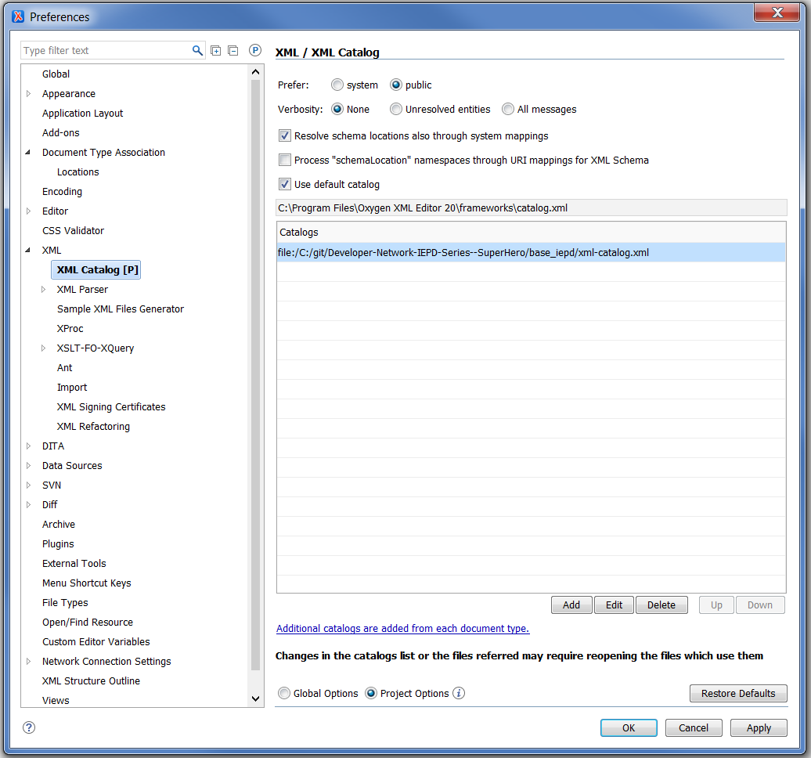
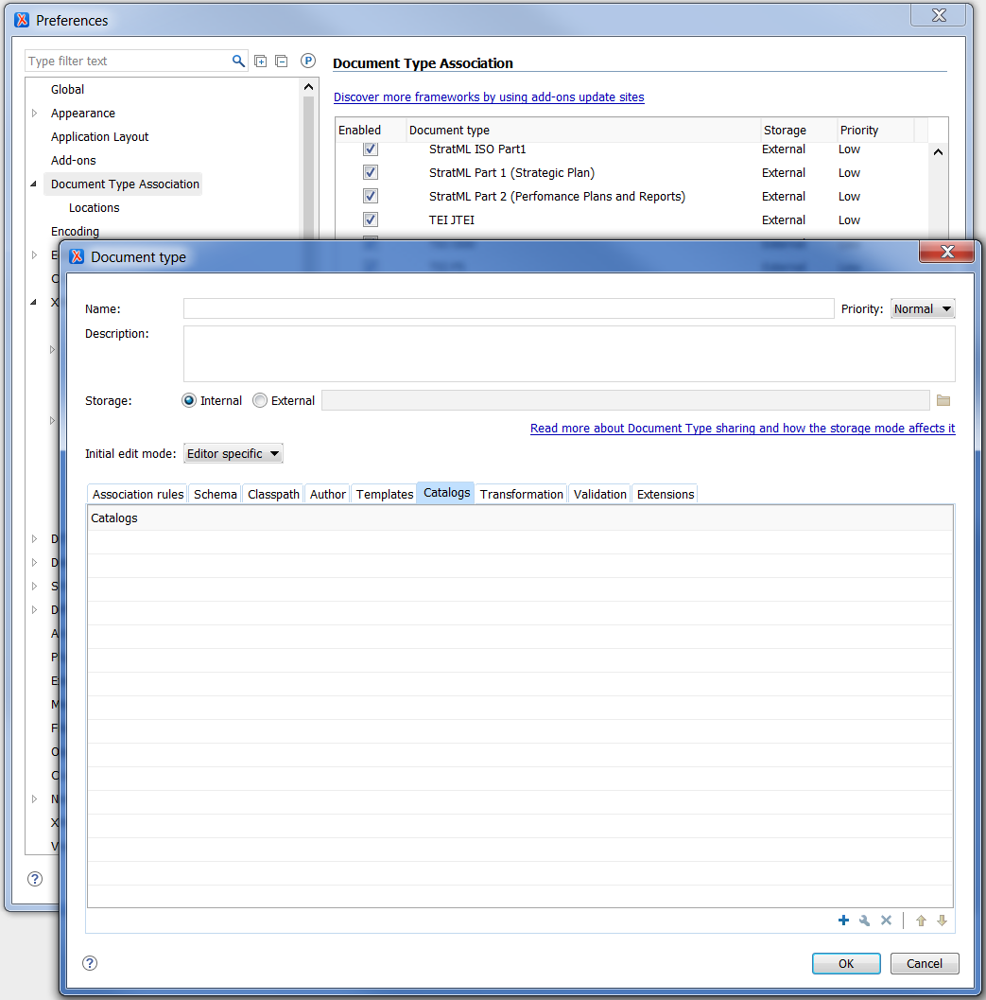

{{ page.description }}

{:toc}
- TOC

Oxygen has several different ways to add a catalog file.

## XML Catalog Preferences

To add a global user-defined catalog in Oxygen via the XML Catalog preferences page:

- Go to Options > Preferences > XML > XML Catalog
- Click the "Add" button to add the new catalog
- Restart Oxygen XML Editor

## Document Type Association

To add a user-defined catalog in Oxygen via a document type association:

- Go to Options > Preferences > Document Type Association
- Add a new Document Type for the XML file(s)
- Add the catalog in the Catalogs tab
- Add an Association Rule

## More

For more information, please see Oxygen's catalog help files:

- [Working with XML Catalogs](https://www.oxygenxml.com/doc/versions/20.1/ug-editor/topics/using-XML-Catalogs.html)
- [XML Catalog Preferences](https://www.oxygenxml.com/doc/versions/20.1/ug-editor/topics/preferences-xml-catalog.html#preferences-xml-catalog)
- [Document Type Configuration Dialog Box](https://www.oxygenxml.com/doc/versions/20.1/ug-editor/topics/the-document-type-dialog.html)
- [Configuring XML Catalogs via a Document Type Association](https://www.oxygenxml.com/doc/versions/18/ug-editor/tasks/dg-xml-catalogs.html)
